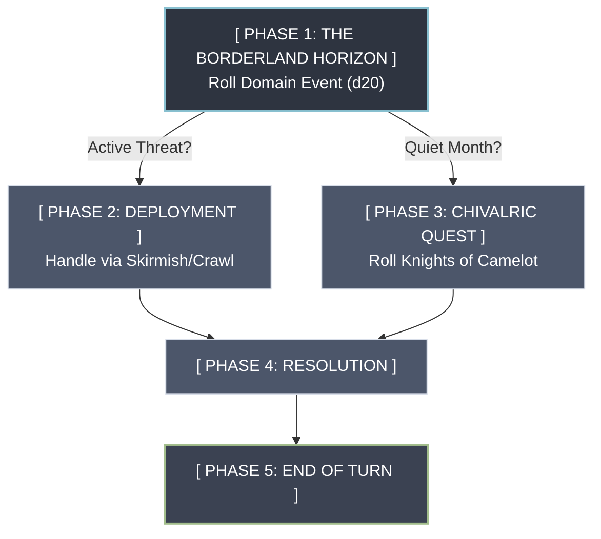
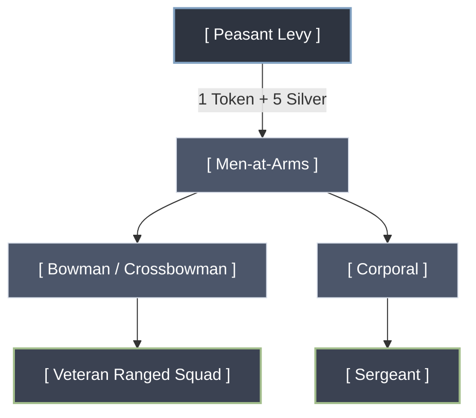

Time of Legends

The Prompt:

Using Hackmaster's Little Keep on the Borderland as a base of operations, I'm trying to create a hybrid skirmish/dungeon crawler/adventure light role playing game.  The idea is to have the player (or players) in charge of the keep as a Castellan.  (This will be a solo/cooperative style game.) The king, duke or baron (an NPC) actually has ownership of the keep.  I'm planning on using TSR's Knights of Camelot to create adventure ideas that the player (acting as the Castellan) will assign to knights under his command.  The idea is to use domain level play from the beginning, and yet be able to play a questing knight leading a lance.  Also, as an option the Castellan could assign tasks/adventures to non knights (huntsman, men-at-arms, or even rogues).  What I need next, is an event table for this domain which will provide seeds for adventures.  It should also include events for putting down peasant revolts, skirmishes with rival lords, hunting down briggands, escort missions, visiting heads of state, marriages, births, deaths, weather events, etc.  I'm also using Warhammer Fantasy Battles/Skirmish (in particular the Bretonnian army list) for the different levels of knights: Squire, Knight Errant, Knight of the Realm, Paladin (Castellan), Questing Knight, Grail Knight.  Non-knight, soldier progression should include: peasant levy, men-at-arms, corporal, sergeant, and bowmen or crossbowman. We alson may need auxiliries such as Huntsman, Wardens, church representatives (monks, priests, friars, etc).  For the economy and price lists, I'm using Chivalry and Sorcery's silver standard.  Knights of Camelot is the basic adventure generator but I am also planning on including tables from Warhammer Quest, especially Little Monk's town and travel events.  The character stats are a hybrid of Rackham's Confrontation (Attack, Strength, Defense, Toughness (Resistance), Aim (for shooting), Leadership (as per Warhammer Fantasy Battles) and Warhammer.  I also have stats for Virtue (tracked by using the Virtue Point system in Knights of Camelot), Honor (as in the Bretonnian Knight in Warhammer Quest) and Luck Points (for re-rolls).  I will also include a Divine Favor stat which would be used for calling upon Saints for miracles and temporary stat boosts.  The Divine Favor stat and mechanic is inspired by the PC game Darklands. The wound system comes from Rackham's Confrontation.  The setting is Arthurian/Amadis of Gaul/Orlando Furioso and especially Tirant lo Blanc.  Future plans: Monster locations, such as the Caves of Chaos need to be converted into a more Arthurian theme.  Fallen knights, fae incursions, demonic infestation, ghosts, etc.

The result:

This is an ambitious and well-thought-out game design concept. You have selected complementary systems to handle each pillar of gameplay.

Here is your design document reformatted and organized for maximum clarity and future development.

**Game Design Document: Hybrid Domain & Skirmish RPG**

**1. Core Gameplay & Structure**

- **Game Concept:** A hybrid solo/cooperative skirmish, dungeon crawler, and light role-playing game.
- **Player Role:** Players act as the **Castellan** managing a keep on the borderlands.
- **Political Structure:** The Castellan manages the keep, but a higher NPC authority (King, Duke, or Baron) owns it.
- **Gameplay Scope:** Domain-level management from day one, paired with tactical combat leading a lance of knights.

**2. Inspired Mechanical Pillars**

- **Base Map / Operations:** _Hackmaster's Little Keep on the Borderland_
- **Adventure Generation:** _TSR’s Knights of Camelot_ (core) and _Warhammer Quest_ (Town/Travel events).
- **Economy & Prices:** _Chivalry and Sorcery_ (Silver Standard).
- **Combat & Stats:** A hybrid of _Rackham’s Confrontation_ and _Warhammer Fantasy Battles_.

**3. Character Stat Blocks**

Characters use a hybrid system tracking seven core statistics:

- **Attack (ATT):** Hand-to-hand combat accuracy.
- **Strength (STR):** Damage dealt in melee.
- **Defense (DEF):** Ability to parry or evade.
- **Toughness/Resistance (RES):** Ability to soak damage.
- **Aim (AIM):** Missile and ranged accuracy.
- **Leadership (LD):** Morale and command capability (per WFB).

**4. Military & Agent Progression**

**The Knightly Order (Bretonnian Framework)**

1. **Squire:** Low-tier mounted or foot support.
2. **Knight Errant:** Eager, aggressive junior knights.
3. **Knight of the Realm:** Core noble defenders of the domain.
4. **Paladin (Castellan):** High-tier leaders and commanders.
5. **Questing Knight:** Elite wanderers hunting specific threats.
6. **Grail Knight:** Legendary champions with supernatural favor.

**Regular Soldiers (Non-Knights)**

- **Peasant Levy:** Untrained draft forces for emergencies.
- **Men-at-Arms:** Standard frontline infantry.
- **Bowmen / Crossbowmen:** Ranged squad support.
- **Corporal:** Junior squad leaders.
- **Sergeant:** Veteran infantry commanders.

**Domain Auxiliaries**

- **Huntsmen / Wardens:** Wilderness scouts and trackers.
- **Rogues:** Agents for covert tasks and subterfuge.
- **Church Representatives:** Monks, priests, and friars for spiritual and healing support.

---

**Domain Event & Adventure Seed Table (d20)**

Roll once per domain turn (e.g., monthly) to generate local crises, political shifts, or adventure seeds for your knights.

|   |   |   |
|---|---|---|
|**Roll**|**Event Type**|**Description & Adventure Seed**|
|**1**|**Peasant Revolt**|High taxes or famine cause a local village to rebel. Send troops to pacify them or negotiate.|
|**2**|**Rival Skirmish**|A neighboring lord disputes your border. A small force has crossed the river to seize land.|
|**3**|**Brigand Activity**|Outlaws are raiding supply lines. A lance must hunt down their hidden forest camp.|
|**4**|**Escort Duty**|A wealthy merchant or minor noble requires protection through dangerous border territory.|
|**5**|**Heads of State**|An envoy from the Duke arrives unannounced. The keep must host them, draining local food supplies.|
|**6**|**Royal Marriage**|A political alliance is struck. You must send a delegation and a costly gift from the treasury.|
|**7**|**Dynastic Birth**|A child is born to the ruling lord. A local tourney is held; your knights can compete for renown.|
|**8**|**Notable Death**|A veteran knight or local religious leader dies. Suspicion of foul play requires an investigation.|
|**9**|**Severe Weather**|A blizzard or flash flood cuts off travel. Sickness spreads; the Castellan must ration food.|
|**10**|**Monster Sighting**|A dangerous beast (from the Warhammer Quest tables) is terrorizing the local peasantry.|
|**11**|**Heretical Cult**|Dark rituals are reported in the nearby ruins. Church representatives demand a purge.|
|**12**|**Tax Harvest**|The King's tax collector arrives. You must protect him while extracting silver from the villages.|
|**13**|**Border Patrol**|A routine patrol spots scout tracks. Send a Huntsman and Squires to recon the area.|
|**14**|**Ancient Ruin**|A collapse in the dungeon levels reveals an old crypt. Classic dungeon crawl opportunity.|
|**15**|**Desertion**|A squad of Men-at-Arms has fled with keep equipment. Track them before they turn to banditry.|
|**16**|**Mercenary Influx**|A band of sellswords arrives looking for work. Cheap to hire, but they cause trouble in town.|
|**17**|**Miracle / Blessing**|A Grail Chapel reports a holy vision. Your knights gain a temporary Leadership bonus.|
|**18**|**Plague Outbreak**|A foul disease strikes the lower outer bailey. Isolate the infected or seek a magical cure.|
|**19**|**Poaching Crisis**|Peasants are hunting the Duke’s royal deer. Send Wardens to catch them or face the Duke's wrath.|
|**20**|**Grand Quest**|A direct order from the Baron. A Questing Knight must be dispatched on a long-distance mission.|

---

To help build out the next phase of this hybrid system, could you clarify:

- How do you want the **turn structure** to work (e.g., do players roll for domain events _before_ or _after_ sending knights on quests)?
- Are you looking for a **resolution system** for quests that are simulated/assigned to NPCs, or will you play out every adventure tactically?
- Do you need help designing the specific **combat resolution formulas** using that hybrid stat block?

This adds fantastic depth to your design. Incorporating _Darklands_-style saintly invocations and the gritty, tactical wound system from _Confrontation_ grounds your game perfectly in the Chivalric-Romance genre of _Tirant lo Blanc_ and _Orlando Furioso_.

Here is Part 2 of your design document, seamlessly reformatted and integrated with your core systems.

**Game Design Document: Hybrid Domain & Skirmish RPG (Part 2)**

**1. Spiritual & Metaphysical Stats**

Your game tracks four distinct non-combat metrics to simulate the moral and spiritual weight of chivalry:

- **Virtue:** Tracked via the _Knights of Camelot_ Virtue Point system. This measures your moral choices, purity, and adherence to the chivalric code.
- **Honor:** Derived from the _Warhammer Quest_ Bretonnian Knight. This measures your reputation, social standing, and military prestige among peers and the peasantry.
- **Luck Points:** A meta-currency pool used by players to force re-rolls during critical tactical moments or domain events.
- **Divine Favor:** Inspired by the PC game _Darklands_. This stat fluctuates based on religious devotion and is expended to pray to specific Christian Saints for active miracles or temporary stat boosts.

**2. Health & Combat Resolution**

- **The Wound System:** Utilizes _Rackham's Confrontation_ mechanics. Instead of a generic pool of Hit Points, combatants track specific wound severity states (e.g., Unhurt, Light Wound, Serious Wound, Critical Wound, Killed).
- **Impact:** Wounds cause cumulative, direct penalties to your core combat stats (ATT, DEF, STR, AIM) as a knight takes damage.

**3. Setting & Tone**

- **Primary Genre:** High Chivalric Romance and Mythic History.
- **Core Influences:** _Arthurian Legend_, _Amadis of Gaul_, _Orlando Furioso_, and the more grounded, tactical military realism found in _Tirant lo Blanc_.

---

**Mythic Conversion: Re-theming the Borderlands**

To shift classic high-fantasy modules (like _The Caves of Chaos_) into an Arthurian/Chivalric setting, replace standard monstrous humanoids with localized curses, fae terrors, and fallen nobility.

|   |   |   |
|---|---|---|
|**Classic Fantasy Tropes**|**Chivalric Romance Equivalents**|**Mechanical & Narrative Role**|
|**Orcs / Goblin Tribes**|**Fallen Knights & Outlaws**|Dishonored, excommunicated knights and mercenary lances holding fortresses in the wilderness.|
|**Kobolds / Troglodytes**|**Fae Incursions (Unseelie)**|Mischievous, malicious earth-sprites, boggarts, or changelings lurking in deep caves and woods.|
|**Undead / Skeletons**|**Restless Ghosts & Phantoms**|The spirits of unburied crusaders or murdered lords haunting ancient battlefields and crypts.|
|**Demons / Cultists**|**Demonic Infestations**|Sorcerers and corrupted hermits invoking infernal powers, requiring high **Virtue** and **Divine Favor** to purge.|
|**Dragon / Apex Monsters**|**The Questing Beast / Quest Monsters**|Unique, named mythological terrors that require a specific **Questing Knight** to be dispatched.|

---

**Chivalric Event Expansion (d10 Supplement)**

_Use this table alongside your core domain events to specifically trigger Arthurian, Fae, or Spiritual crises._

|          |                             |                                                                                                                                              |
| -------- | --------------------------- | -------------------------------------------------------------------------------------------------------------------------------------------- |
| **Roll** | **Event Type**              | **Description & Chivalric Adventure Seed**                                                                                                   |
| **1**    | **Fae Market**              | An eerie mist reveals a hidden marketplace. Items bought here grant massive stat boosts but cost **Virtue**.                                 |
| **2**    | **Fallen Challenge**        | A rogue Paladin sets up a pavilion at a local bridge. He refuses to let anyone pass unless beaten in a joust.                                |
| **3**    | **Saintly Apparition**      | A peasant reports a vision of a Saint. Visiting the site grants a permanent boost to **Divine Favor** if a shrine is built.                  |
| **4**    | **The Green Knight's Test** | A strange, supernatural knight rides into your courtyard, offering a dangerous wager of trading blows.                                       |
| **5**    | **Demonic Possession**      | A key NPC soldier (e.g., a Sergeant) begins acting erratically. Church representatives claim infernal influence.                             |
| **6**    | **Haunted Border post**     | A frontier watchtower is abandoned. Soldiers claim ghosts of a fallen lance are slaying guards at midnight.                                  |
| **7**    | **The Damsel's Appeal**     | A weeping maiden arrives at the keep. Her estate has been seized by a cruel neighbor; she begs for a champion.                               |
| **8**    | **Chivalric Feast**         | A nearby court hosts a grand festival. Attending boosts **Honor**, but leaving your keep unattended risks an ambush.                         |
| **9**    | **Relic Discovery**         | A Huntsman finds a holy relic in the wilderness. Bring it back to the chapel to gain a massive pool of **Divine Favor**.                     |
| **10**   | **Courtly Scandal**         | One of your Knights Errant is accused of a tryst that breaks their vows. Preside over a trial that will cost either **Honor** or **Virtue**. |

Here is the finalized **Bi-Weekly Domain Turn Structure** designed for your hybrid system.

**The Bi-Weekly Domain Turn Structure**

**Phase 1: The Borderland Horizon (Day 1 & Day 15)**

The Castellan checks the state of the fief. Roll 1d20 on your **Domain Event Table**.

- **If a Crisis Rolls (Rolls 1–15, e.g., Brigands, Revolts, Fae Incursions):** This becomes a _Pressing Event_. You must address it immediately. Proceed to **Phase 2**.
- **If a Neutral/Positive Event Rolls (Rolls 16–20, e.g., Births, Festivals, Blessings):** The borderlands are peaceful. Proceed to **Phase 3**.

**Phase 2: Garrison Deployment (Active Crisis)**

You must assemble a lance or squad to neutralize the threat.

- **Select the Commander:** Choose a Paladin, Knight of the Realm, or veteran Sergeant to lead.
- **Form the Lance:** Allocate your forces based on the threat (e.g., sending Wardens for poachers, or heavy Knights for a rival lord's skirmish).
- **Tactical Play:** Play out the tactical combat or dungeon crawl using your _Confrontation/Warhammer_ hybrid rules.
- _Skip Phase 3 and proceed directly to Phase 4._

**Phase 3: The Chivalric Quest (Quiet Month)**

With no pressing threats to the keep, your knights can seek glory, virtue, and honor.

- **The Camelot Board:** Roll on the _Knights of Camelot_ adventure tables to generate a classic chivalric quest (e.g., searching for a lost relic, rescuing a captured maiden).
- **The Journey:** Use your _Warhammer Quest_ travel tables to resolve random encounters on the way to the quest location.
- **Tactical Play:** Play out the quest location.

**Phase 4: Resolution & Accounting**

After the combat or quest concludes, update the ledger at the keep:

- **The Silver Toll:** Pay upkeep for your Men-at-Arms and collect any taxes or loot using the _Chivalry & Sorcery_ standard.
- **Chivalric Ledger:** Update the **Virtue** and **Honor** pools of the participating knights based on their deeds.
- **Casualties & Recovery:** Check the _Confrontation_ wound states of injured characters. Determine who recovers and who is permanently scarred.

**Phase 5: End of Turn**

Reset the calendar. Advance the game time by two weeks. If this was Day 1, repeat the loop for Day 15. If it was Day 15, advance to the next month and check for seasonal weather shifts.

---

To flesh out the mechanics of this loop, let me know:

- Should sending forces to a **Pressing Event** cost **Silver** for supplies, or do they live off the land while defending the domain?
- Do you want to establish a **garrison minimum** (e.g., a rule stating you must always leave at least 1 Sergeant and 10 Men-at-Arms behind to guard the keep)?
- Would you like to build out the **Virtue and Honor reward modifiers** for completing these events versus failing them?

**d100 Chivalric Domain Event Table## 01–15: Weather & Harvest (Impacts the Silver Economy)**

- 01–05: Blight or Drought. Peasant unrest increases by +1. Halve all domain tax income this month.
- 06–10: Torrential Rains. Rivers flood. All movement on the travel map is halved. No heavy cavalry deployment allowed in skirmishes this month due to deep mud.
- 11–15: Bountiful Season. Tax revenues increase by +25%. Domain Morale increases. Peasant revolt threshold drops.

**16–35: Peasantry & Outlaws (Internal Security)**

- 16–20: Brigand Ambush. A supply wagon is raided. Skirmish: Deploy a Squire or Knight Errant with a small lance to hunt down the brigands. Failure costs 100 Silver Pieces (sp).
- 21–25: Poachers in the Ducal Woods. Peasants are stealing the Duke’s game. Adventure Seed: Send a Knight of the Realm to dish out high justice. Choice: Execute them (gain Virtue, lose Peasant Loyalty) or conscript them (gain Bowmen recruits).
- 26–30: Heresy / Witchcraft. A dark cult takes root in a local hamlet. Dungeon Crawl: A Paladin or Questing Knight must lead a lance into a desecrated ruin to purge the cult leader.
- 31–35: Peasant Revolt! Heavy taxes or starvation trigger an uprising. Skirmish: The Castellan must deploy a force to crush the rebellion. Brutality lowers Honor but restores order; mercy risks a spreading rebellion.

**36–60: Feudal Politics & Rival Lords (External Threats)**

- 36–40: Boundary Dispute. A rival Baron’s knights move frontier markers. Skirmish: A border clash between Knights of the Realm. No heavy armor for the first d3 rounds as it is a sudden skirmish.
- 41–45: Escort Duty. A neighboring Countess is traveling through your lands. Adventure Seed: Escort her safely. Roll on the Warhammer Quest travel tables with a permanent +2 modifier to enemy ambush rolls.
- 46–50: Visit from the Duke. Your liege lord arrives to inspect the Keep. Costs 200sp to host a feast. Paladin must test Leadership. Success grants Divine Favor; failure lowers the Keep's political standing.
- 51–55: Diplomatic Marriage. The Duke arranges a marriage for one of your Knights of the Realm. Requires a 500sp dowry but secures an alliance, lowering the chance of "Rival Lord" events for 6 months.
- 56–60: Feud Declared. A slight at court leads a rival house to declare a private war. Expect raiding parties. Every month, roll a d6; on a 1–2, a border settlement is attacked.

**61–85: Chivalry, Virtue & The Grail (The Knightly Path)**

- 61–65: The Green Knight / Mysterious Challenger. A lone knight blocks a local bridge, challenging your best to single combat. Skirmish: 1v1 joust or duel using Confrontation wound mechanics. Winning grants massive Honor.
- 66–70: A Maiden’s Plight. A damsel arrives at the Keep seeking a champion to slay a monster. Knights of Camelot Adventure: A Knight Errant or Questing Knight must leave immediately to gain their spurs or advance their quest.
- 71–75: Holy Relic Discovered. Rumors of a Saint’s bone in a nearby barrow. Dungeon Crawl: Use Warhammer Quest tables. Securing the relic provides a permanent +1 to Divine Favor generation inside the Keep.
- 76–80: Passing Grail Knight. A legendary Grail Knight visits the Keep. All Squires and Knights Errant gain +1 Leadership for the next month due to pure inspiration.
- 81–85: Call to Crusade. The Duke orders a campaign abroad. The Castellan must send half the Keep's lances away for d6 months. Domain defense is weakened, but returning knights bring back hoard wealth in Silver.

**86–100: Life, Death & Dynastic Milestones**

- 86–90: Birth of an Heir. A Knight of the Realm celebrates a firstborn son. Costs 50sp for a tournament. All knights gain +1 Luck Point for the next adventure.
- 91–95: Death in the Line of Duty. An older Paladin or Advisor dies of illness or wounds. The Castellan must find a replacement. Lose -1 Domain Morale until a grand funeral (100sp) is held.
- 96–100: Grand Tournament. The Baron hosts a melee. The Castellan can enter his best knights. Use the Confrontation Attack/Defense stats for a bracketed tournament. Cash prizes in Silver and massive Honor updates for victors.

Your assumption is absolutely correct. In the High and Late Middle Ages, military logistics shifted away from the early feudal "serve for free for 40 days" model toward a professional, contract-based cash economy—perfectly matching your _Chivalry & Sorcery_ silver standard. [1, 2]

When a Castellan dispatched a force to deal with a crisis, it was an incredibly expensive endeavor that required advance funding, strict contract parameters, and careful supply management. [3, 4]

**1. How It Worked Nationally (The Chivalric Reality)**

- **The Cash Advance:** A commander (like your Paladin or Sergeant) was rarely expected to pay for an official campaign out of pocket. They signed an _indenture_ (a military contract) and were given a large lump sum of silver upfront. This money was used to pay the soldiers' initial wages and purchase bulk rations. [2, 5, 6, 7, 8]
- **The Logistics Train:** Armies did not just "live off the land" by foraging; that was a desperate last resort that slowed down troop movement. Instead, the cash advance was used to buy grain, cured meats, and ale from the home domain, which were loaded onto supply carts driven by camp followers. [3, 9, 10, 11, 12]
- **Living Off the Land:** Soldiers only "lived off the land" when crossing into _enemy_ territory to intentionally starve out the rival lord or punish rebellious peasants. Doing this in your own territory would destroy your own economy. [10, 13]

**2. Foraging vs. Provisioning in Your Domain**

To make this historical reality a fun, tactical choice for your **Phase 2: Deployment**, you can give the Castellan two choices when funding a lance:

- **Option A: Securely Provisioned (Historical Standard)**

- **The Cost:** The Castellan pays an upfront **Supply Cost in Silver** based on the size of the squad and distance.
- **The Benefit:** The troops travel fast, stay healthy, and maintain high morale. They gain a **+1 to Leadership** and suffer no attrition on the travel tables. [2]

- **Option B: Live Off the Land (Desperate / Cheap Measure)**

- **The Cost:** 0 Silver from the treasury.
- **The Consequence:** The squad must forage. You must roll on a dangerous "Foraging Table" during travel. Failure can cause **Light Wounds** (from starvation/spoiled food) or cause a **Peasant Unrest** check because your soldiers are stealing crops from your own villagers. [6, 9, 14]

**3. The Ransom and Plunder Incentive**

Historically, why did knights and soldiers gladly accept these dangerous missions? **Plunder and Ransoms**. Capturing a rival knight or an outlaw leader meant a massive payout. [15]

In your game, you can implement the historical **"Rule of Thirds"**: [15]

- 1/3 of all loot/ransom goes to the squad that found it.
- 1/3 goes to the Captain/Knight leading the lance.
- 1/3 goes directly back to your Keep's Treasury (The Castellan) to help fund the next expedition! [15]

---

If you like this tactical balance, let me know:

- Would you like to design a quick **Bulk Provisions Price List** based on your _Chivalry & Sorcery_ standard (e.g., how much silver it costs to feed a lance of 5 knights and 10 men-at-arms for a week)?
- Do you want to create a **Foraging Hazard Table** for when the Castellan decides to save money and forces troops to live off the land?
- Should **Virtue or Honor** be penalized if your knights are caught stealing food from your own peasants while foraging? [2, 6, 14]

[1] [https://www.quora.com](https://www.quora.com/How-were-soldiers-paid-during-medieval-times-Did-they-receive-gold-or-silver-coins-or-were-other-forms-of-payment-used-such-as-salt-or-wheat-What-was-the-average-salary-for-a-soldier-per-day-week-month-or-year)

[2] [https://www.scribd.com](https://www.scribd.com/document/993060865/Medieval-Soldiers-Daily-Wages-England)

[3] [https://www.medievalists.net](https://www.medievalists.net/2025/11/logistics-and-paperwork-in-early-medieval-warfare/)

[4] [https://www.medievalists.net](https://www.medievalists.net/2022/08/medieval-warfare-expensive-business/)

[5] [https://www.reddit.com](https://www.reddit.com/r/MedievalHistory/comments/1pyxvml/were_medieval_mercenaries_paid_before_or_after/)

[6] [https://en.wikipedia.org](https://en.wikipedia.org/wiki/History_of_military_logistics)

[7] [https://www.englishmartyrs.org](https://www.englishmartyrs.org/wp-content/uploads/sites/25/2022/09/History-Cognitive-Cue-Cards.pdf)

[8] [https://www.chinaknowledge.de](http://www.chinaknowledge.de/History/Terms/junxiang.html)

[9] [https://www.reddit.com](https://www.reddit.com/r/history/comments/71u9ob/how_did_leaders_in_medieval_periods_and_prior/)

[10] [https://history.stackexchange.com](https://history.stackexchange.com/questions/64100/did-medieval-armies-cultivate-resources-during-their-campaigns)

[11] [https://history.stackexchange.com](https://history.stackexchange.com/questions/64100/did-medieval-armies-cultivate-resources-during-their-campaigns)

[12] [https://www.reddit.com](https://www.reddit.com/r/AskHistorians/comments/2nf121/how_did_medieval_armies_handle_logistics_how/)

[13] [https://en.wikipedia.org](https://en.wikipedia.org/wiki/History_of_military_logistics)

[14] [https://historum.com](https://historum.com/t/medieval-army-logistic-problem.198325/)

[15] [https://www.youtube.com](https://www.youtube.com/watch?v=BHtBUDfI53I)

Here are the rules, tables, and price lists to integrate historical logistics, foraging risks, and chivalric consequences directly into your game’s **Phase 2: Deployment**.

**1. Bulk Provisions Price List (Silver Standard)**

Upkeep and supply costs are calculated **per week** for the entire deployment. These costs cover food, horse feed, weapon maintenance, and basic camp gear.

|   |   |   |
|---|---|---|
|**Unit Type**|**Weekly Supply Cost (Silver)**|**Historical Logistics Notes**|
|**Knight (Any Tier)**|**10 Silver**|Includes feed for a destrier, a palfrey, and a pack horse.|
|**Squire / Warden / Huntsman**|**5 Silver**|Includes feed for a single riding horse or scout mount.|
|**Professional Soldier** _(Sergeant, Bowman, Men-at-Arms)_|**2 Silver**|Standard infantry rations (ale, hardbread, salted pork).|
|**Peasant Levy**|**1 Silver**|Minimal subsistence rations; expected to bring their own basic bowl and spoon.|

- **The Castellan’s Advance:** Before a lance departs, calculate total weekly costs and multiply by estimated travel/combat weeks. Deduct this total from the keep’s treasury and hand it to the commander.

---

**2. Foraging Hazard Table (d10)**

If the Castellan refuses to pay the upfront Silver cost, or if a campaign goes on too long and supplies run out, the force must **Live Off the Land**. Roll 1d10 per week of foraging.

|   |   |   |
|---|---|---|
|**Roll**|**Foraging Outcome**|**Mechanical & Narrative Consequence**|
|**1**|**Starvation & Spoiled Rations**|The force eats rotten roots or bad water. Every character takes a **Light Wound** (per _Confrontation_ rules). **-2 to Leadership**.|
|**2**|**Desperate Pillarage**|Soldiers aggressively seize grain from your own domain's peasants. Immediately trigger a **Peasant Unrest Check**.|
|**3**|**Fae Trickery**|While foraging in deep woods, a Squire eats berries from a fae ring. The force loses 1d3 days wandering in circles.|
|**4**|**Strayed Mounts**|Horses break away looking for grass. Lose **1 Luck Point** or face a **-1 to combat Defense (DEF)** in the next skirmish due to missing gear.|
|**5**|**Lean Pickings**|Only basic forage is found. Troops are irritable and hungry. The force suffers **-1 to Aim (AIM)** due to fatigue.|
|**6**|**Fair Forage**|The hunters bring back wild game. The force gets by without losing health, but gains no bonuses.|
|**7**|**Bountiful Poaching**|The Huntsmen find a herd of deer. If they hunt them, the force is well-fed (**+1 to Strength** next battle). _See Chivalric Penalties below._|
|**8**|**Hidden Cache**|The scouts stumble upon an abandoned brigand camp filled with cured meats. Free supplies for the next 2 weeks!|
|**9**|**Local Hospitality**|A wealthy village elder welcomes the knights, feeding the men out of respect. Gain **+1 to Honor**.|
|**10**|**Saint's Blessing**|The force finds a pristine, holy spring. All existing **Light Wounds** are healed. Gain **+1 Divine Favor**.|

---

**3. Chivalric Penalties for Foraging**

Foraging is dirty, unglamorous work. In the medieval romance tradition, true knights do not steal from the weak. If a force is caught foraging or chooses to seize food, use these rules:

**Aggressive Seizure (Roll 2)**

- **The Penalty:** The Knight leading the lance immediately loses **2 Virtue Points** and **2 Honor Points**.
- **The Reason:** Chivalric law dictates a knight must protect the peasantry, not rob them.

**Poaching the Duke's Deer (Roll 7)**

- **The Choice:** The Castellan/Knight can choose to let the men eat the deer for a combat bonus, or forbid it to respect the law.
- **If they eat the deer:** The Knight loses **3 Honor Points** for violating the Duke’s forest laws. If a **Heads of State** event is rolled later, the Duke's envoy may demand a massive silver fine as punishment.

**The "Squire's Shield" (Optional Trait)**

- If the lance includes an active **Squire** or a **Huntsman**, you may re-roll any **1** or **2** on the Foraging Hazard Table. The commoners do the foraging quietly in the background, keeping the Knight's hands clean and preserving his **Virtue**.

---

To continue fleshing out this system, what should we focus on next?

- Do you want to build out the **Peasant Unrest Check** mechanic (e.g., how high unrest must get before it triggers an actual **Peasant Revolt**)?
- Would you like to map out the **"Rule of Thirds" Loot and Ransom Table** for when your knights successfully capture enemy nobles or brigand leaders?
- Should we design the **Saintly Invocations menu** using your **Divine Favor** stat?

Here are the rules and tables for managing **Peasant Unrest** and executing the historical **Rule of Thirds** for spoils and ransoms.

**1. The Peasant Unrest System**

Peasant Unrest is tracked as a domain-level metric from **0 to 100**. It represents the collective frustration of the lower classes due to heavy taxation, military exploitation, and lack of protection.

**Tracking Unrest**

- **Starting Value:** 10 Unrest (a baseline of typical medieval peasant complaints).
- **Triggers for Increase:**

- **+5 Unrest:** Forcing a force to "Live Off the Land" in your own domain.
- **+10 Unrest:** Rolling a "Desperate Pillage" on the Foraging Table.
- **+15 Unrest:** Losing a skirmish to brigands or a rival lord within your borders (showing you cannot protect them).

**The Unrest Check**

Whenever an event or action triggers an Unrest Check, roll **1d100**.

- If you roll **ABOVE** your current Unrest score, the peasants grumble but return to work.
- If you roll **EQUAL TO or BELOW** your current Unrest score, the tension boils over. Replace your scheduled Phase 1 Domain Event with an immediate **Peasant Revolt**.

**Quelling Unrest (The Castellan's Choices)**

During the **Phase 4: Resolution & Accounting** phase, the Castellan can attempt to lower Unrest:

- **The Bread and Ale Subsidy:** Spend **50 Silver** from the treasury to hold a market festival. **Reduces Unrest by 10**.
- **Almsgiving:** Sacrifice **5 Virtue Points** or **5 Divine Favor** to have church representatives distribute food and blessings. **Reduces Unrest by 15**.
- **Public Executions:** Publicly hang captured brigands or poachers. **Reduces Unrest by 5**, but costs **2 Virtue Points** for cruelty.

---

**2. The "Rule of Thirds" Loot & Ransom Table**

When a skirmish or dungeon crawl ends, aggregate the total value of all captured silver, gear, and prisoners. This total is split into three equal pools:

1. **The Fief’s Share (1/3):** Deposited directly into the Keep’s Treasury to fund future advancements and provisions.
2. **The Captain’s Share (1/3):** Given to the Knight leading the lance. This boosts their personal wealth and grants them **+1 Honor** per 50 Silver earned.
3. **The Men's Share (1/3):** Divided among the surviving Squires, Men-at-Arms, and Auxiliaries. If their share exceeds **5 Silver per man**, that unit gains **+1 Leadership** for their next battle due to high morale.

**Capturing Prisoners & Ransoms**

Defeated enemies are not always killed. When an enemy leader or knight is brought to a **Critical Wound** state or surrenders, they are captured. Roll 1d10 on the table below during Phase 4 to determine their ransom value based on the _Chivalry & Sorcery_ standard.

|   |   |   |   |
|---|---|---|---|
|**Roll**|**Captured Target Type**|**Ransom Value (Silver)**|**Chivalric & Narrative Condition**|
|**1-2**|**Brigand / Outlaw Leader**|**15 Silver**|No one will pay for his life. This value represents a bounty paid by the local merchants. You can hang him to lower Unrest.|
|**3-4**|**Wealthy Merchant Agent**|**50 Silver**|His merchant guild will pay the ransom within one month. If you release him without ransom, gain **+5 Virtue**.|
|**5-6**|**Enemy Squire / Veteran Sergeant**|**75 Silver**|His commanding lord will pay to get him back. Keeping him imprisoned costs **1 Silver/week** for basic bread and water.|
|**7-8**|**Knight Errant / Junior Noble**|**150 Silver**|His family will liquidate land to pay this. Refusing to feed him properly costs you **3 Honor Points**.|
|**9**|**Knight of the Realm / Rival Lord**|**300 Silver**|A massive windfall. While he is in your dungeon, your domain gains **+5 Honor** because your martial prestige skyrockets.|
|**10**|**Fae Lord / Corrupted Sorcerer**|**Special Relic**|They have no silver. They will offer a magical artifact, a localized blessing (**+10 Divine Favor**), or a secret map to a dragon’s lair to secure their release.|

---

Since you have the Divine Favor mechanics handled, what area should we develop next to support this campaign loop?

- Do you want to build out the **Confrontation Wound Chart** and map specific stat penalties to those wound levels?
- Would you like to create a **Garrison Recruitment & Training System** to show how a Peasant Levy upgrades into a Man-at-Arms, Corporal, or Sergeant?
- Should we design the **"Little Keep on the Borderland" Facility Upgrades** (e.g., building a Blacksmith to lower supply costs or a Chapel to aid your Divine Favor mechanics)?

Here is the **Garrison Recruitment & Training System** paired with the **Keep Facility Upgrades** for the Blacksmith and Chapel, fully integrated into your campaign’s economy and military progression.

**1. Garrison Recruitment & Training System**

To maintain your garrison, you can recruit raw talent from your domain and train them into hardened soldiers during **Phase 4: Resolution & Accounting**.

**Recruitment Costs**

You can hire fresh recruits from the local villages. Paying the recruitment fee covers their signing bonus, initial gear, and introduction to the barracks.

|   |   |   |
|---|---|---|
|**Unit Type [1]**|**Recruitment Cost (Silver)**|**Prerequisite / Limit**|
|**Peasant Levy**|**2 Silver**|Unlimited (drawn from the local populace).|
|**Men-at-Arms**|**10 Silver**|Requires a functioning **Blacksmith** to outfit them.|
|**Bowman / Crossbowman**|**12 Silver**|Requires a functioning **Blacksmith** for ammunition/arms.|
|**Huntsman / Warden**|**15 Silver**|Limit: Maximum of 3 active in the garrison at once.|
|**Church Representative**|**15 Silver**|Requires a functioning **Chapel**.|
|**Squire**|**25 Silver**|Must be attached to a specific Knight.|

**Veteran Training & Promotion**

Units do not automatically level up. Instead, after surviving a combat deployment or quest, a unit earns an **Experience Token**. During the accounting phase, you can spend Silver and these tokens to promote your soldiers along your historical tree. [2]

- **To Men-at-Arms:** Spend **1 Token + 5 Silver**. The Peasant trades their pitchfork for a spear and gambeson.
- **To Bowman / Crossbowman:** Spend **1 Token + 8 Silver**. The soldier is assigned to the archery range.
- **To Corporal:** Spend **2 Tokens + 15 Silver** on a Man-at-Arms. This elevates them to a junior squad leader.
- **To Sergeant:** Spend **3 Tokens + 30 Silver** on a Corporal. This creates a veteran commander capable of leading non-knight deployments independently.

---

**2. Keep Facility Upgrades**

The Little Keep on the Borderland starts with basic, weathered structures. You can reinvest the Fief’s Share of silver from your **Rule of Thirds** table into upgrading these two critical facilities.

**The Blacksmith**

_The soot-stained heart of the keep’s military readiness. A master smith keeps weapons sharp and armor fitted, directly mitigating the impact of grueling borderland campaigns._

- **Level 1: The Basic Forge (Starts Active)**

- _Effect:_ Allows the recruitment of standard Men-at-Arms and Ranged soldiers.

- **Level 2: The Armorer’s Guild (Upgrade Cost: 200 Silver)**

- _Effect: Bulk Logistics._ Your weekly supply costs for all Knights, Squires, and professional soldiers are **reduced by 1 Silver per man** due to efficient domestic equipment repair.

- **Level 3: Masterwork Foundry (Upgrade Cost: 500 Silver)**

- _Effect: Chivalric Pride._ Your weapons are of such legendary quality that all Knights and Sergeants outfitted here gain a permanent **+1 to Attack (ATT)** or **+1 to Defense (DEF)** (player's choice upon upgrading).

**The Chapel**

_A sanctuary of stone and stained glass dedicated to the Saints. It serves as the spiritual anchor for your knights' Virtue and your domain's Divine Favor mechanics._

- **Level 1: The Inner Ward Shrine (Starts Active)**

- _Effect:_ Allows the recruitment of Church Representatives (Monks, Priests, Friars).

- **Level 2: Consecrated Chapel (Upgrade Cost: 250 Silver)**

- _Effect: Spiritual Beacon._ When executing the **Almsgiving** action to lower Peasant Unrest, it only costs **3 Virtue/Divine Favor** instead of 5. Additionally, visiting the Chapel resets any negative morale modifiers on your troops.

- **Level 3: Saintly Reliquary (Upgrade Cost: 600 Silver)**

- _Effect: Heavenly Attunement._ The keep acquires a holy relic (e.g., a splinter of the True Cross or the bone of a martial saint). This unlocks your advanced _Darklands_-inspired **Divine Favor** mechanics, boosting your maximum pool size and granting a +2 bonus to all rolls made to invoke a Saint's miracle.

---

To continue refining the management of your borderland domain, let me know:

- Would you like to detail the specific **combat stats and special rules for Church Representatives** (e.g., how monks or priests support knights during a _Confrontation_ style skirmish)?
- Do you want to establish a **Garrison Upkeep System** where you must pay a baseline silver cost every month just to keep your soldiers from deserting?
- Should we create a **Tourney System** for when a "Dynastic Birth" or "Royal Marriage" event triggers, allowing your knights to win Honor and Silver in jousts?

[1] [https://www.youtube.com](https://www.youtube.com/watch?v=Dcgmfi8Idu8)

[2] [https://www.custompatchfactory.com](https://www.custompatchfactory.com/guides/acu-army-jacket-patch-placement-location-regulations)

**1. Church Representatives: Combat Stats & Special Rules**

Church representatives use your hybrid stat block but focus on spiritual fortification, morale, and treating wounds rather than raw offensive power. They use blunt weapons (maces, quarterstaffs) to avoid shedding blood, in keeping with historical ecclesiastical tradition.

**The Stat Blocks**

- **Monk / Friar (Support Specialist)**

- **ATT:** 2 | **STR:** 3 | **DEF:** 3 | **RES:** 3 | **AIM:** 1 | **LD:** 7

- **Priest (Spiritual Commander)**

- **ATT:** 3 | **STR:** 3 | **DEF:** 4 | **RES:** 4 | **AIM:** 1 | **LD:** 8

**Special Rules**

- **Spiritual Sanctuary (Passive):** Any friendly soldier within 6 inches of a Priest or Monk may use the cleric's **Leadership (LD)** score for morale and panic tests instead of their own.
- **Field Triage (Active):** Once per skirmish, during a lull in combat, a Monk or Priest can tend to a wounded comrade. Roll 1d10. On a 6+, they successfully stabilize a **Serious Wound**, reducing its severity to a **Light Wound** for the remainder of the battle.
- **Anoint the Shield (Active):** Before combat begins, a Priest can expend **3 Divine Favor** points from the domain pool to bless a knight’s lance. That knight gains **+1 to Defense (DEF)** for the duration of the skirmish.

---

**2. Garrison Monthly Upkeep System**

To prevent your standing army from drifting into banditry or deserting, you must pay a baseline retention wage at the end of every second bi-weekly turn (the end of the month). This is separate from the deployment supply costs and represents basic wages while staying at the barracks.

**Monthly Wage Ledger**

- **Sergeant:** 8 Silver
- **Corporal / Bowman / Crossbowman:** 4 Silver
- **Man-at-Arms / Huntsman / Warden:** 3 Silver
- **Monk / Friar / Priest:** 2 Silver (Paid as a tithe to the church)
- **Peasant Levy:** 0 Silver (They are returned to their farms at the end of a two-week turn; they do not draw a monthly wage). [1]

**The Consequence of Empty Coffers**

If you cannot pay your garrison's full monthly wages from the keep treasury:

- Units that go unpaid suffer a permanent **-2 to Leadership (LD)** for the next month.
- You must immediately make a **Peasant Unrest Check** with a **+10 modifier**, as unpaid soldiers begin extorting the local villagers for food and coin.

---

**3. Commercial & Economic Keep Upgrades**

Adding commercial facilities to the outer bailey or the surrounding village transforms your keep from a simple military bunker into a thriving economic hub. These upgrades generate passive monthly income and offer unique mechanical bonuses.

**The Keep Bakery**

_A massive stone oven ensuring the keep and the surrounding peasants are consistently fed. Grain from the fief is processed here into stable hardbread and rations._

- **Level 1: The Bread Ovens (Cost: 150 Silver)**

- _Effect: Ration Efficiency._ The cost to provision your deployments is streamlined. Reduce the weekly supply cost of **Peasant Levies and Men-at-Arms by 1 Silver** (to a minimum of 1 Silver for Levies).

- **Level 2: The Granary Vaults (Cost: 300 Silver)**

- _Effect: Siege Readiness._ If a **Severe Weather** or **Peasant Revolt** event cuts off supply lines, your keep can ignore the food rationing penalties for one full month.

**The Borderland Inn & Tavern**

_A lively establishment that attracts traveling merchants, weary pilgrims, sellswords, and low-born agents looking for coin._

- **Level 1: The Boar’s Head Tavern (Cost: 200 Silver)**

- _Effect: Passive Revenue & Rumors._ Generates **15 Silver** of passive income at the end of every month. Additionally, when rolling on the _Knights of Camelot_ adventure tables during a quiet month, you may roll twice and pick the quest you prefer.

- **Level 2: The Castellan’s Inn (Cost: 350 Silver)**

- _Effect: Elite Recruitment._ Generates **35 Silver** per month. The comfortable beds attract veteran talent. You can now recruit **Huntsmen and Wardens for 10 Silver** instead of 15, as they actively seek employment at the inn.

**The Frontier Trading Post**

_A fortified merchant stall that serves as the primary gateway for trade between the wild borderlands and the civilized heart of the kingdom._

- **Level 1: The Merchant's Scales (Cost: 250 Silver)**

- _Effect: Market Liquiditiy._ Generates **20 Silver** per month. When selling captured weapons, armor, or mundane loot recovered during quests, you receive **20% more Silver** from buyers.

- **Level 2: The Chartered Market (Cost: 500 Silver)**

- _Effect: Luxury Procurement._ Generates **50 Silver** per month. The trading post is grand enough to attract international spice and silk merchants. You can now directly spend Silver to purchase **Luck Points** at a rate of **100 Silver per 1 Luck Point** (maximum of 2 bought per month).

---

To continue building out this micro-economy and management loop, let me know:

- Should we design an **Accounting Worksheet/Ledger layout** to help you track your monthly income vs. garrison upkeep at the end of each month?
- Do you want to establish a **Taxation Mechanic** where your income scales based on how high or low your **Peasant Unrest** score is?
- Would you like to map out how **Church Representatives** interact with your _Darklands_-inspired **Divine Favor** mechanic during combat?

[1] [https://www.dragonsfoot.org](https://www.dragonsfoot.org/forums/viewtopic.php?t=76188)

Here is the comprehensive **Taxation Mechanic** showing how your peasant unrest directly impacts your keep's revenue, followed by a complete **Monthly Accounting Ledger** designed to track all your expenses—including your knightly ranks—and your commercial income.

**1. The Chivalric Taxation Mechanic**

Your tax revenue is collected once a month (at the end of every second bi-weekly turn). The base tax revenue generated by the villages, farms, and mills surrounding the Little Keep on the Borderland is **200 Silver**.

However, the peasants' willingness to pay—and their ability to harvest crops without sabotage—depends entirely on your **Peasant Unrest** score.

**The Unrest Tax Modifier Table**

At the end of the month, check your current Peasant Unrest score before calculating your tax revenue:

|   |   |   |   |
|---|---|---|---|
|**Current Unrest Score**|**Fief Status**|**Tax Revenue Modifier**|**Narrative & Mechanical Reality**|
|**0 – 15**|**Content**|**+25% (250 Silver)**|The fields are safe. Peasants gladly pay extra out of profound loyalty to the Castellan.|
|**16 – 40**|**Stable**|**100% (200 Silver)**|Standard medieval grumbling. Taxes are paid on time and in full.|
|**41 – 60**|**Tense**|**-25% (150 Silver)**|Minor sabotage, hidden grain caches, and foot-dragging reduce your tax collector's efficiency.|
|**61 – 80**|**Volatile**|**-50% (100 Silver)**|Widespread tax strikes. Collecting coin requires deploying Men-at-Arms, increasing local friction.|
|**81 – 100**|**Rebellious**|**0% (0 Silver)**|Complete economic collapse. The peasants refuse to pay. A **Peasant Revolt** is imminent.|

---

**2. The Keep’s Monthly Accounting Ledger**

Copy or print this ledger layout to process your finances at the end of every month. This ledger accounts for all baseline garrison costs, facility revenues, your tax brackets, and **the upkeep of your various knightly ranks**.

**Historical Note on Knightly Upkeep**

Knights do not receive a standard monthly "wage" like common foot soldiers; instead, they require **Stipends and Fief Maintenance**. Higher-ranking noble knights require larger stipends to maintain their heavy armor, retainers, squires, and warhorses in pristine, battle-ready condition.

---

**THE LITTLE KEEP ON THE BORDERLAND: MONTHLY LEDGER**

**Month:** _______________ | **Current Treasury Balance:** _______________ Silver

**SECTION A: INCOME (+)**

1. **Fief Tax Base:** 200 Silver
2. **Peasant Unrest Modifier:** ______ % (From the Tax Modifier Table)
3. **FINAL TAX REVENUE COLLECTED:** + ______ Silver
4. **Boar’s Head Tavern / Castellan’s Inn Revenue:** + ______ Silver (Level 1: 15 / Level 2: 35)
5. **Frontier Trading Post / Chartered Market Revenue:** + ______ Silver (Level 1: 20 / Level 2: 50)
6. **The Fief's Share of Loot/Ransoms:** + ______ Silver (Accumulated during the month)

- **TOTAL MONTHLY INCOME (Sum of Lines 3 to 6):** **+ ______ Silver**

---

**SECTION B: STANDING EXPENSES (-)**

**1. The Knightly Order Stipends**

- ____ **Squires** x 4 Silver each = ______ Silver
- ____ **Knights Errant** x 6 Silver each = ______ Silver
- ____ **Knights of the Realm** x 12 Silver each = ______ Silver
- ____ **Paladins / Castellans** x 20 Silver each = ______ Silver
- ____ **Questing Knights** x 15 Silver each = ______ Silver _(Reduced slightly as they travel/live light)_
- ____ **Grail Knights** x 0 Silver each = 0 Silver _(Purely spiritual; maintained by Chapel tithes)_

**2. Regular Soldier & Auxiliary Wages**

- ____ **Sergeants** x 8 Silver each = ______ Silver
- ____ **Corporals** x 4 Silver each = ______ Silver
- ____ **Bowmen / Crossbowmen** x 4 Silver each = ______ Silver
- ____ **Men-at-Arms** x 3 Silver each = ______ Silver
- ____ **Huntsmen / Wardens** x 3 Silver each = ______ Silver

**3. Spiritual Tithes & Mitigations**

- ____ **Monks / Priests / Friars** x 2 Silver each = ______ Silver
- **Keep Bakery Discount:** - ______ Silver _(If Level 1 is active, subtract 1 Silver per Man-at-Arms)_
- **Blacksmith Discount:** - ______ Silver _(If Level 2 is active, subtract 1 Silver per Knight/Soldier)_
- **TOTAL MONTHLY EXPENSES (Sum of Lines 1 to 3 minus Discounts):** **- ______ Silver**

---

**SECTION C: THE FINAL BALANCE**

- **Net Monthly Profit/Loss:** [Total Income] minus [Total Expenses] = **______ Silver**
- **NEW TREASURY BALANCE:** [Old Balance] + [Net Profit/Loss] = **______ Silver**

---

**THE GARRISON RECONCILIATION CHECK**

- Did you completely cover Section B? **[ YES ] / [ NO ]**
- _If NO:_ Enter a **-2 Leadership (LD)** penalty on all unpaid units next month and trigger an immediate **Peasant Unrest Check (+10 modifier)**.

---

To finalize the underlying operational loop of the keep, what should we build next?

- Prior to executing our next step, **how many total knights and soldiers** are currently starting in your garrison ledger?
- Do you want to build a **Seasonal Weather and Harvest Table** that adds random modifiers to your base tax income depending on the time of year (Spring planting vs. Winter blizzards)?
- Should we design the **Castle Defense and Siege rules** for when your Peasant Unrest fails completely or a rival lord brings a full army to your gates?

Let's convert your starting garrison of 230 soldiers into your game's military hierarchy, map out their monthly upkeep, and then dive into the **Seasonal Weather and Harvest Table**.

**Your Garrison Conversion & Monthly Budget**

Based on your exact troop counts, your starting garrison is a powerful, highly professional border force. Here is how they map to your specific unit tiers and what they will cost your keep's treasury each month:

- **1 Captain:** Maps to **Paladin / Castellan** (20 Silver/month) = **20 Silver**
- **4 Lieutenants:** Map to **Knights of the Realm** (12 Silver/month each) = **48 Silver**
- **30 Heavy Cavalry:** Map to **Knights Errant** (6 Silver/month each) = **180 Silver**
- **15 Sergeants:** Veteran infantry commanders (8 Silver/month each) = **120 Silver**
- **120 Bowmen/Crossbowmen:** Ranged squad support (4 Silver/month each) = **480 Silver**
- **60 Men-at-Arms:** Standard frontline infantry (3 Silver/month each) = **180 Silver**

**Total Baseline Standing Monthly Garrison Upkeep: 1,028 Silver.**

Because your starting army costs 1,028 Silver a month and your base tax revenue is only 200 Silver, you will need to aggressively hunt brigands, claim ransoms via the **Rule of Thirds**, invest in commercial upgrades (like the Inn and Trading Post), or unlock **Blacksmith Level 2** to heavily discount these costs and keep your army paid!

---

**The Seasonal Weather & Harvest Table**

Roll **1d10** once at the start of every season (every 3 months of game time). This roll simulates macro-environmental changes, affecting your baseline harvest, movement speeds, and tactical combat.

## Seasonal Domain Modifiers

|Roll|Spring|Summer|Autumn|Winter|
|---|---|---|---|---|
|1-2|Late Thaw (-25% Tax)|Drought (-50% Tax)|Early Frost (-25% Tax)|Deep Blizzard (-75% Tax) _(Roll 1-3)_|
|3-5|Gentle Rains (Base Tax)|Bumper Crop (+25% Tax) _(Roll 3-6)_|Golden Harvest (+50% Tax) _(Roll 3-7)_|Mild Frost (Base Tax) _(Roll 4-7)_|
|6-8|Mud Season (+10 Unrest)|Heat Wave (-1 AIM) _(Roll 7-9)_|Autumn Gales (-1 AIM) _(Roll 8-9)_|Dark Wolves (+1 Brigand Event) _(Roll 8-10)_|
|9-10|Perfect Sowing (+20% Tax)|Solstice Fair (+50 Silver) _(Roll 10)_|Saint's Feast (+5 DF) _(Roll 10)_|_(See above rows)_|

**🌸** **Spring: The Sowing Season**

- **1–2: Late Thaw:** The ground stays frozen too long. **Tax revenue drops by 25%** for the season.
- **3–5: Gentle Rains:** Standard conditions. Base tax is collected normally.
- **6–8: Mud Season:** Heavy rains turn roads into bogs. Movements on travel tables take twice as long. Peasants are miserable; **gain +10 Peasant Unrest**.
- **9–10: Perfect Sowing:** Ideal weather. Peasants work with immense energy. **Tax revenue increases by 20%** for the season.

**☀️** **Summer: The Campaign Season**

- **1–2: Severe Drought:** Crops wither in the fields. **Tax revenue is slashed by 50%**. Peasant Unrest increases by +15.
- **3–6: Bumper Crop:** Warm sun and steady rain. **Tax revenue increases by 25%**.
- **7–9: Heat Wave:** Armor becomes an oven. During tactical skirmishes, all Knights and Heavy Infantry suffer a **-1 penalty to Aim (AIM)** due to sweat and fatigue.
- **10: Midsummer Solstice:** A time of ancient joy. Traveling merchants flock to the keep. If you have an Inn or Trading Post, they generate an **extra +50 Silver** this season.

**🍂** **Autumn: The Harvest Season**

- **1–2: Early Frost:** Ruined crops right before harvest. **Tax revenue drops by 25%**.
- **3–7: The Golden Harvest:** The ultimate payout. Storehouses are completely full. **Tax revenue increases by a massive 50%** for the season.
- **8–9: Autumn Gales:** Blustering winds and driving horizontal rain. All ranged units suffer a **-1 penalty to Aim (AIM)** in skirmishes.
- **10: Saint’s Day Feast:** A deeply holy harvest celebration. Gain **+5 Divine Favor** and **+5 Honor** across the domain pool.

**❄️** **Winter: The Cruel Season**

- **1–3: Deep Blizzard:** Fief is entirely snowbound. **Tax revenue is slashed by 75%**. No quests or deployments can be sent out this season unless it is an emergency defense of the keep.
- **4–7: Mild Frost:** Standard cold. Base tax is collected normally, but foraging table rolls suffer a -2 modifier.
- **8–10: The Dark Wolves:** Starving wolves and desperate brigands descend from the mountains. Instantly trigger **one mandatory Brigand Activity event**, bypassing your normal bi-weekly roll.

---

Now that your army, economy, and seasonal mechanics are aligned, what would you like to build out next?

- Do you want to create a **Starting Roster Sheet** layout to map out your 5 named leadership characters (1 Captain, 4 Lieutenants) with their specific _Confrontation_ stats?
- Would you like to design the **Adventure Generation Tables** for when you roll a "Quiet Month" and switch over to the _Knights of Camelot_ style quests?
- Should we establish a list of specific **Saintly Invocations** that you can use your **Divine Favor** pool for now that we know how much it costs to run your keep?

**🛡️ Strategic Narrative Adjustment: Crown Subsidies & Border Economy**

Because the Little Keep on the Borderland stands as the primary shield against an aggressive enemy, the Crown cannot afford for it to fall. This completely changes your financial landscape and creates an engaging ultimate campaign goal: **Establish total regional security to safely transition the keep from a wartime footing to a peaceful, self-sustaining domain.**

**👑** **The Royal Borderland Subsidy**

- **The Crown's Payroll:** The King/Duke directly covers **75% of your standing garrison upkeep (771 Silver/month)** as long as the region remains a high-risk borderland threat zone.
- **The Castellan's Burden:** Your actual net monthly baseline garrison expense is reduced from 1,028 Silver to just **257 Silver/month**.
- **The Win Condition:** Once you clear out all major local threat zones (e.g., converting the _Caves of Chaos_ equivalents), peace is declared. The Crown subsidy drops to 0%, and you must safely decommission or dismiss your wartime soldiers down to a lean, self-sustaining peace-time operational garrison.

**🪙 Commercial Revenue: Gate Fees & Merchant Storage**

To help cover your remaining expenses, your outer bailey and gatehouses generate active trade income based on your keep's infrastructure:

- **Gate Entry Fees:** For every 10 Bowmen/Crossbowmen stationed on watch duty at the gates, you successfully extract **+10 Silver/month** from incoming travelers and peasants. With your 120 ranged troops, this provides a steady **+120 Silver/month**.
- **Merchant Secure Storage Vaults:** If you build the **Frontier Trading Post (Level 1)**, you can lease out secure, heavily guarded cellars inside the keep to merchants. This adds an additional **+30 Silver/month** of passive storage fees, scaling to **+75 Silver/month** at Level 2.

---

**📜** **The Starting Roster Sheet**

Use this template to track your named command officers. Their statistics use your hybrid system (_Rackham's Confrontation_ core combat mechanics paired with _Warhammer Fantasy Battles_ Leadership).

- **Wound Track Reminder:** _Unhurt (0)_ _➔_ _Light Wound (-1)_ _➔_ _Serious Wound (-2)_ _➔_ _Critical Wound (-3)_ _➔_ _Killed._

**⚔️** **The Castellan (Your Player Character)**

- **Name / Title:** Sir _______________, Paladin & Castellan of the Borderland
- **Stats:** ATT: 6 | STR: 5 | DEF: 6 | RES: 5 | AIM: 3 | LD: 9
- **Current Metrics:** Virtue: _____ | Honor: _____ | Luck Points: _____ | Divine Favor: _____
- **Equipment:** Masterwork Plate Armor (+2 RES, included), Holy Sword (+1 STR), Shield (+1 DEF).
- **Wound Status:** [ ] Unhurt | [ ] Light (-1) | [ ] Serious (-2) | [ ] Critical (-3) | [ ] Killed

**🐎** **The Lieutenants (Knights of the Realm)**

These four named knights each command a specific sub-lance of your 30 heavy cavalry and garrison infantry.

- **Lieutenant 1 (The First Lance):** Sir _______________

- _Stats:_ ATT: 5 | STR: 4 | DEF: 5 | RES: 4 | AIM: 2 | LD: 8
- _Wound:_ [ ] Unhurt | [ ] Light (-1) | [ ] Serious (-2) | [ ] Critical (-3)

- **Lieutenant 2 (The Second Lance):** Sir _______________

- _Stats:_ ATT: 5 | STR: 4 | DEF: 5 | RES: 4 | AIM: 2 | LD: 8
- _Wound:_ [ ] Unhurt | [ ] Light (-1) | [ ] Serious (-2) | [ ] Critical (-3)

- **Lieutenant 3 (The Infantry Gate-Guard):** Sir _______________

- _Stats:_ ATT: 5 | STR: 4 | DEF: 5 | RES: 4 | AIM: 2 | LD: 8
- _Wound:_ [ ] Unhurt | [ ] Light (-1) | [ ] Serious (-2) | [ ] Critical (-3)

- **Lieutenant 4 (The Scout Range-Master):** Sir _______________

- _Stats:_ ATT: 4 | STR: 4 | DEF: 4 | RES: 4 | AIM: 4 | LD: 8
- _Wound:_ [ ] Unhurt | [ ] Light (-1) | [ ] Serious (-2) | [ ] Critical (-3)

---

**🗺️ The Chivalric Adventure Generation Tables**

When your bi-weekly Domain roll results in a **Quiet Month (Rolls 16–20)**, the Castellan looks to the _Knights of Camelot_ records and the local tavern gossip to dispatch a lance on an elective, glory-seeking quest.

**Step 1: The Quest Catalyst (Roll 1d10)**

_Determines who or what brings the quest to the keep._

1. **A Weeping Maiden:** Arrives at the gate, begging for a champion to avenge her family.
2. **An Inward Pilgrim:** A monk brings word of a lost relic revealed in a fever-dream.
3. **A Royal Herald:** A decree from the Duke demanding a localized task be completed for regional glory.
4. **A Traitor’s Confession:** A dying outlaw reveals a location before his execution.
5. **A Fae Whisper:** A strange, glowing light appears on the castle battlements, pointing toward the wildwoods.
6. **A Local Woodsman:** A panicked huntsman maps out a location he stumbled upon while tracking game.
7. **An Ancient Map:** Discovered behind a loose stone block in the keep's chapel library.
8. **A Rival's Taunt:** A neighboring lord challenges your knights to achieve a feat of arms before his own men can.
9. **A Wandering Grail Knight:** Passes through the keep and leaves a cryptic prophecy of a trial nearby.
10. **A Vision in the Hearth:** The Castellan sees a specific geometric landmark in the fireplace flames.

**Step 2: The Core Quest Objective (Roll 1d10)**

_Generates the tactical mechanical goal of the adventure layout._

|   |   |   |   |
|---|---|---|---|
|**Roll**|**Quest Title**|**Narrative Goal**|**Mechanical Completion Reward**|
|**1**|**The Fallen Pavilion**|A dishonored knight has blocked a trade bridge. Challenge him to a formal joust/duel.|**+15 Honor**, Unlocks 1 Captured Mount, clears local trade lane.|
|**2**|**The Hermit's Holy Crypt**|Deep in the wilderness, an old chapel has been desecrated by heretics. Purge it.|**+10 Divine Favor**, **+5 Virtue**, yields 1 minor holy relic.|
|**3**|**The Captive Damsel**|A noblewoman is held hostage in a ruined watchtower by local outlaws.|**+20 Virtue**, **+100 Silver** reward from her grateful noble family.|
|**4**|**The Fae Font**|A magical spring has turned sour, blighting local crops. Confront the fae spirits.|**-15 Peasant Unrest**, restores local agricultural taxes back to normal.|
|**5**|**The Shattered Lance**|A previous patrol went missing. Locate their final stand, retrieve their bones and banner.|**+20 Honor** to the keep. Surviving troops gain **+1 Leadership (LD)**.|
|**6**|**The Merchant's Retribution**|A caravan was ambushed. Track the stolen luxury goods to a hidden cavern storage network.|**+150 Silver** worth of trade goods to liquidate at your Trading Post.|
|**7**|**The Haunted Cairn**|Restless ghosts of dead crusaders are rising from an ancient barrow. Purge the undead.|**+15 Divine Favor**. Monks/Priests gain 1 Experience Token.|
|**8**|**The Rogue Paladin**|A highly ranked knight has broken his vows, turning to dark sorcery and banditry. Slay or capture him.|**+30 Honor**, triggers a massive **Rule of Thirds** ransom payout roll.|
|**9**|**The Great Hunt**|A named legendary beast (e.g., the Calydon Boar or Questing Beast) has been sighted. Hunt it down.|**+15 Honor**. All participating Squires are promoted to Knights Errant for free.|
|**10**|**The Infiltration**|Send a team of Huntsmen and Rogues into enemy territory to map out an aggressive rival outpost.|Grants a permanent **+2 modifier** to your next 3 Domain Event rolls.|

**Step 3: Journey Hazards (_Warhammer Quest_ Style Travel, Roll 1d6)**

_Roll once while traveling to the Quest location to see how the wilderness treats your lance._

- **1–2: Ambush!** Outlaws attack from the brush. Play a quick, surprise skirmish. Ranged units cannot fire in the first combat round.
- **3–4: Lost in the Fens:** Boggy ground slows travel. The quest takes 1 extra week. You must deduct an additional week of supply costs from your treasury.
- **5–6: Chivalric Encounters:** You meet a traveling friar or a wandering knight. Spend 5 Silver to host them; gain **+2 Virtue** or **+2 Honor**.

---

To finalize the strategic systems governing your keep, what element should we flesh out next?

- Do you want to establish the **Peace-Time Operational Garrison Target** (the specific lower numbers you need to hit to win the campaign)?
- Would you like to build out the **Jousting / Dueling Resolution Formulas** for when your knights confront a "Fallen Pavilion" challenge?
- Should we design a **Merchant Taxation Table** that increases your income as you build more commercial facilities?

**1. The Peace-Time Operational Garrison Target**

To achieve your ultimate victory condition and pacify the borderlands, you must reduce regional threat levels until the King/Duke declares the border secure. When this occurs, the **Crown Subsidy drops from 75% to 0%**, and your keep must transition to a self-sustaining peacetime force.

To avoid economic collapse under the weight of an unpaid military, you must reduce your wartime army down to or below the **Peacetime Operational Target** while building up your commercial infrastructure.

**Peacetime Roster Adjustments**

- **The Standing Garrison:** Your professional army will shrink from 230 soldiers down to a lean **52-man security force**.
- **The Demobilization Rule:** During Phase 4 of any turn after peace is declared, you can safely decommission units. Decommissioned soldiers return to the civilian workforce, which **permanently lowers your base Peasant Unrest by 1 per 5 common soldiers dismissed**.

|   |   |   |   |   |
|---|---|---|---|---|
|**Rank / Tier**|**Wartime Capacity**|**Peacetime Target**|**Peacetime Role**|**Monthly Cost (Silver)**|
|**Paladin (Castellan)**|1|**1**|Fief Ruler & Administrator|20 Silver|
|**Knights of the Realm**|4|**1**|High Sheriff / Captain of the Guard|12 Silver|
|**Knights Errant**|30|**0**|Dispatched back to their family estates|0 Silver|
|**Sergeants**|15|**2**|Gate and Barracks Masters|16 Silver|
|**Bowmen / Crossbowmen**|120|**20**|Wall watchmen and gate tax collectors|80 Silver|
|**Men-at-Arms**|60|**25**|Standard local patrol guards|75 Silver|
|**Huntsmen / Auxiliaries**|0|**3**|Game wardens and wilderness scouts|9 Silver|

- **Peacetime Maintenance Total:** **212 Silver/month**.
- _Note:_ With your base tax of 200 Silver plus gate fees and merchant taxes, this peacetime budget allows your keep to run a completely self-sustaining financial surplus without any royal help.

---

**2. Chivalric Jousting & Dueling Resolution**

When a knight accepts a formal challenge (such as _The Fallen Pavilion_ quest or a tournament event), the battle is resolved using a dramatic, three-pass cinematic system based on your hybrid stat block. [1]

**Phase A: The Mounted Joust (3 Passes)**

Both knights charge at one another with lances. For each of the three passes, both players roll **1d10 + Attack (ATT) + Aim (AIM)**. Compare the results: [2]

1. **Win by 1–3 points (Glancing Hit):** The target's armor absorbs the blow. The target must roll **1d10 + Toughness (RES)** against a Damage value equal to the attacker's **Strength (STR) + 2**. If they fail, they take a **Light Wound**.
2. **Win by 4–6 points (Solid Strike):** The target is shaken. They take an automatic **Serious Wound** and must pass a **Leadership (LD)** test to avoid being unhorsed. [3, 4]
3. **Win by 7+ points (De-Horsed / Shattered Lance):** The target is violently blasted from their saddle. They take an automatic **Critical Wound** and the joust immediately ends.

- _If both knights survive all three passes in the saddle, the duel moves to the ground._

**Phase B: Ground Swordplay (The Skirmish Duel)**

If knights are unhorsed or survive the joust, they draw swords. Combat proceeds in rounds using a tactical flow: [5]

1. **The Attack Roll:** Attacker rolls **1d10 + ATT**. Defender rolls **1d10 + Defense (DEF)**. [6]
2. **Stat Penalties Apply:** Remember to apply your _Confrontation_ wound tracking modifiers dynamically to these rolls (Light = -1, Serious = -2, Critical = -3).
3. **Damage Resolution:** If the attacker wins the roll, subtract the defender's **Resistance (RES)** from the attacker's **Strength (STR)**.

- Result is **0 or less**: Glancing blow, no damage.
- Result is **1–2**: Inflicts a **Light Wound**.
- Result is **3–4**: Inflicts a **Serious Wound**.
- Result is **5+**: Inflicts a **Critical Wound**.

---

**3. The Merchant Taxation & Storage Table**

As your border keep becomes safer, merchants will pay premium rates to store their exotic goods, spices, and silks inside your heavily fortified vaults rather than risking outdoor warehouses.

Your monthly trade revenue expands dynamically based on your keep's commercial facility upgrades and your current safety rating:

[ Base Trade Tax ] ───► Apply Commercial Upgrades ───► Modify by Peasant Unrest ───► Total Revenue

**Monthly Commercial Revenue Generation**

At the end of the month, calculate your merchant revenue by adding up your infrastructure tiers and modifying the total by your **Peasant Unrest** bracket:

|   |   |   |
|---|---|---|
|**Commercial Infrastructure**|**Base Monthly Revenue**|**Special Merchant Benefit**|
|**Gate Fees (Wartime Guard)**|**+120 Silver**|Extracted from travelers by your 120 Bowmen.|
|**Frontier Trading Post (Level 1)**|**+20 Silver**|Allows standard buying and selling of basic arms.|
|**Trading Post Vaults (Level 2)**|**+75 Silver**|Secure storage leases for high-end merchant cartels.|
|**Boar's Head Tavern (Level 1)**|**+15 Silver**|Generates local coin from guards and visitors.|
|**The Castellan's Inn (Level 2)**|**+35 Silver**|Lodging taxes from wealthy guild masters.|

**The Security Multiplier**

Merchants will flee if the keep is unstable. Multiply your **Total Commercial Revenue** (the sum of the facilities above) by your security modifier before adding it to your treasury:

- **Peasant Unrest 0–15 (Content):** **120% Revenue.** Capital flies to your keep; merchants pay a premium for your legendary stability.
- **Peasant Unrest 16–40 (Stable):** **100% Revenue.** Standard trade flow.
- **Peasant Unrest 41–60 (Tense):** **75% Revenue.** Merchants begin bypassing the keep due to rumors of unrest.
- **Peasant Unrest 61+ (Volatile/Rebellious):** **25% Revenue.** Trade completely dries up. Vaults are emptied as merchants flee the impending revolt. [7, 8]

---

Given that your core campaign systems—ranging from wartime logistics and seasonal weather to chivalric duels and peacetime victory metrics—are now fully integrated, what foundational variables or design elements should we refine next to best prepare this system for your first playtest?

- Should we construct a **Sample Fief Ledger Example** demonstrating a complete monthly turn calculation using your starting 230-man garrison and a randomized weather event?
- Would you like to design a **Chivalric Recovery and Scarring Table** to determine if a knight permanently loses stats after sustaining a Critical Wound in a joust?
- Do you need an **NPC Outlaw & Rival Lord Stat Block Menu** to serve as baseline combatants for your skirmishes and dueling mechanics?

[1] [https://flashcards.world](https://flashcards.world/flashcards/sets/87ded537-25a9-4aca-b476-f43f565435f1)
[2] [https://redelf.narod.ru](https://redelf.narod.ru/w6/bretonnia/tilt_joust.html)
[3] [https://www.goonhammer.com](https://www.goonhammer.com/detachment-focus-black-spear-task-force/)
[4] [https://www.goonhammer.com](https://www.goonhammer.com/detachment-focus-null-maiden-vigil)
[5] [https://www.gamersdungeon.net](https://www.gamersdungeon.net/?m=202105)
[6] [https://fullmoonstorytelling.com](https://fullmoonstorytelling.com/2021/04/04/naval-skirmishes-and-battles-for-5e-dd/)
[7] [https://orientalempires.fandom.com](https://orientalempires.fandom.com/wiki/Unrest)
[8] [https://orientalempires.fandom.com](https://orientalempires.fandom.com/wiki/Unrest)

Here is the final suite of operational tools, tables, and examples to launch your first campaign playtest.

---

**1. Sample Fief Ledger Example (Turn Simulation)**

To demonstrate how these systems interlock, here is a complete end-of-month financial simulation.

**Setup & Assumptions**

- **Garrison:** Starting wartime force (230 men). Base upkeep is **1,028 Silver**.
- **Subsidies:** The 75% Crown Borderland Subsidy is active, reducing your out-of-pocket garrison cost to **257 Silver**.
- **Infrastructure:** The keep has built a **Boar’s Head Tavern (Level 1)** and a **Frontier Trading Post (Level 1)**.
- **Current Domain State:** Peasant Unrest is at **20 (Stable)**.
- **Seasonal Roll:** The Castellan rolls a 3 in Autumn: **The Golden Harvest (+50% Tax)**.

**The Accounting Process**

**SECTION A: INCOME (+)**

1. **Fief Tax Base:** 200 Silver
2. **Seasonal Modifier:** +50% (Golden Harvest) → 300 Silver
3. **Peasant Unrest Modifier:** 100% (Unrest is 20, so no penalty) → **Final Collected Tax:** +300 Silver
4. **Gate Entry Fees:** 120 Bowmen / 10 = 12 Watch Squads → +120 Silver
5. **Commercial Upgrades:** Tavern (+15 Silver) + Trading Post (+20 Silver) → +35 Silver
6. **Subtotal Commercial Revenue:** 120 (Gates) + 35 (Upgrades) = 155 Silver
7. **Security Multiplier Adjustment:** Unrest is 20 (Stable), so multiplier is 100% → **Final Commercial Income:** +155 Silver
8. **Loot & Ransoms:** The knights successfully cleared a brigand camp this month → +75 Silver

- **TOTAL MONTHLY INCOME:** 300 + 155 + 75 = **+530 Silver**

**SECTION B: STANDING EXPENSES (-)**

1. **Standing Garrison Baseline Upkeep:** -1,028 Silver
2. **Crown Borderland Subsidy:** +771 Silver (75% covered by the Duke)

- **NET CASTELAN OUT-OF-POCKET EXPENSE:** **-257 Silver**

**SECTION C: THE FINAL BALANCE**

- **Net Monthly Profit/Loss:** 530 (Income) - 257 (Expenses) = **+273 Silver**

_The treasury grows by 273 Silver this month! The Castellan can safely bank this coin or immediately reinvest it into upgrading the Trading Post to Level 2 next turn._

---

**2. Chivalric Recovery & Scarring Table**

When a character is brought to a **Critical Wound (-3)** state during a skirmish or a joust, they run the risk of permanent physical or psychological trauma. During Phase 4 (Accounting & Resolution), roll **1d10** for every critically wounded survivor to see how they heal.

|   |   |   |
|---|---|---|
|**Roll**|**Healing & Scarring Outcome**|**Permanent Attribute & Narrative Impact**|
|**1**|**The Mortal Wound**|The character succumbs to their injuries. They pass away peacefully. Lose **2 Honor** from the keep pool.|
|**2**|**Shattered Knee / Joint**|The character walks with a permanent, heavy limp. **Permanently lose -1 Defense (DEF)**.|
|**3**|**Blind in One Eye**|A splintered lance or blade caught their face. **Permanently lose -1 Aim (AIM)**.|
|**4**|**Crushed Sinews**|The grip is weakened. **Permanently lose -1 Strength (STR)**.|
|**5**|**Grievous Disfigurement**|Horrific facial scars. The knight can no longer participate in Courtly Romance quests. Lose **5 Honor**, but gain **+1 Attack (ATT)** due to a terrifying combat presence.|
|**6**|**Battle Fatigue (Shell Shock)**|The mind is fractured by the violence. **Permanently lose -1 Leadership (LD)**.|
|**7**|**Honorable Scars**|The wound heals cleanly, leaving a striking mark of veteran status. No stat penalties. Gain **+5 Honor**.|
|**8-9**|**Full Physical Recovery**|Through the grace of the church representatives and bedrest, the knight makes a full recovery. No penalties.|
|**10**|**Saintly Intervention**|A miraculous recovery occurs overnight. All penalties are ignored. The knight permanently gains **+1 Toughness/Resistance (RES)** or **+3 Divine Favor**.|

---

**3. NPC Enemy Stat Block Menu**

Use these pre-calculated stat blocks to populate your tactical encounters. They perfectly mirror your hybrid system (_Rackham's Confrontation_ core mechanics + _Warhammer Fantasy Battles_ Leadership).

**🪓** **Borderland Outlaws & Rebels**

- **Peasant Rebel (Pitchfork / Club)**

- _Stats:_ ATT: 2 | STR: 2 | DEF: 2 | RES: 2 | AIM: 1 | LD: 5
- _Rules:_ **Rabble:** Must make a Panic Test (using LD) if they lose more than half their squad in a single round.

- **Brigand Archer (Hunting Bow)**

- _Stats:_ ATT: 3 | STR: 3 | DEF: 3 | RES: 3 | AIM: 3 | LD: 6
- _Rules:_ **Skirmisher:** Gains +1 DEF when defending behind cover or inside forests.

- **Outlaw Rogue / Brigand Leader**

- _Stats:_ ATT: 4 | STR: 4 | DEF: 4 | RES: 4 | AIM: 3 | LD: 7
- _Rules:_ **Dirty Fighting:** Once per combat, may force a friendly knight to re-roll a successful DEF check.

**🛡️ The Aggressive Rival Lord's Vanguard**

- **Rival Man-at-Arms (Spear & Shield)**

- _Stats:_ ATT: 3 | STR: 3 | DEF: 4 | RES: 4 | AIM: 1 | LD: 7
- _Rules:_ **Shieldwall:** Gains +1 DEF against front-facing melee and missile attacks when standing adjacent to another friendly shield-user.

- **Rival Crossbowman (Heavy Steel Crossbow)**

- _Stats:_ ATT: 3 | STR: 3 | DEF: 3 | RES: 3 | AIM: 3 | LD: 7
- _Rules:_ **Armor Piercing:** Ranged attacks ignore 1 point of an elite knight's armor/Resistance (RES).

- **Rival Knight Errant (Mounted / Lance)**

- _Stats:_ ATT: 4 | STR: 4 | DEF: 4 | RES: 4 | AIM: 2 | LD: 8
- _Rules:_ **Impetuous:** Must always declare a charge if an eligible enemy target is within movement distance.

- **Rival Baron / Commander (Full Plate & Greatsword)**

- _Stats:_ ATT: 6 | STR: 5 | DEF: 5 | RES: 5 | AIM: 2 | LD: 9
- _Rules:_ **Crushing Blow:** Heavy melee strikes reduce the defender's effective Resistance (RES) by -1 point.

---

Your campaign framework is completely optimized and ready for deployment. To step into your first game turn, let me know:

- Do you want to roll your **very first bi-weekly Domain Event** right now to see if your campaign opens with a crisis or a peaceful month?
- Would you like to assign names to your **four Lieutenants** to anchor them onto your Roster Sheet?
- Do you want to establish the exact starting pool numbers for your **Virtue, Honor, and Luck points**?

To match your setting's blend of classic Arthurian legend, Carolingian romance (_Orlando Furioso_), and Iberian chivalric realism (_Tirant lo Blanc_), here are the names and localized background titles for your four Lieutenants.

You can copy these directly into your starting Roster Sheet:

**🐎** **The Command Roster**

- **Lieutenant 1 (The First Lance / Shock Cavalry Commander):**

- **Name:** Sir Gualterio of the Silver Fountain
- _Role:_ Leads your vanguard of heavy cavalry into the teeth of the enemy.
- _Stats:_ ATT: 5 | STR: 4 | DEF: 5 | RES: 4 | AIM: 2 | LD: 8
- _Wound Status:_ [ ] Unhurt | [ ] Light (-1) | [ ] Serious (-2) | [ ] Critical (-3)

- **Lieutenant 2 (The Second Lance / Heavy Cavalry Commander):**

- **Name:** Sir Amadis of the White Rock
- _Role:_ Commands your reserve cavalry lance, securing flanks and reinforcing breakthroughs.
- _Stats:_ ATT: 5 | STR: 4 | DEF: 5 | RES: 4 | AIM: 2 | LD: 8
- _Wound Status:_ [ ] Unhurt | [ ] Light (-1) | [ ] Serious (-2) | [ ] Critical (-3)

- **Lieutenant 3 (The Infantry Gate-Guard / Keep Defense Master):**

- **Name:** Sir Berngar the Steadfast
- _Role:_ Anchors the defenses of the keep, managing the 60 Men-at-Arms and organizing wall rotations.
- _Stats:_ ATT: 5 | STR: 4 | DEF: 5 | RES: 4 | AIM: 2 | LD: 8
- _Wound Status:_ [ ] Unhurt | [ ] Light (-1) | [ ] Serious (-2) | [ ] Critical (-3)

- **Lieutenant 4 (The Scout Range-Master / Auxiliary Commander):**

- **Name:** Sir Tirante of the Fens
- _Role:_ A lighter, swift-moving knight who coordinates the 120 Bowmen and Crossbowmen along the frontier borders.
- _Stats:_ ATT: 4 | STR: 4 | DEF: 4 | RES: 4 | AIM: 4 | LD: 8
- _Wound Status:_ [ ] Unhurt | [ ] Light (-1) | [ ] Serious (-2) | [ ] Critical (-3)

---

Now that your leadership is named, how would you like to proceed?

- Should we roll your **very first bi-weekly Domain Event** to kick off the campaign?
- Would you like to determine your keep's **starting pool** for **Virtue**, **Honor**, and **Luck** points?

**NPC Ruler Interactivity Table (D20)**

This table models the relationship between your Castellan and the higher authority (King, Duke, or Baron). Roll on this table at the start of each **Domain Turn** to determine the ruler's mood, demands, or occasional rewards.

|   |   |   |   |
|---|---|---|---|
|**D20**|**Event Type**|**Event Name**|**Mechanics & Narrative Effect**|
|**1**|**Crisis**|Auditing the Books|A royal tax collector arrives. Pay 15% extra silver tax or face a temporary **Leadership** penalty across the keep.|
|**2–3**|**Demand**|Royal Requisition|The Ruler demands your best squad of Men-at-Arms for an external war. They are unavailable for 1d4 turns.|
|**4–5**|**Demand**|The Unwanted Guest|The Ruler sends a troublesome, incompetent relative to the keep. You must assign a Knight to babysit them on quests.|
|**6–8**|**Challenge**|High Expectations|The Ruler demands you clear a specific threat on the Domain Event Table within 3 turns, or lose Favor.|
|**9–12**|**Neutral**|Distant Oversight|The Ruler is occupied with court politics elsewhere. No mechanical changes this turn.|
|**13–15**|**Boon**|Royal Subsidy|The Ruler sends a small chest of silver coin to reinforce the border. Add bonus silver to the keep's treasury.|
|**16–17**|**Boon**|Military Reinforcements|A seasoned Sergeant and 1d3 Crossbowmen arrive from the capital to reinforce your garrison for free.|
|**18–19**|**Favor**|Letter of Commendation|Your excellent management pleases the Ruler. The Castellan gains a permanent **+1 Leadership** bonus for the next 3 turns.|
|**20**|**Windfall**|Land Grant / Title|The Ruler officially expands your jurisdiction. Permanently reduce the silver upkeep cost of all Men-at-Arms by 10%.|

---

**Non-Knight Hierarchy & Auxiliary Leveling**

Unlike Knights who follow a path of chivalric glory and vows, non-knights level up through **experience, specialization, and bureaucratic appointment**.

Because your stats bridge _Confrontation_ and _Warhammer_, non-knights grow by gaining incremental stat bumps or unlocking specific tactical abilities.

**1. The Standard Infantry Path**

Peasant levies are cheap but fragile. If they survive, they can be formally retained as professional soldiers.

- **Peasant Levy:** Baseline stats. High risk of failing **Leadership** tests. If a Levy survives 2 combat encounters or scores a killing blow, they can be upgraded.
- **Man-at-Arms:** Paid in silver. Gains **+1 Defense** and **+1 Toughness** as they receive standard-issue armor and training.
- **Corporal / Sergeant:** Promoted from veterancy. They gain a **+1 Leadership** aura that stabilizes nearby Peasant Levies or Men-at-Arms in tactical skirmishes.

**2. The Specialist Auxiliary Paths**

To level up into an auxiliary role, a basic Man-at-Arms or Peasant Levy must be assigned to a specific **Master** at the keep (e.g., the Master of Hounds, the Warden, or the Keep Chaplain) and spend silver from the treasury for their specialized gear.

- **The Huntsman Path:** Upgraded from a standard Bowman.

- _Level Up Mechanic:_ Pay silver for woodsman gear.
- _Stat Bonus:_ Gains **+1 Aim** and the _Scout_ ability (allows them to deploy outside the standard deployment zone in _Warhammer Skirmish_).

- **The Warden Path:** Upgraded from a veteran Sergeant.

- _Level Up Mechanic:_ Requires the Castellan to formally grant them a border-patrol jurisdiction.
- _Stat Bonus:_ Gains **+1 Attack** and a tracking ability that grants a re-roll on the Domain Event Table when hunting down Brigands.

- **The Church Representative Path:** Recruited directly from the keep's chapel using silver tithes.

- _Level 1 (Monk/Friar):_ No combat capability, but grants a **+1 Leadership** bonus to any squad they accompany due to spiritual fervor.
- _Level 2 (Priest):_ Upgraded by paying a silver tithe to the cathedral city. They gain a basic holy prayer mechanic (similar to _Warhammer Quest_ blessings) to heal wounded Knights or soldiers between skirmish rounds.

---

To keep refining this system, let me know:

- Do you want a **favor tracking system** (e.g., a numerical score) to determine how the Ruler reacts to you over time?
- Should non-knights have a **maximum cap** on their stats so they never accidentally become stronger than a Knight of the Realm?
- Do you need a system for **permanent injuries or death** for soldiers who fall in the dungeon crawler segments?

**The Favor System (The Ruler's Metric)**

The Castellan tracks their standing with the NPC ruler using a numerical value called **Favor**. This score represents your political capital, reliability, and standing at court.

**Favor Scale & Thresholds**

Your Favor score fluctuates between **0 and 20**. The game starts at **10 (Neutral)**.

- **0 to 4: Disgraced.** The Ruler actively distrusts you. You suffer a **-2 modifier** on the _NPC Ruler Interactivity Table_. At 0 Favor, the Ruler dispatches a royal executioner or a replacement Castellan (Game Over conditions apply).
- **5 to 9: Neglected.** You are underperforming. You suffer a **-1 modifier** on the _NPC Ruler Interactivity Table_.
- **10 to 14: Neutral.** You are fulfilling basic duties. Roll on the table normally.
- **15 to 19: Favored.** The court speaks highly of you. You gain a **+1 modifier** on the _NPC Ruler Interactivity Table_. [1]
- **20: Right Hand.** You are fiercely trusted. You gain a **+2 modifier** on the table. You may spend 5 Favor at any time to automatically veto and re-roll an unfavorable _Domain Event Table_ result.

---

**Integrating Favor with the Interactivity Table**

Apply your current Favor modifier directly to your D20 roll on the **NPC Ruler Interactivity Table** from our previous discussion.

- _Example:_ If your Favor is 17 (+1 modifier) and you roll a 14, your final result is 15 (**Royal Subsidy**).

---

**How to Gain and Lose Favor**

**Gaining Favor**

- **Fulfill Royal Challenges:** Successfully clearing an assigned threat from the _Domain Event Table_ within the time limit yields **+2 Favor**.
- **Financial Tithing:** Sending an extra 20% of your domain's seasonal silver income directly to the capital as a "gift" yields **+1 Favor**.
- **Host Dignitaries:** Successfully managing a "Visiting Head of State" event without incident yields **+1 Favor**.
- **Knightly Glory:** If a Questing Knight under your command successfully slays a major Monster Incursion or retrieves a Holy Relic, gain **+1 Favor** as tales reach the court.

**Losing Favor**

- **Fail Royal Challenges:** Ignoring or failing an explicit demand from the Ruler yields **-2 Favor**.
- **Default on Taxes:** Failing to pay the required silver tax during an audit yields **-2 Favor**.
- **Unrest Escalation:** Allowing a Peasant Revolt to persist on the map for more than two consecutive domain turns yields **-1 Favor** per turn.
- **Losing Royal Assets:** If the "Unwanted Guest" (the Ruler’s incompetent relative) gets killed or permanently crippled on a quest, immediately lose **-3 Favor**.

---

[1] [https://thepegeek.com](https://thepegeek.com/2022/08/alternate-hand-wall-test/)

Here is the fully integrated **Master Domain Event Table (D100)**.

To merge the systems, the _Chivalric Event Expansion_ has been woven directly into the table. When you roll a result that dictates a **Chivalric Crisis**, you will immediately roll a secondary **d10** to determine the exact Arthurian, Fae, or spiritual event that occurs.

**Master Domain Event Table (D100)**

|   |   |   |   |
|---|---|---|---|
|**D100 Roll**|**Event Category**|**Event Name**|**Adventure Seed / Mechanical Effect**|
|**01–10**|**Civil Unrest**|Peasant Revolt|Discontent over taxes. Deploy a lance to put down the rebellion or negotiate.|
|**11–15**|**Civil Unrest**|Poaching Epidemic|Peasants are depleting the Lord's game. Send Huntsmen or Wardens to catch them.|
|**16–22**|**Military Threat**|Rival Lord Skirmish|A neighbor disputes your border. Intercept their raiding party on the frontier.|
|**23–30**|**Military Threat**|Brigand Infestation|Outlaws are robbing merchants. Hunt down the brigand camp in the wilds.|
|**31–35**|**Military Threat**|Monster Incursion|Beastmen or orcs spotted nearby. Send a Questing Knight to purge the threat.|
|**36–45**|**Chivalric Trigger**|**Chivalric Crisis (Odd)**|**Roll 1d10 on the Chivalric Table below.** Mystical Fae or deep spiritual forces disrupt the domain.|
|**46–50**|**Logistics**|Escort Mission|A wealthy merchant caravan requires safe passage through the borderlands.|
|**51–54**|**Logistics**|Supply Shortage|Rot or rats destroyed grain stores. Buy food using the Silver Standard or face unrest.|
|**55–60**|**Diplomacy**|Visiting Head of State|A foreign noble visits. Spend silver on a feast to gain favor, or risk a political snub.|
|**61–70**|**Chivalric Trigger**|**Chivalric Crisis (Even)**|**Roll 1d10 on the Chivalric Table below.** Arthurian challenges, tests of honor, or courtly drama arrive at your gates.|
|**71–74**|**Dynastic**|Noble Marriage|An opportunity to marry off a knight. Requires an escort mission to the wedding.|
|**75–78**|**Dynastic**|Heir Born|The NPC Ruler celebrates a birth. Pay a mandatory tithe or send a grand gift to gain Favor.|
|**79–82**|**Dynastic**|Grim Bereavement|A key knight or local religious leader dies. High risk of morale/Leadership penalties.|
|**83–86**|**Religious**|Holy Relic Discovered|A Friar finds a relic nearby. Send a lance to secure it before heretics claim it.|
|**87–91**|**Weather**|Severe Winter / Drought|Travel and movement on the map are halted. Men-at-arms require double upkeep.|
|**92–95**|**Weather**|Flash Flood|Bridges are washed out. The keep is cut off from trade for 1d6 turns.|
|**96–00**|**Windfall**|Wandering Errant|A lone Knight Errant arrives at the keep looking for a quest. Free recruitment turn.|

---

**Secondary Roll: Chivalric Event Expansion (d10 Sub-Table)**

_Triggered when rolling **36–45** or **61–70** on the master table._

|   |   |   |
|---|---|---|
|**d10 Roll**|**Event Type**|**Description & Chivalric Adventure Seed**|
|**1**|**Fae Market**|An eerie mist reveals a hidden marketplace. Items bought here grant massive stat boosts but cost Virtue.|
|**2**|**Fallen Challenge**|A rogue Paladin sets up a pavilion at a local bridge. He refuses to let anyone pass unless beaten in a joust.|
|**3**|**Saintly Apparition**|A peasant reports a vision of a Saint. Visiting the site grants a permanent boost to Divine Favor if a shrine is built.|
|**4**|**The Green Knight's Test**|A strange, supernatural knight rides into your courtyard, offering a dangerous wager of trading blows.|
|**5**|**Demonic Possession**|A key NPC soldier (e.g., a Sergeant) begins acting erratically. Church representatives claim infernal influence.|
|**6**|**Haunted Border Post**|A frontier watchtower is abandoned. Soldiers claim ghosts of a fallen lance are slaying guards at midnight.|
|**7**|**The Damsel's Appeal**|A weeping maiden arrives at the keep. Her estate has been seized by a cruel neighbor; she begs for a champion.|
|**8**|**Chivalric Feast**|A nearby court hosts a grand festival. Attending boosts Honor, but leaving your keep unattended risks an ambush.|
|**9**|**Relic Discovery**|A Huntsman finds a holy relic in the wilderness. Bring it back to the chapel to gain a massive pool of Divine Favor.|
|**10**|**Courtly Scandal**|One of your Knights Errant is accused of a tryst that breaks their vows. Preside over a trial that will cost either Honor or Virtue.|

---

If you'd like to expand this system further, let me know:

- Do you want to define specific **Virtue and Honor mechanics** for these chivalric events?
- Should we design a **Dungeon Exploration table** for when a knight enters a cave or ruins during an incursion?
- Do you need a set of **quick combat rules** for handling the jousts mentioned in the Fallen Challenge?

**Honor & Virtue Systems**

To support the Arthurian themes of _Knights of Camelot_ and the Bretonnian-inspired knight hierarchy, your domain tracks two separate spiritual currencies: **Honor** (social reputation) and **Virtue** (personal, spiritual purity).

Knights use these pools to qualify for promotions, resist the _Confrontation_-style **Demonic Possession** event, or survive encounters with Fae entities.

**The Core Mechanics**

- **Pool Limits:** Honor and Virtue both scale from **0 to 20**. They begin at **10**.
- **Honor (The Public Eye):** Represents adherence to feudal law, bravery in formal combat, and loyalty to the Castellan and NPC Ruler.
- **Virtue (The Soul):** Represents personal purity, mercy, piety, and resistance to the corrupting influences of the Fae or dark magic.

**Mechanical Impacts on Knights & Soldiers**

|   |   |   |
|---|---|---|
|**Score Range**|**Honor System Effects**|**Virtue System Effects**|
|**16–20 (Exemplary)**|**+1 Leadership** aura for the knight. Lowers silver recruitment costs of Men-at-Arms by 10%.|Knight gains **+1 Toughness/Resistance** against magic and demonic entities.|
|**6–15 (Standard)**|Standard stats. No modifiers.|Standard stats. No modifiers.|
|**0–5 (Tarnished)**|**-1 Leadership** penalty. Squires refuse to serve this knight; promotion to next tier is locked.|Knight cannot benefit from Church Representative blessings or healing.|

**Gaining & Losing Honor and Virtue**

- **Gain Honor:** Defeating the _Fallen Challenge_ paladin in a formal joust (+2), attending the _Chivalric Feast_ (+1), or hunting down brigands (+1).
- **Lose Honor:** Ignoring _The Damsel's Appeal_ (-2), executing prisoners (-1), or failing a royal challenge from the NPC Ruler (-2).
- **Gain Virtue:** Donating found holy relics to the Church (+3), building a shrine at the _Saintly Apparition_ site (+2), or resisting a temptation at the _Fae Market_ (+1).
- **Lose Virtue:** Buying corrupting items at the _Fae Market_ (-3), covering up a _Courtly Scandal_ (-2), or deploying _Peasant Levies_ as intentional meat-shields (-1).

---

**Dungeon Exploration Table (D20)**

When a knight leading a lance pursues a _Monster Incursion_, tracks brigands to their lair, or investigates the _Haunted Border Post_, use this tactical dungeon exploration table to map out their crawl before resolving combat.

|   |   |   |
|---|---|---|
|**D20 Roll**|**Exploration Room / Encounter**|**Tactical & Mechanical Challenge**|
|**1–3**|**Guarded Threshold**|Standard _Warhammer Skirmish_ combat against 1d6 basic enemies (goblins, brigands, or cultists).|
|**4–5**|**Hidden Spike Trap**|The lead character must pass an **Aim/Agility** test. Failure deals a **Strength 4** hit bypassing defense.|
|**6–7**|**Desecrated Shrine**|A church representative can cleanse this room. Success grants **+1 Virtue** to the lance. Failure triggers an ambush.|
|**8–10**|**The Twisting Catacombs**|The squad becomes lost. The leader must pass a **Leadership** test or the lance suffers **-1 Attack** next round due to fatigue.|
|**11–12**|**Abandoned Armory**|A cache of old steel. Spend a turn searching to find a weapon upgrade that grants **+1 Attack** for one Man-at-Arms.|
|**13–14**|**Fae-Touched Grotto**|A glowing pool. Drinking restores all lost wounds but requires a **Virtue** check. Fail the check and lose 1 point of permanent Virtue.|
|**15–16**|**Chained Captives**|Peasants locked in cages. Freeing them immediately ends any active _Peasant Revolt_ modifiers on your Domain map.|
|**17–18**|**The Reliquary**|A hidden safe guarded by an elite monster. Defeating it yields a holy relic (**+3 Virtue** or heavy Silver Standard value). See note 1|
|**19**|**Treasure Hoard**|A massive chest of old coin. Add 2d6 x 10 Silver Standard pieces directly to the keep's treasury.|
|**20**|**The Lair of the Beast**|Boss encounter. Face the leader of the incursion (e.g., a Chaos Champion or Orc Warboss) with a **+1 Defense** bonus for the enemy.|

Note 1:

In the context of your economic system from _Chivalry & Sorcery_, the **Silver Standard value** represents the pure bullion or market worth of the relic if you choose to sell it rather than donate it to the church.

This introduces a direct strategic choice for the Castellan between spiritual power and economic survival:

- **Option A: The Pious Choice (Donate to the Church)**

- **Effect:** You turn the relic over to your Keep Chaplain or Friar.
- **Reward:** You gain **+3 Virtue** or a massive pool of **Divine Favor**.
- **Best Used For:** Boosting your knights' resistance to magic, curing a **Demonic Possession** event, or qualifying a Questing Knight for promotion to a Grail Knight.

- **Option B: The Pragmatic Choice (Liquidate to the Silver Standard)**

- **Effect:** You melt the relic down, sell it to a visiting merchant, or pawn it off to finance your domain.
- **Reward:** You immediately add a significant sum of silver coins (e.g., 200–500 silver pieces, depending on your exact price lists) straight into the keep's treasury.
- **Best Used For:** Paying off a sudden royal tax audit from the NPC Ruler, purchasing specialized gear to upgrade a Man-at-Arms into a Warden, or covering the weekly upkeep costs of your garrison.
- **Penalty:** Doing this may trigger a loss of **-1 Virtue** or anger the local church representatives if they find out.

To help you balance these two options, let me know:

- Do you want to establish an exact **Silver Standard upkeep cost** for your garrison so you know how much a massive silver payout is worth?
- Should selling a relic trigger a specific **roll on the Church Rep table** to see if your Monks or Friars discover your greed?
- Do you need a list of **magical or political benefits** that keeping the relic in your own keep's chapel provides without donating it?

**Garrison Upkeep Costs (Silver Standard)**

Managing your borderlands keep requires paying your garrison weekly or seasonally using _Chivalry & Sorcery_'s silver standard. If you cannot afford your upkeep, troops will mutiny, desert, or trigger a **Peasant Revolt**.

|   |   |   |
|---|---|---|
|**Unit Profile**|**Base Upkeep (per Turn)**|**Logistic Penalty for Defaulting**|
|**Peasant Levy**|1 Silver|Immediately deserts.|
|**Bowman / Crossbowman**|3 Silver|Refuses to shoot; **Aim** stat drops to 0.|
|**Man-at-Arms**|5 Silver|Mutinies; joins the nearest **Brigand Infestation**.|
|**Corporal / Sergeant**|8 Silver|Loses their **Leadership** aura bonus.|
|**Huntsman / Warden**|10 Silver|Stops patrolling; rolls on the _Domain Event Table_ get a -2 penalty.|
|**Squire**|4 Silver|Refuses to polish armor; Knight's **Defense** drops by -1.|
|**Knight (Errant / Realm)**|15 Silver|Loses **-1 Honor**. Refuses to deploy on quests.|
|**Paladin (Castellan)**|0 Silver|(Paid directly by the NPC Ruler's court).|

---

**Church Discovery Table (D6)**

If you choose to liquidate a holy relic for silver instead of donating it, the Keep Chaplain, Monks, or Friars might discover your greed. Roll a **D6** immediately upon selling a relic.

|   |   |   |
|---|---|---|
|**D6 Roll**|**Discovery Outcome**|**Mechanical Punishment / Effect**|
|**1**|**Blind Eye**|The clergy remains completely oblivious. You keep all the silver with no penalty.|
|**2**|**Suspicious Whispers**|Rumors spread. Church representatives refuse to accompany your squads for 2 turns.|
|**3**|**pious Blackmail**|A Friar catches you. You must pay a 25% "hush money" tithe or lose **-2 Honor**.|
|**4**|**Divine Disfavor**|Word reaches the Bishop. Lose **-2 Virtue**. All active knights suffer **-1 Leadership** next turn.|
|**5**|**Altar Stripped**|The Chaplain publicly denounces your greed. You lose **-3 Virtue** and **-1 Favor** with the Ruler.|
|**6**|**Interdict / Excommunication**|Total spiritual lockdown. No unit can receive blessings or healing until you build a new shrine.|

---

**Keep Chapel Relic Benefits**

Instead of selling the relic or fully donating it to the wider church hierarchy, you can permanently mount the relic inside your keep's personal chapel. This locks away its immediate silver value but provides powerful static domain buffs.

**1. The Shroud of Saint Agilbert**

- **Domain Passive:** All wounded Knights and Sergeants resting at the keep recover from injuries twice as fast.
- **Tactical Buff:** Any Church Representative deploying from this keep gains +1 to their Holy Prayer rolls.

**2. The Splinter of the True Lance**

- **Domain Passive:** Enhances the garrison's resolve. The Castellan gains a permanent **+1 Leadership** bonus while inside the keep.
- **Tactical Buff:** All Knights Errant and Knights of the Realm gain **+1 Attack** during the first round of any skirmish.

**3. The Chalice of Tears**

- **Domain Passive:** Fae entities detest its presence. Suppress the **Fae Market** and **The Green Knight's Test** results on the _Chivalric Event Table_ (treat them as a re-roll).
- **Tactical Buff:** Any soldier or knight within 6 inches of a Church Representative automatically passes their first failed **Toughness / Resistance** test.

---

To tie all these advanced elements together for your alpha playtest, let me know:

- Do you want a **quick spreadsheet-style Turn Sequence** sheet to show exactly when to collect taxes, pay upkeep, and roll events?
- Should we design the **Jousting & Dueling sub-system** next to resolve the _Fallen Challenge_ and _Green Knight's Test_ encounters?
- Do you need a set of **combat stat blocks** for your basic Peasant Levy and Knight Errant using your hybrid rules?

---

To continue expanding your system rules, let me know:

- Do you want a structured **Jousting & Dueling sub-system** to handle those specific Knight-vs-Knight challenges?
- Should we design **special abilities or rules profiles** for the highest knightly tiers (like the Paladin or Grail Knight)?
- Do you need a **Silver Standard upkeep table** to calculate how much managing the keep costs you every turn?

Limiting **Virtue, Honor, and Luck points** exclusively to **Heroes** perfectly aligns your game with the design philosophies of _Mordheim_ and _Path to Glory_. This cleanly separates the exceptional individuals who drive the narrative from the rank-and-file soldiers who act as fodder or operational support.

Here is the classification system defining who qualifies for these heroic mechanics, alongside rules for how a Non-Hero can beat the odds and rise to stardom.

**1. The Hero vs. Non-Hero Classification**

**🌟** **Heroes (Track Virtue, Honor, Luck, and Divine Favor)**

These characters are individuals of status, unique talent, or noble blood. They possess individual names, track injuries on the _Recovery and Scarring Table_, and are the only characters who can utilize Luck re-rolls or personal Chivalric stats.

- **The Castellan (Your PC)**
- **The Four Lieutenants** _(Sir Gualterio, Sir Amadis, Sir Berngar, Sir Tirante)_
- **Questing Knights & Grail Knights** _(When hired or appearing via events)_
- **Priests** _(High-tier church representatives who can actively channel Divine Favor)_

**🛡️ Non-Heroes (Standard Group Profiles)**

These units represent the rank-and-file garrison. They do not have personal names, do not track Virtue or Honor, and use standard group-based casualty rules. If they hit a Critical Wound state, they are simply removed from play at the end of the skirmish unless a Hero uses an ability to save them.

- **Squires & Knights Errant** _(Junior tiers acting as retainers)_
- **Sergeants, Corporals, Men-at-Arms, and Ranged Troops**
- **Huntsmen & Wardens**
- **Monks & Friars** _(Low-tier spiritual support)_

---

**2. The "Path to Glory" Promotion Rule (Non-Hero To Hero)**

In classic _Mordheim_ fashion, an exceptional deed on the battlefield can elevate a common soldier or junior knight into a fully tracked **Hero**.

During **Phase 4: Resolution & Accounting**, look at the performance of your Non-Heroes during the tactical skirmish. If a specific unnamed model accomplished a major feat, roll **1d10** on the **Promotion Table**:

**Feat Triggers (Choose one to roll)**

- A **Squire** or **Knight Errant** strikes the final blow against an enemy Leader or Rogue Paladin.
- A **Sergeant** or **Corporal** successfully passes a solo morale check and holds an objective alone against multiple enemies.
- A single **Man-at-Arms** or **Bowman** rolls a maximum damage strike that instantly neutralizes a high-threat enemy target.

**The Promotion Table (d10)**

|   |   |   |
|---|---|---|
|**Roll**|**Promotion Outcome**|**Mechanical & Narrative Transformation**|
|**1–4**|**Local Renown**|The soldier is rewarded with **15 Silver** from the captain's share. They remain a Non-Hero but start their next battle with a permanent **+1 to Leadership (LD)**.|
|**5–7**|**The Knight's Favor**|The soldier is given an individual name and officially becomes a **Hero**. They gain a baseline pool of **1 Luck Point** and **5 Honor**.|
|**8–9**|**The Shield Raised**|If a common soldier (Man-at-Arms/Sergeant): They are elevated to the nobility and become a **Knight Errant (Hero Status)**. If already a junior knight: They are promoted to a **Knight of the Realm**. Gain **1 Luck**, **5 Virtue**, and **10 Honor**.|
|**10**|**Chosen of the Saint**|The character experiences a miraculous battlefield awakening. They become a **Hero**, instantly heal all wounds, and gain **2 Luck Points**, **10 Virtue**, and **5 Divine Favor**.|

---

With the Hero distinction locked in, your campaign core is fully mapped out. How would you like to launch the first turn?

- Should we establish the **starting pool sizes** of Virtue, Honor, and Luck for your Castellan and four Lieutenants?
- Would you like to generate your **very first bi-weekly Domain Event** to set the narrative stage?

**The Domain Turn Sequence**

Run through these six phases in order at the start of every game session to manage your keep, economy, and event generation before diving into tactical skirmishes.

+-----------------------------------------------------------------------+

|                       THE DOMAIN TURN SEQUENCE                         |

+-----------------------------------------------------------------------+

|                                                                       |

|  [PHASE 1: INCOME & TAXATION]                                         |

|  Collect baseline silver income from the Little Keep's domain.        |

|                                                                       |

|  [PHASE 2: GARRISON UPKEEP]                                           |

|  Pay silver upkeep for all active knights, soldiers, and auxiliaries. |

|                                                                       |

|  [PHASE 3: THE RULER'S VOICE]                                         |

|  Roll 1D20 on the NPC Ruler Interactivity Table (apply Favor mods).   |

|                                                                       |

|  [PHASE 4: DOMAIN EVENTS]                                             |

|  Roll D100 on the Master Domain Event Table (+ 1D10 Chivalric Table). |

|                                                                       |

|  [PHASE 5: COMMAND & DEPLOYMENT]                                      |

|  Assign lances to quests, upgrade veterans, or hire new recruits.     |

|                                                                       |

|  [PHASE 6: RESOLUTION (THE CRAWL)]                                    |

|  Play out tactical Dungeon Exploration rooms and Warhammer Skirmishes.|

|                                                                       |

+-----------------------------------------------------------------------+

---

Here is the sequence converted into a clean markdown table:

## The Domain Turn Sequence

|Phase|Title|Description|
|---|---|---|
|1|Income & Taxation|Collect baseline silver income from the Little Keep's domain.|
|2|Garrison Upkeep|Pay silver upkeep for all active knights, soldiers, and auxiliaries.|
|3|The Ruler's Voice|Roll 1D20 on the NPC Ruler Interactivity Table (apply Favor mods).|
|4|Domain Events|Roll D100 on the Master Domain Event Table (+ 1D10 Chivalric Table).|
|5|Command & Deployment|Assign lances to quests, upgrade veterans, or hire new recruits.|
|6|Resolution (The Crawl)|Play out tactical Dungeon Exploration rooms and Warhammer Skirmishes.|

If you want to flesh this system out, let me know:

- Do you need to generate the NPC Ruler Interactivity Table?
- Should we design the Master Domain Event Table?
- Do you need templates for Garrison Upkeep costs?

I can help you build out any of these mechanics for your game.

**Initial Hybrid Combat Stat Blocks**

These baseline stat profiles fuse Rackham’s _Confrontation_ values with _Warhammer Fantasy Battles_ combat paradigms. Since you are utilizing the _Full Tilt_ jousting rules for knightly duels, these stats map perfectly into that framework's charge and combat resolutions.

**Peasant Levy**

_The cheapest, most expendable fodder in the domain. They rely entirely on numbers and the proximity of a commanding knight._

- **Attack:** 2
- **Strength:** 3
- **Defense:** 2
- **Toughness (Resistance):** 3
- **Aim:** 2
- **Leadership:** 5
- **Special Rules:**

- _Rabble:_ Must always use the **Leadership** value of the nearest Knight or Sergeant within 6 inches if available.
- _Fragile Will:_ If they lose a round of combat in a skirmish, they must immediately pass a Leadership test or flee the battlefield.

**Knight Errant**

_A young noble eager to prove their bravery. Highly aggressive, but prone to reckless charges._

- **Attack:** 3
- **Strength:** 4 (5 on the turn they charge with a lance)
- **Defense:** 4
- **Toughness (Resistance):** 4 (Includes heavy armor/barding)
- **Aim:** 0 (Knights do not utilize ranged weaponry)
- **Leadership:** 7
- **Special Rules:**

- _Impulsive Charge:_ If an enemy is within charge range during a _Warhammer Skirmish_, the Knight Errant must pass a **Leadership** test or be forced to declare a charge.
- _Chivalric Code:_ Gains a +1 bonus to **Attack** when engaged in a formal 1-on-1 challenge against an enemy leader or champion.

---

To continue fleshing out your rulebook, let me know:

- Do you need stat blocks for the **specialist auxiliaries** (the Huntsman and the Warden)?
- Should we design the **Divine Favor pool mechanics** used by the church representatives to cast blessings?
- Do you want a system to track **Keep Fortifications** (e.g., spending silver to repair walls or upgrade towers to lower brigand raid risks)?

**Auxiliary Stat Blocks (Hybrid System)**

These specialized units do not belong to the nobility but possess specialized wilderness and garrison training. They bridge the gap between fragile peasant levies and heavy knights.

**Huntsman**

_Expert woodsmen and trackers who secure the domain's frontiers and keep the lord's forests clear of poachers and beasts._

- **Attack:** 2
- **Strength:** 3
- **Defense:** 3
- **Toughness (Resistance):** 3
- **Aim:** 4
- **Leadership:** 6
- **Special Rules:**

- _Skirmisher:_ When targeted by ranged attacks in a dungeon or skirmish, they gain a +1 bonus to their **Defense** if any cover is present.
- _Scout Deployment:_ May deploy outside the standard deployment zone in tactical skirmishes, capturing key choke points early.

**Warden**

_Hardened border-patrol veterans tasked with maintaining the security of the keep's immediate jurisdictions and outposts._

- **Attack:** 3
- **Strength:** 3
- **Defense:** 4
- **Toughness (Resistance):** 4 (Equipped with reinforced brigandine armor)
- **Aim:** 2
- **Leadership:** 7
- **Special Rules:**

- _Border Patrol:_ When a Warden is active in your garrison, you may re-roll any **Poaching Epidemic** or **Brigand Infestation** results on the Master Domain Event Table.
- _Hold the Line:_ Gains +1 **Defense** when defending a doorway, bridge, or fortification wall.

---

**Keep Fortification Upgrades**

The Castellan can reinvest silver from the treasury directly into the architecture of the _Little Keep on the Borderlands_. Upgrading your infrastructure mitigates the severity of specific random events and secures your domain level play.

+--------------------------------------------------------------------------+
|                        KEEP FORTIFICATION MENU                           |
+--------------------------------------------------------------------------+
|  CURRENCY: Silver Standard (C&S)                                         |
+--------------------------------------------------------------------------+
|                                                                          |
|  [1] REINFORCED CURTAIN WALLS                                            |
|      Cost: 250 Silver                                                    |
|      Effect: Permanently reduces the threat of Peasant Revolts. If a     |
|              Revolt triggers, it takes 4 turns to breach instead of 2.   |
|                                                                          |
|  [2] WATCHTOWER BEACONS                                                  |
|      Cost: 150 Silver                                                    |
|      Effect: Grants early warning against wilderness threats. You may    |
|              re-roll any Monster Incursion event result.                 |
|                                                                          |
|  [3] MOAT AND DRAWBRIDGE                                                 |
|      Cost: 300 Silver                                                    |
|      Effect: Attacks from Rival Lord Skirmishes suffer a permanent -1    |
|              modifier to enemy Attack stats during siege encounters.     |
|                                                                          |
|  [4] EXTENDED GRANARY SILOS                                              |
|      Cost: 200 Silver                                                    |
|      Effect: Completely immune to the "Supply Shortage" event on the     |
|              Master Domain Event Table.                                  |
|                                                                          |
|  [5] FORTIFIED GARRISON BARRACKS                                         |
|      Cost: 175 Silver                                                    |
|      Effect: Reduces the weekly upkeep cost of all Men-at-Arms and       |
|              Sergeants by 1 Silver piece (minimum cost of 1 Silver).     |
|                                                                          |
+--------------------------------------------------------------------------+

---

Here is the menu converted into a clean markdown table for easy reading:

## Keep Fortification Menu

Currency: Silver Standard (C&S)

|#|Upgrade|Cost|Effect|
|---|---|---|---|
|[1]|Reinforced Curtain Walls|250 Silver|Permanently reduces the threat of Peasant Revolts. If a Revolt triggers, it takes 4 turns to breach instead of 2.|
|[2]|Watchtower Beacons|150 Silver|Grants early warning against wilderness threats. You may re-roll any Monster Incursion event result.|
|[3]|Moat and Drawbridge|300 Silver|Attacks from Rival Lord Skirmishes suffer a permanent -1 modifier to enemy Attack stats during siege encounters.|
|[4]|Extended Granary Silos|200 Silver|Completely immune to the "Supply Shortage" event on the Master Domain Event Table.|

To help you track your domain stats, tell me:

- What is your current Silver total?
- Are you dealing with any active threats right now?
- Do you need a layout for a domain tracking sheet?

I can help you build the perfect tracker for your campaign.

To push your hybrid design to a completely playable alpha stage, let me know:

- Do you want a worksheet for **tracking individual Knight injuries and scars** when they drop to 0 wounds in a dungeon?
- Should we design the **Divine Favor pool mechanics** for Church Representatives to cast blessings/miracles?
- Do you need a baseline **D100 Market Price List** based on your silver standard for buying weapons, shields, and warhorses?

In the Middle Ages, the titles of **Huntsman** and **Warden** (alongside related titles like _Forester_ or _Woodward_) carried massive administrative, ecological, and economic responsibilities. The "forest" was not just a collection of trees; it was a highly legally regulated zone of resources reserved for the nobility. [1, 2, 3]

Here is a breakdown of their secondary jobs, how their roles overlapped, and how you can use this to create unique mechanical abilities for your skirmish campaign.

---

## 1. The Medieval Huntsman: Secondary Responsibilities

Beyond tracking stags and coordinating the hounds for a lord’s recreational outing, the professional huntsman was a highly skilled master of the wilderness. [3, 4]

- **Apex Predator Control:** Huntsmen were actively responsible for culling dangerous predators that threatened the fief's livestock or peasantry. If a pack of starving wolves or a massive, aggressive wild boar began terrorizing a local village, it was the huntsman's official duty to track and kill it. [3]
- **Military Scouting and Reconnaissance:** Because huntsmen possessed peerless terrain assessment, woodcraft, and mapmaking skills, wartime lords used them as military scouts. They charted hidden paths, located fresh water sources for marching armies, and monitored enemy troop movements in dense brush. [5]
- **Animal Husbandry & Master of Kennels:** A primary "day job" for a huntsman was breeding, training, and caring for the lord's expensive hunting hounds. They managed the diet, medical care, and tactical commands of scent-hounds, greyhounds, and mastiffs. [4, 6]
- **The Ritual Meat Processing (The Breaking):** It was a major social faux pas for a noble lord to get messy cutting up a carcass. The huntsman was a master butcher, trained in the highly precise ritual division of the animal (known as "the breaking" or "unlacing") to prepare and salt meat for the keep’s larder. [7, 8]

---

## 2. The Medieval Warden: Secondary Responsibilities

A Warden (often acting as a _Chief Forester_ or _Verderer_) was a law enforcement officer and property manager first, and a woodsman second. [1, 9]

- **Timber and Resource Taxation:** Trees were medieval gold. Wardens monitored lumber cutting. They negotiated the sale of timber to shipbuilders or carpenters, and collected fees for _Estover_ (the right of peasants to gather dead firewood). [2, 9, 10]
- **Agricultural Pasture Policing (_Agistment_):** Peasants were forbidden from letting their livestock wander into the lord’s woods without paying. Wardens fined peasants who illegally let their pigs root for acorns (_Pannage_) or grazed their cattle in protected clearings. [1, 9, 10]
- **Land Encroachment Audits (_Assarting_):** Wardens constantly patrolled boundaries to ensure local peasants weren't subtly moving fences, clearing trees to create illegal farmland (_Assarting_), or building unlicensed structures inside the lord's territory. [1, 10]
- **Border Patrol & Thief Takers:** Wardens possessed the legal authority to arrest vagabonds, escaped serfs, and highwaymen. If a notorious gang of outlaws took refuge in the deep woods, the Warden would organize and lead an armed expedition of Men-at-Arms to root them out. [11]

---

## 3. Where Their Jobs Overlapped

Because both professionals lived and worked in the same deep woods, their paths crossed constantly, occasionally creating a natural professional rivalry or a powerful alliance:

- **The Anti-Poaching Overlap:** While it was the Warden’s _legal_ duty to arrest poachers, it was the Huntsman's _practical_ duty to keep the deer population healthy for the next hunt. Huntsmen would report signs of illegal snares, campfire ash, or missing game to the Warden.
- **Winter Wildlife Conservation:** During brutal winter blizzards, both the Huntsman and the Warden worked together to keep the local deer herds from dying out. They built brush shelters and carried winter feed deep into the forest to protect newly-born calves.
- **The Border Skirmish Force:** If a rival lord launched a sudden border raid through the wilderness, the Huntsman used their tracking skills to locate the enemy force, while the Warden used their legal/military authority to muster local woodsmen and form an immediate ambush party. [3, 9]

---

## 🛠️ Game Mechanic Integration for Your RPG

To give these two auxiliary types distinct tactical identities in your game, you can grant them unique passive traits based on these historical duties:

## The Huntsman (The Predator Hunter & Scout)

- **Passive Trait: _Vanguard Tracker_.** If a deployment squad includes a Huntsman, you ignore the "Lost in the Fens" hazard on the Journey Travel Table.
- **Combat Ability: _Cull the Beast_.** Gains a **+1 Attack (ATT)** and **+1 Strength (STR)** modifier when fighting monsters, wild animals, or named "Apex" creatures.

## The Warden (The Forest Law Enforcer)

- **Passive Trait: _Timber Revenue_.** For every active Warden staying at the keep during Phase 4 Accounting, your base monthly trade/resource revenue increases by **+5 Silver** due to strict timber and pasture taxation.
- **Combat Ability: _Thief Taker_.** When fighting Outlaws, Rebels, or Brigands, the Warden gains **+1 Defense (DEF)** and their melee attacks cause an automatic morale/panic test on the target if a wound is inflicted.

---

With these thematic identities established for your auxiliaries, how should we proceed?

- Would you like to build out the specific **combat stat blocks and starting equipment** for the Huntsman and Warden models?
- Should we establish the **starting pool sizes** of Virtue, Honor, and Luck points for your five starting Hero characters?
- Are you ready to roll the **very first bi-weekly Domain Event** to start Chapter 1 of your campaign?

[1] [https://jannagnoelle.com](https://jannagnoelle.com/2017/04/24/medieval-forest-law-order-medieval-mondays-6e/)

[2] [https://en.wikipedia.org](https://en.wikipedia.org/wiki/Forester)

[3] [https://www.youtube.com](https://www.youtube.com/watch?v=ROhEowaN3qk&t=144)

[4] [https://www.quora.com](https://www.quora.com/Was-huntsman-an-actual-job-in-the-medieval-times)

[5] [https://en.wikipedia.org](https://en.wikipedia.org/wiki/Medieval_hunting)

[6] [https://csis.pace.edu](https://csis.pace.edu/grendel/projs2002b/Medieval%20Hunting%20text.htm)

[7] [https://www.medievalists.net](https://www.medievalists.net/2011/05/who-will-break-the-deer-lord-and-huntsman-in-medieval-english-hunting-ritual/)

[8] [https://aprilmunday.wordpress.com](https://aprilmunday.wordpress.com/2019/08/11/medieval-huntsmen/)

[9] [https://www.reddit.com](https://www.reddit.com/r/AskHistorians/comments/4d2jt8/questions_about_medieval_english_foresters/)

[10] [https://medium.com](https://medium.com/illumination/the-rules-of-royal-forests-6592016e6434)

[11] [https://robinhoodlegend.com](https://robinhoodlegend.com/chief-justice-wardens-foresters/)

# Combat

# Follow up

After defeating a foe, a figure may make a Short move.  This move can take the figure into base contact with an enemy, but his activation then stops.  This ability can only be done once per round.

# Skills

⚔️ **Relentless Pursuit (Passive) or Righteous Furor**  
_When this figure eliminates an enemy and uses their baseline **Advance** move to engage a new foe, their first attack against that new target gains **+2 Strength**._

_When this model downs an enemy, it may make its free follow-up move. If this move brings it into contact with a new enemy, it may immediately make one free Attack with **+1 Strength**. This does not require rolling for activation._

**⚔️ Core Skill: Relentless Pursuit**

_Available only to Heroes and Boss Monsters. Limited to once per turn._

**Relentless Pursuit (Passive)**  
When this model eliminates an enemy, it may immediately make a free **Short Move**. If this movement brings it into base-to-base contact with a new enemy, it may immediately make a free **Attack Action** against that target. This free action does not require rolling activation dice. Limit: Once per turn.

---

**👑** **The Upgrade Skill: Chain-Killing Options**

To allow elite models to bypass the "once per turn" limit, you can introduce a secondary skill. Here are three Arthurian-themed names and mechanics for this upgrade, tailored to how your dice system works:

---

**🎲** **Combat Flow Example (Rackham Math + Song of Blades Engine)**

Here is how a high-stakes turn plays out with these rules in action:

1. **Activation:** You choose your Hero Knight (Quality 3+, Attack Value 4) and roll 3 activation dice. You get two successes and one failure. The turn does not end.
2. **The First Strike:** The Knight uses their first action to move and attack a Saxon Grunt (Defense Value 2).

- _Attacker Rolls:_ 1d6 + 4 Attack. (Rolls a 3 = **7 Total**)
- _Defender Rolls:_ 1d6 + 2 Defense. (Rolls a 4 = **6 Total**)
- _Result:_ 7 vs 6. The Knight hits, inflicts damage, and eliminates the Grunt.

4. **Relentless Pursuit Triggers:** Because the Grunt is eliminated, the Knight immediately uses **Relentless Pursuit**. They take a free 2-inch move into base-to-base contact with a _second_ Saxon Grunt (Defense Value 3).
5. **The Free Attack:** The Knight rolls their free attack.

- _Attacker Rolls:_ 1d6 + 4 Attack. (Rolls a 2 = **6 Total**)
- _Defender Rolls:_ 1d6 + 3 Defense. (Rolls a 3 = **6 Total**)
- _Result:_ 6 vs 6. Because **ties go to the attacker**, the Knight hits and eliminates the second Grunt!

7. **The Chain Upgrade:** Normally, the turn-limit would stop the Knight here. However, because this Hero also possesses **Righteous Furor**, they trigger Relentless Pursuit a _second_ time, moving to engage a third enemy.
8. **Resuming the Turn:** Once the chain finally stops, the Knight still has their second successful activation action remaining from Step 1 to use normally.

Would you like to explore how **damage and wounds** are calculated after a hit is determined, or should we look at how **Shields or Armor** might interact with this d6 + Value system?

That is a perfect summary of your core combat momentum mechanics.

The naming conventions fit beautifully into both the Arthurian theme and the tactile, rule-forward style of _Confrontation_. Using **Implacable/X** as a graded trait is an excellent design choice, allowing you to easily scale the power level of different characters (e.g., a standard Knight Champion might have _Implacable/1_, while Lancelot or a massive Dragon might have _Implacable/3_).

## 📋 The Final Rule Set Summary

- **Universal "Follow Up" Move (All Models)**: When any model eliminates its foe, it gains a free **Short Move** to reposition or engage a new enemy. It does not grant a free attack.
- **Relentless Pursuit (Heroes & Bosses Only)**: A passive skill allowing the model to make a free **Attack Action** if its universal Follow Up move brings it into base-to-base contact with a new enemy. Baseline limit: Once per turn. [1, 2]
- **Implacable/X (Elite Upgrade Skill)**: This trait allows a Hero or Boss to trigger _Relentless Pursuit_ an additional **X** times per turn, provided they continue to eliminate their targets with each sequential free attack.

## 🎲 Complete Turn Sequence Example

To see how **Implacable/2** functions in your _Song of Blades_ + _Confrontation_ hybrid engine:

1. **Action**: A Hero Knight with **Implacable/2** successfully activates, moves, and attacks Saxon Grunt A.
2. **Resolution**: The Knight hits (wins the d6 roll or ties) and eliminates Grunt A.
3. **Follow Up & Relentless Pursuit (Base)**: The Knight takes a free Short Move into Grunt B and makes a free Attack. Grunt B is eliminated.
4. **Implacable [1/2] Triggers**: Because the Knight has _Implacable/2_, they ignore the "once per turn" restriction. They take a second free Short Move into Grunt C and make a free Attack. Grunt C is eliminated.
5. **Implacable [2/2] Triggers**: The Knight takes their final free Short Move into Grunt D and makes a free Attack. This time, the Knight misses or fails to eliminate the target.
6. **The Chain Ends**: The Knight has exhausted their _Implacable_ value for the turn and remains locked in combat with Grunt D. The player resumes their normal activation turn.

If you are ready to test this out, let me know if you would like to flesh out how **Weapons** (like a two-handed Greatsword or a Lance) might grant bonuses during a Relentless Pursuit, or how **Shields and Armor** affect the final damage when a hit lands.

[1] [https://www.reddit.com](https://www.reddit.com/r/SWlegion/comments/yt28od/charge_relentless/)

[2] [https://www.reddit.com](https://www.reddit.com/r/onednd/comments/1fdm3m3/battle_master_has_funny_tricks/)