# Knight Progression

**Standard Progression Rules**

- **Static Profiles**: Starting Heroes never change their class type.
- **Stat Increases**: Characters grow by upgrading individual attributes.
- **Skill Acquisition**: Heroes unlock abilities from allowed categories.
- **Leader Succession**: The highest-Leadership Hero takes over upon death.
- **No Class Transformation**: Promoted leaders retain their original profile.

**The Variant Exception**

The alternative rules on [The New Mordheimer's Bretonnian Chapel Guard Page](https://mordheimer.net/docs/warbands/grade-1c-warbands/bretonnian-chapel-guard) feature a unique exception: [4]

- **Henchman Squires**: Squires begin the game as Henchmen.
- **Hero Promotion**: They can roll "The Lad's Got Talent".
- **Knighthood Choice**: Players can upgrade them to Knight Errant.
- **Profile Shift**: This changes their equipment options completely. [3, 4, 5]

[1] [https://www.reddit.com](https://www.reddit.com/r/mordheim/comments/1oh95o4/bretonnian_warband_knight_died/)
[2] [https://broheim.net](https://broheim.net/downloads/warbands/unofficial/Bretonnian%20Knights.pdf)
[3] [https://broheim.net](https://broheim.net/downloads/warbands/web/Bretonnian%20Chapel%20Guard.pdf)
[4] [https://mordheimer.net](https://mordheimer.net/docs/warbands/grade-1c-warbands/bretonnian-chapel-guard)
[5] [https://mordheimer.net](https://mordheimer.net/docs/warbands/grade-1c-warbands/bretonnian-chapel-guard)

Here is a balanced mechanical framework to build your homebrew system:

**🪙 1. Triggering the Promotion**

- **XP Milestones**: Tie class changes to specific total experience thresholds.
- **Advancement Swap**: Forfeit a rolled advance to buy the promotion.
- **Chivalric Tax**: Require a gold crown payment for new armor.

**📊** **2. Handling Stat Changes**

- **Stat Inheritance**: Keep earned stats but adapt new maximum caps.
- **Flat Profile Boost**: Grant a specific bonus, like +1 Weapon Skill.
- **Profile Replacement**: Overwrite old stats entirely with the new base.

**⚔️** **3. Skill and Equipment Shifting**

- **Skill Freezing**: Freeze existing Shooting skills upon gaining knighthood.
- **Table Swap**: Swap the Shooting category for the Special Virtue table.
- **Chivalric Code**: Enforce immediate loss of all black powder options.

**👑** **4. Roster Hierarchy Caps**

- **Leader Limit**: Restrict the Questing Knight title to one hero.
- **Pyramid Structure**: Require more Knights Errant than Knights of the Realm.

If you want to flesh this out further, we can design:

- The exact **Gold Crown cost** for each knighthood tier
- A custom **"Trial of Chivalry" scenario** required for promotion
- The modified **Stat Profile Caps** for a Knight of the Realm

Let me know **which mechanical piece** you want to draft first!

This blueprint outlines the Gold Crown promotion costs.

**🪙 Knighthood Promotion Costs**

- **Squire to Errant (40 GC)**: Buys heavy plate armor.
- **Errant to Realm (65 GC)**: Funds a barded warhorse.
- **Realm to Questing (85 GC)**: Funds fine great weapons.
- **Questing to Paladin (110 GC)**: Finances blessed relic armor.

**🏆** **The Grail Quest Mechanics**

High-tier knights can chase ultimate glory.

- **Quest Entry**: Requires a **150 GC** offering.
- **The Condition**: Knight must have 50+ XP.
- **The Trial**: Must fight a solo beast.
- **The Arena**: Occurs in a special scenario.
- **Victory State**: Promotes to a **Grail Knight**.
- **Stat Upgrade**: Grants +1 Toughness permanently.
- **Psychology Rule**: Becomes _Immune to Psychology_.
- **Combat Rule**: Deals permanent magical damage.
- **Failure State**: The knight dies instantly.

Should we design the **solo scenario rules** next?

Integrating the **Honour Points** and **Settlement Exploration mechanics** from classic Warhammer Quest's Bretonnian Knight expansion adds true narrative depth to your Mordheim homebrew.

**🩸** **Phase 1: Earning Honour Points**

Borrowing from the Warhammer Quest rulebook's Renown track, a Paladin or Questing Knight must track a separate pool of **Honour Points** during the campaign:

- **Monster Slaying**: Earn +2 points for defeating a Large creature.
- **Leader Duels**: Earn +3 points for defeating an enemy Leader.
- **Chivalric Oaths**: Lose -3 points if you voluntarily rout.
- **Cowardly Acts**: Lose -5 points if you hide from enemies.
- **Target Milestone**: Reaching 20 points unlocks the final quest.

**🗺️ Phase 2: The Settlement Phase Search**

In Warhammer Quest's Settlement System, knights forgo urban comforts to find a **Grail Chapel**. In Mordheim, swap a standard post-game exploration action for a **Vision Roll** on a D6:

- **Roll 1**: False vision leads to a mutant ambush.
- **Roll 2-3**: Holy water traces grant temporary combat buffs.
- **Roll 4-5**: Sacred Lake location reveals a magic relic.
- **Roll 6**: Grail Chapel is located inside the city.

**⚔️** **Phase 3: The Solo Grail Trial**

Once a chapel is located, the knight must face a solo Warhammer Quest style encounter without the warband's help:

1. **Isolate**: Deploy the knight alone inside a chapel terrain piece.
2. **Spawn**: Generate a random boss monster like a Vampire.
3. **Fight**: Slay the creature alone to complete the vow.
4. **Ascend**: Drink from the Grail to become a Grail Knight.

In [Warhammer Fantasy Battles](https://www.google.com/search?q=Warhammer+Fantasy+Battles&kgmid=/hkb/Cg4KCGxhbmd1YWdlEgJlbgoSCgR0eXBlEgpWSURFT19HQU1FCigKC2VudGl0eV9uYW1lEhl3YXJoYW1tZXIgZmFudGFzeSBiYXR0bGVz#sv=CBwS9QYKzwUSzAUKjAVBTW4zLXlTLVZWdWpWOHJReWxXNnd6ckNRdGxNeEotWEpCWm9KMkdQNklvNmE5Ql90UUM2NVY4OW9vSDVqYlUwN0dBMjhEaXBzR0pLNndpNlN2NGNfZnIzNVZ3bzhCd09Fa2htQmJKN3F4cjcwUTBLRTNHTTNkSE0yNnlWVDd0N1hnRWFKM2lPWlBKd3NhOWxqcndXYzdmM0hjZ3poRTdQWFFFcGhfYkJqSjNMM3JSclpOWGN3ZHJiVXdiUjZUb2dPUHpuQVFDazhvRGE4SkNaRkpCWXpLU2VkR1FTb1lTbmxtQmduWkJRS3lvTFMxU2h6ZGdTdTkxLXJ5T2hfT25vOUZ1SnV5Y20zd2k4UHlNVTVGMnVVdzA0MnQtN1F1aF9Ob0lteDFYZDRNY2VKUWNxVVB5U1I4ODJQOTBXQkxJYnZtcm5NclM1R1hhRFcxbFJGR2prY3hGZUFvaFhZdURUZGNIZ1BtNU9rUXdzT3A0eXN0azZjVFBmY0Q1cm9CeFFxNVdTeW5VUmdDeUFHam9reDNmd1Jod1FQOUFTTmRKbWtYcmRyQW5HUUt0aFd2c2tPdHd1QjVQR0lwVjNpVjhsMkVJX3dhbjdSZkMyZjRiZnBLVFZGR3E4Z2V2V3c2OG1Ra25idW9oRmdvZ0ozVWdnVlZsTDVNRnhsMHZzdlEzaTNRelRvbUk5bm43dm54bXVqV3dVSjJ1YzYwbmNRcmliaUpHSlM4MENCdW1ManFpa0dYTjFzX3kyV0p5bFJCQ1NRWXJ0cG1sb2hLZG1UcTFRd24wSi1icVI2dXNEMjRNSjhQbjBucTA0M2Z3djZ5OEJNTzgtekNCU281MUxTYjliTFRuT1kybDE1UWVUEhdsQllvYW92MkJidTBwdFFQMGJyU3NRWRoiQUpLTEZtSkxDVXNqYUxPaTVEMUR3ZW15dElYVVc3VExXURIENzg1NBoBMyIeCgFxEhlXYXJoYW1tZXIgRmFudGFzeSBCYXR0bGVzInYKBWtnbWlkEm0vaGtiL0NnNEtDR3hoYm1kMVlXZGxFZ0psYmdvU0NnUjBlWEJsRWdwV1NVUkZUMTlIUVUxRkNpZ0tDMlZ1ZEdsMGVWOXVZVzFsRWhsM1lYSm9ZVzF0WlhJZ1ptRnVkR0Z6ZVNCaVlYUjBiR1Z6KAAYRSCx7r3nDg), Bretonnian knights are the backbone of the nation's military and feudal structure, moving through a strict progression of spiritual and martial ranks. [1, 2, 3]

The primary progression of Bretonnian knights is detailed below, followed by an explanation of how "landed knights" and "knight bannerettes" fit into the lore.

## The Ranks of Bretonnian Knights

[Battle Masters Knights of the Realm for Bretonnia?!? : r ...](https://www.reddit.com/r/Bretonnian/comments/1lsbnul/battle_masters_knights_of_the_realm_for_bretonnia/)

[As requested: the full unit of Bretonnian Knights Errant ...](https://www.reddit.com/r/Warhammer/comments/c05gpa/as_requested_the_full_unit_of_bretonnian_knights/)

[For the Lady! I've recently finished up a bunch of Questing ...](https://www.facebook.com/tabletoptactics/posts/for-the-lady-ive-recently-finished-up-a-bunch-of-questing-knights-for-our-breton/1381546437312761/)

- **Knights Errant**: These are young, headstrong nobles who have not yet earned their spurs. They ride into battle with immense bravado, eager to perform a great deed of valor to be formally elevated into the nobility. [4, 5]
- **Knights of the Realm**: The core majority of Bretonnia's nobility. Once an Errant performs a worthy feat, they are given a domain (a small fiefdom consisting of a village, land, and a castle) to rule and protect. They can also fight as **Foot Knights** when exceptional tactical circumstances demand it. [4, 5, 6, 7]
- **Questing Knights**: Knights who willingly give up their worldly lands and titles to pursue the ultimate spiritual journey: the search for the Holy Grail. They swear off using the lance, wielding massive two-handed greatswords instead as they wander the Old World facing dangerous monsters. [8, 9, 10, 11, 12]
- **Grail Knights**: The absolute elite living saints of Bretonnia. If a Questing Knight is deemed worthy by the Lady of the Lake, they drink from the Grail and are infused with superhuman vitality, glowing with divine energy. [13, 14, 15, 16, 17]
- **Pegasus / Hippogryph Knights**: Wealthier, highly skilled Knights of the Realm who fly into battle atop winged steeds instead of traditional warhorses. [18, 19]

---

## Landed Knights vs. Knight Bannerettes [20]

The terms **"landed knight"** and **"knight banneret"** exist in Bretonnia, but they represent legal, administrative, and tactical distinctions within the **Knights of the Realm** tier rather than completely separate unit types.

## Landed Knights

In Bretonnian law, a **Landed Knight** is synonymous with a standard, fully invested **Knight of the Realm**. The term is specifically used to contrast them with _unlanded_ nobles (like Knights Errant, household knights who serve in a lord's castle, or Questing Knights who have surrendered their fiefs). A Landed Knight has absolute authority over their peasants, collects taxes, and bears their own distinct hereditary heraldry on the battlefield. [4, 6, 8, 19, 21]

## Knight Bannerettes

The term **Knight Banneret** (or simply Banneret) is explicitly mentioned in Bretonnian feudal lore, particularly in supplemental materials like the _Warhammer Fantasy Roleplay_ sourcebook _Knights of the Grail_.

- **The Tactical Distinction**: While a typical Knight of the Realm carries a pointed pennon, a Knight Banneret is granted the right to cut the tails off their pennon to form a square banner. [22, 23, 24]
- **The Role**: A Banneret is a wealthy, distinguished landed knight who commands enough influence to lead a sub-faction or a "lance" of multiple other knights into battle under their own colors. They sit directly between standard Knights of the Realm and higher nobility like Barons or Paladins in the feudal pecking order. [25, 26, 27, 28]

If you would like to explore this faction further, I can provide details on the **Chivalric Code** they must follow, or explain how their peasant infantry, like the **Grail Reliquae**, treat these knights. Which would you prefer? [29, 30]

[1] [https://www.reddit.com](https://www.reddit.com/r/WarhammerFantasy/comments/175qzv6/differences_between_imperial_knights_and/)
[2] [https://www.goonhammer.com](https://www.goonhammer.com/the-old-world-bretonnia-faction-review)
[3] [https://vaultdirect.co.uk](https://vaultdirect.co.uk/collections/bretonnia)
[4] [https://www.youtube.com](https://www.youtube.com/watch?v=ArZe-HajZgk&t=162)
[5] [https://www.warhammer.com](https://www.warhammer.com/en-US/shop/kingdom-of-bretonnia-knights-of-the-realm-2024)
[6] [https://warhammerfantasy.fandom.com](https://warhammerfantasy.fandom.com/wiki/Knights_of_the_Realm)
[7] [https://warhammerfantasy.fandom.com](https://warhammerfantasy.fandom.com/wiki/Foot_Knights)
[8] [https://warhammerfantasy.fandom.com](https://warhammerfantasy.fandom.com/wiki/Questing_Knight)
[9] [https://whfb.lexicanum.com](https://whfb.lexicanum.com/wiki/List_of_Bretonnia_characters)
[10] [https://www.warhammer.com](https://www.warhammer.com/en-CA/shop/kingdom-of-bretonnia-questing-knights-2024)
[11] [https://www.reddit.com](https://www.reddit.com/r/totalwar/comments/k7uzrp/lore_question_about_grail_knights/)
[12] [https://warhammerfantasy.fandom.com](https://warhammerfantasy.fandom.com/wiki/Questing_Knight)
[13] [https://warhammerfantasy.fandom.com](https://warhammerfantasy.fandom.com/wiki/Grail_Knight)
[14] [https://warhammerfantasy.fandom.com](https://warhammerfantasy.fandom.com/wiki/Black_Grail_Knights)
[15] [https://www.reddit.com](https://www.reddit.com/r/warhammerfantasyrpg/comments/luc5ar/is_it_possible_to_create_story_about_a_bretonnian/)
[16] [https://forums.fatsharkgames.com](https://forums.fatsharkgames.com/t/so-grail-knight-kruber/39666)
[17] [https://warhammerfantasy.fandom.com](https://warhammerfantasy.fandom.com/wiki/Grail_Knight)
[18] [https://www.patreon.com](https://www.patreon.com/posts/bretonnia-unit-41474820)
[19] [https://www.youtube.com](https://www.youtube.com/watch?v=pyVcwMWbSts&t=702)
[20] [https://www.reddit.com](https://www.reddit.com/r/AskHistorians/comments/gtjymt/what_was_a_knight_banneret/)
[21] [https://www.reddit.com](https://www.reddit.com/r/WarhammerFantasy/comments/13parba/loresetting_question_for_bretonnia_and_other/)
[22] [https://en.wikipedia.org](https://en.wikipedia.org/wiki/Knight_banneret)
[23] [https://www.reddit.com](https://www.reddit.com/r/AskHistorians/comments/9fs54e/what_are_the_key_differences_between_knight/)
[24] [https://www.reddit.com](https://www.reddit.com/r/MedievalHistory/comments/1lnteup/was_a_knight_banneret_1300s_like_a_second_man_in/)
[25] [https://www.reddit.com](https://www.reddit.com/r/Bretonnian/comments/1gbwldd/question_regardin_bretonnian_banners/)
[26] [https://www.youtube.com](https://www.youtube.com/watch?v=4rQTzA6GWiI&t=68)
[27] [https://www.worldanvil.com](https://www.worldanvil.com/w/shadows-over-the-reikland-not-saint-nerevar/a/bretonnian-article)
[28] [https://www.reddit.com](https://www.reddit.com/r/PendragonRPG/comments/1ikr1g7/what_made_banneret_different_from_just_rich_knight/)
[29] [https://www.youtube.com](https://www.youtube.com/watch?v=pyVcwMWbSts&t=62)
[30] [https://www.scribd.com](https://www.scribd.com/doc/43027201/Bretonnia-Spread-Sheet)

**Yes, exactly.** A Knight of the Realm can functionally occupy the role of a "bachelor" (a standard landed or landless knight) or a "banneret" (a wealthy knight leading a larger tactical group).

Within Bretonnia's feudal hierarchy, if we look at the tier of fully dubbed secular lords sitting between a basic knight and a major Duke, there is a third distinct option: the **Paladin** (often holding the administrative title of a **Castellan**).

**The Third Option: Paladins & Castellans**

While "bachelor" and "banneret" are primarily titles of tactical command and land wealth, Bretonnia introduces the **Paladin** as the next formal escalation of a knight's personal status before they reach the high peerage of a Baron or Duke.

- **The Role**: A Paladin is a Knight of the Realm who has achieved incredible martial renown, surviving countless battles. They represent the absolute pinnacle of secular, non-Grail knighthood.
- **The Administration (Castellans)**: Many Paladins who do not own massive private estates are given the title of **Castellan**. A Castellan is an unlanded or minor-landed knight entrusted by a Duke or Baron to govern a vital stronghold, border fort, or entire province in the lord's name. They hold immense political power and military command, but the land itself remains the property of the Duke.
- **The Battlefield Status**: In battle, while a standard knight fights in the ranks and a banneret commands a "lance" (squadron), a Paladin acts as the army's ultimate champion, leading entire wings of the army or carrying the Duke’s sacred Battle Standard.

**Summary of the Three Tiers**

To visualize how a Knight of the Realm scales up in authority before hitting the high nobility, the hierarchy operates like this:

|   |   |   |   |
|---|---|---|---|
|**Tier**|**Bretonnian Title**|**Functional Role**|**Historical Equivalent**|
|**Tier 1**|**Knight of the Realm**|Baseline dubbed knight; can be a minor landowner or a landless household knight.|**Knight Bachelor**|
|**Tier 2**|**Knight Banneret**|Wealthy landed knight commanding a large squadron under a square banner.|**Knight Banneret**|
|**Tier 3**|**Paladin / Castellan**|Legendary champion; often acts as a military governor of a fortress or a general's right hand.|**High Castellan / Captain-General**|

Yes, the medieval **lance** (specifically the _lance fournie_ or "equipped lance") is the closest historical equivalent to modern small units, though historically it is most frequently compared to a **squad** rather than a fire team due to its total size and mixed composition. [1, 2]

While a modern fire team consists of 4 tightly integrated soldiers with identical mobility, a medieval lance functioned as an independent, self-contained combat cell. [3, 4]

## How They Compare

|   |   |   |
|---|---|---|
|**Feature [1, 3, 5, 6]**|**Modern Fire Team**|**Medieval Lance (_Lance Fournie_)**|
|**Size**|4 soldiers.|4 to 10 people (variable by region).|
|**Structure**|Homogeneous (all infantry).|Highly heterogeneous (mixed roles).|
|**Primary Goal**|Fire and maneuver tactics.|Supporting and maintaining one heavy knight.|

## The Composition of a Lance

Unlike modern military units where everyone in the team is a peer with a similar kit, a medieval lance was built as a hierarchy around a single premier asset: the fully armored **man-at-arms** (or knight). A typical 15th-century French or Burgundian lance included: [1, 3, 5]

- **1 Knight / Man-at-Arms**: The heavy cavalry leader and primary offensive power.
- **1 Squire / Coutillier**: A lightly armored horseman who fought alongside the knight and guarded his flanks.
- **2–3 Missile Troops**: Mounted archers, crossbowmen, or handgunners to provide ranged support.
- **1–2 Foot Soldiers**: Pikemen or halberdiers for close-quarters infantry defense.
- **Non-combatants**: A page or servant to handle baggage, care for horses, and maintain the knight's heavy armor. [1, 3, 5]

## Key Tactical Differences

- **Administrative vs. Tactical:** The fire team is a rigid tactical unit; they move and shoot together on the battlefield. The _lance fournie_ was primarily an administrative and recruitment unit. When it was time for actual battle, the unit was often broken apart—the knights would gather into a massive cavalry block, while the archers from all the different lances would form a combined missile line. [5, 7, 8]
- **Combined Arms:** A fire team achieves "combined arms" through different firearms (rifles, grenadiers, automatic weapons). A lance achieved it through radically different troop types (cavalry, infantry, and ranged weapons) packaged into one small payroll. [1, 5]

If you are interested in historical army structures, we can explore **how medieval companies were organized**, or look into the **Roman Contubernium**—which is another close historical ancestor to the modern squad. What would you like to explore next? [1, 9]

[1] [https://en.wikipedia.org](https://en.wikipedia.org/wiki/Lance_fournie)
[2] [https://military-history.fandom.com](https://military-history.fandom.com/wiki/Lances_fournies)
[3] [https://www.youtube.com](https://www.youtube.com/shorts/5ZOqksNCRvg)
[4] [https://southernusa.salvationarmy.org](https://southernusa.salvationarmy.org/uss/news/fireteams-squads-platoons-and-companies/)
[5] [https://www.reddit.com](https://www.reddit.com/r/fantasywriters/comments/14412pd/help_1500s_knight_battalion_size/)
[6] [https://quizlet.com](https://quizlet.com/918122486/corporals-course-fire-team-operations-flash-cards/)
[7] [https://scottroberts.org](https://scottroberts.org/christian-fireteams-guide-what-is-it-in-mens-discipleship-warrior-disciple-preview/)
[8] [https://en.wikipedia.org](https://en.wikipedia.org/wiki/Lance_fournie)
[9] [https://en.wikipedia.org](https://en.wikipedia.org/wiki/Roman_infantry_tactics)

A single medieval lance (_lance fournie_) would be led by a **knight bachelor**. [1]

A **knight banneret** was a much higher-ranking, wealthier warrior who had the authority to command **multiple lances** at once. [2, 3]

The structural and tactical differences between how these two tiers of knighthood interacted with the lance unit include:

## The Knight Bachelor (The Unit Leader)

- **Role:** The **knight bachelor** was the standard, baseline rank-and-file knight. They were often younger, landless, or held smaller estates. [1, 4]
- **Command:** A knight bachelor lacked the financial means or feudal standing to raise a large army. Instead, they brought just themselves and their direct immediate retinue—which was exactly one lance. [3, 4, 5, 6, 7]
- **The Flag:** They flew a **pennon** (a small, triangular or tapering flag). This indicated they did not hold independent tactical command and fought under someone else's banner. [8, 9, 10, 11]

## The Knight Banneret (The Sub-Commander)

- **Role:** A **knight banneret** was a distinct, elevated status usually earned on the field of battle for exceptional valor or leadership. They possessed significantly larger fiefdoms and wealth. [6, 8, 12, 13]
- **Command:** Rather than leading a single lance, a banneret was a mid-level commander responsible for a **company or "banner" of troops**. This company typically consisted of anywhere from 4 to 20 individual lances (totaling 20 to 60+ men), which included subordinate knights bachelors, squires, and archers. [8, 10, 14, 15]
- **The Flag:** They earned the right to carry a **square banner**. In a famous military tradition, when a knight bachelor was promoted to banneret on the battlefield, the king or commander would literally cut off the pointy tails of the knight's triangular pennon, turning it into a square banner. [8, 9, 10, 12, 16]

## Summary Hierarchy

Think of a **knight bachelor** as a modern squad leader or platoon leader who directly commands the men in his immediate vehicle or team. Think of a **knight banneret** as a company commander who directs a collection of those squads on the battlefield. [1, 3, 14, 15]

Would you like to know more about the **financial costs** of outfitting a lance, or how a knight bachelor could **earn a promotion** to a banneret on the field? [8, 12]

[1] [https://www.reddit.com](https://www.reddit.com/r/DnD/comments/mj31b8/what_are_some_types_of_retainers_someone_with_the/)
[2] [https://en.wikipedia.org](https://en.wikipedia.org/wiki/Lance_fournie)
[3] [https://en.wikipedia.org](https://en.wikipedia.org/wiki/Lance_fournie)
[4] [https://grokipedia.com](https://grokipedia.com/page/Knight_Bachelor)
[5] [https://legal-resources.uslegalforms.com](https://legal-resources.uslegalforms.com/k/knights-banneret)
[6] [https://www.shadowedrealm.com](https://www.shadowedrealm.com/medieval-glossary/term/Knight-banneret)
[7] [https://www.quora.com](https://www.quora.com/How-many-attendants-or-staff-would-a-medieval-knight-have-with-him-when-he-went-to-battle)
[8] [https://en.wikipedia.org](https://en.wikipedia.org/wiki/Knight_banneret)
[9] [https://historicalbritainblog.com](https://historicalbritainblog.com/a-knight-is-a-knight-is-a-knight-or-was-he/)
[10] [https://www.reddit.com](https://www.reddit.com/r/MedievalHistory/comments/1lnteup/was_a_knight_banneret_1300s_like_a_second_man_in/)
[11] [https://www.reddit.com](https://www.reddit.com/r/heraldry/comments/1qmy2t0/what_banners_would_be_flown_by_a_landed_knight_in/)
[12] [https://en.wikipedia.org](https://en.wikipedia.org/wiki/Knight_banneret)
[13] [https://definitions.uslegal.com](https://definitions.uslegal.com/k/knights-banneret/)
[14] [https://grokipedia.com](https://grokipedia.com/page/Knight_banneret)
[15] [https://study.com](https://study.com/academy/lesson/knight-history-ranks-facts.html)
[16] [https://study.com](https://study.com/academy/lesson/knight-history-ranks-facts.html)

# A note about coins.

240 Silver Pennies = 1 pound of silver

12 silver pennies = 1 Shilling

20 Shillings = 1 pound of silver

About 12 pounds of silver = 1 pound of gold

A silver penny is about the size of a US Dime, although the silver penny is much thinner.  Shillings were more of a unit of account and not really a minted coin.

Silver pennies were also known as denarius and used the abbreviation: d

The gold (Noble) = 80 silver

3 Nobles = 1 pound of silver

# A note about castles and holdings

**Yes, there is.** [_Chivalry & Sorcery_](https://www.google.com/search?q=Chivalry+%26+Sorcery&kgmid=/hkb/Cg4KCGxhbmd1YWdlEgJlbgoMCgR0eXBlEgRCT09LCiEKC2VudGl0eV9uYW1lEhJjaGl2YWxyeSAmIHNvcmNlcnk%3D#sv=CBwSngYKjwUSjAUKzARBTW4zLXlTd1dFSVNZT1dNbFZfdFVmWGFuWFRpYklMWUFDanNXUU1HdVJ6YVpNcGdqbHlHTEQtTVFLY2Rod2ZmZWJuM3dnbldaZTlHSjYteHdjRldxc0pGUEcxdXRWcGtoNHltMHF4d0RhVlJOMWh3WW43WExzbTRPdVpHTThqRkpKU1J0emVwVlNGS3hmZlBlb21pdEJraC1vVDctb1NvTDIxRTczbWVkZWcxeXNzYmFZb2E5YnQ0UF9ZV21pNVc4SDRYMDBnUXNKRzd6d0UtY09PR1hqOUtMbThHd25BdFZ4VDBGbHZmWHcwNF9oRmkta1RjTXNscEtqQmhNbmdjVnFRSkp0S1JuSWp0WHhNTHJ6RzJEUnBycHpJM1djcnY4Wmk3OFA5TTNEZ2ZvV3dmemE0T2tGaG1GRWlqTVh5b1FHazhRSmZCZVJqLWVGYnpxRXRvNkhmN0JqeGxmcVdfdVRyNVY4bVotS2tLbzR1Ykl0NmR0UWpGb2JDaGVRWnhGSmRYMmxBMllfc2VBZndKRlhoeWlzOTBfZ0FaWVRjNFAwYW9EWjhGRDhLcWM1NEZ1cDFZUmVmVUN4bk04WkFWY1F5a2xXbmY1RzdoSWUyNUJIamdPWnZVcm5TdlQ0MFpDZDROMjFwMVM1NGhsSE1EYkk3aVNpNTV5YVVTNVI3OGVrRkpISW52X2h0YzA0TFhTU0ljd0RnNUowT2duelBnTXNMY0NpekR0cVFUNUd0Z3NOdEltMklVYjZvWEVtQllUVWg1RHFOVS1wX0YSF01Fb29hcVNyTXJDZnc4Y1BxYmZuaVFJGiJBSktMRm1MUnB3a3ZKSy1GZ2FPMHp3V0pGeGdwc2VfU1V3EgQ3ODU0GgEzIhcKAXESEkNoaXZhbHJ5ICYgU29yY2VyeSJmCgVrZ21pZBJdL2hrYi9DZzRLQ0d4aGJtZDFZV2RsRWdKbGJnb01DZ1IwZVhCbEVnUkNUMDlMQ2lFS0MyVnVkR2wwZVY5dVlXMWxFaEpqYUdsMllXeHllU0FtSUhOdmNtTmxjbms9KAAYRSCphLuzDg) (2nd Edition, 1983) breaks down fortification sizes, construction costs, and defensive requirements within its deeply detailed feudal and economics rules. [1, 2]

Rather than listing abstract numbers, the system ties a fortification's size directly to its structural type, calculating the **minimum number of men required to defend the walls** based on the length of the perimeter and the number of towers.

## The Castle Size & Garrison Breakdown

The rules define castle classes by their defensive architecture. The manning requirements are calculated for a fully alert siege situation (peacetime garrisons are typically only 10% to 25% of these numbers just to man gates and watchtowers). [3, 4]

- **Fortified Manor House / Peel Tower**: This is the smallest noble stronghold (typically held by a standard Knight Bachelor or basic Knight of the Realm). It features a single stone tower or a wooden palisade.

- **Garrison needed**: **10 to 25 men**.

- **Small Castle / Motte-and-Bailey**: A basic keep surrounded by a simple curtain wall with 1 or 2 small flanking towers.

- **Garrison needed**: **30 to 60 men**.

- **Medium Castle / Baronial Stronghold**: A major stone keep with an inner and outer bailey, featuring a gatehouse and 4 to 6 defensive towers.

- **Garrison needed**: **100 to 250 men**.

- **Large Castle / Concentric Fortress**: A massive ducal or royal castle (such as a simulated Edwardian concentric fortress) with multi-layered wall circuits, a heavily fortified barbican, and numerous large D-shaped towers.

- **Garrison needed**: **300 to 600+ men**.

## How C&S 2e Calculates Garrison Requirements

True to the game's legendary hyper-realism and mechanical "crunch," _Chivalry & Sorcery_ determines the exact number of men needed using precise geometric and military formulas rather than vague flavor text: [1]

- **The Linear Wall Rule**: The game dictates that a curtain wall requires **1 defender for every 5 to 10 feet of wall space** to successfully repel ladders and grappling hooks.
- **Tower Allocation**: Every individual tower along the wall circuit requires a minimum sub-garrison (usually **4 to 8 archers/crossbowmen** per floor/hoarding) to maintain crossfire over the killing zones.
- **The "Three-Shift" Logistics**: Because the rules factor in exhaustion during a prolonged siege, a lord must have access to enough manpower to rotate active defenders on the ramparts. A castle with 100 active wall positions actually requires a total force of 300 men to survive a multi-week siege effectively.

## The Economic Bottleneck

The system strictly simulates the financial strain of these strongholds. Keeping a castle at maximum defensive capacity requires paying for upkeep, weapon maintenance, and massive food stores. For this reason, players running a fiefdom usually keep their fortresses at a skeleton crew, only mobilizing local peasant levies and hiring mercenary sergeants to meet the "man-per-wall" requirements when war is officially declared. [5, 6, 7]

If you are currently managing a fief or planning a siege layout in your campaign, I can break down the **monetary cost (in Feudal £/s/d)** to build these walls, or explain the **siege engine rules** used to knock them down. What would you like to explore next?

[1] [https://waynesbooks.games](https://waynesbooks.games/2024/04/23/chivalry-sorcery-rpg-1st-2nd-edition-1977-1983-crunch-specifics-in-medieval-feudalism/)
[2] [https://whiteboxandbeyond.blogspot.com](http://whiteboxandbeyond.blogspot.com/2019/02/chivalry-sorcery-2e.html)
[3] [https://www.english-heritage.org.uk](https://www.english-heritage.org.uk/castles/life-in-a-castle/)
[4] [https://study.com](https://study.com/academy/lesson/video/different-types-of-castles-lesson-for-kids.html)
[5] [https://www.reddit.com](https://www.reddit.com/r/MedievalHistory/comments/n13tjr/how_many_soldiers_on_average_would_be_in_a_castle/)
[6] [https://forum.rpg.net](https://forum.rpg.net/index.php?threads/castle-keep-population.773340/)
[7] [https://forums.giantitp.com](https://forums.giantitp.com/showthread.php?596506-How-many-soldiers-should-be-in-a-castle-town-garrison)

In [_Chivalry & Sorcery_](https://www.google.com/search?q=Chivalry+%26+Sorcery&kgmid=/hkb/Cg4KCGxhbmd1YWdlEgJlbgoMCgR0eXBlEgRCT09LCiEKC2VudGl0eV9uYW1lEhJjaGl2YWxyeSAmIHNvcmNlcnk%3D#sv=CBwSngYKjwUSjAUKzARBTW4zLXlSb3RQVHI1RFQxaEppY3c3U0hRbHF2bHc2Q0NuSWdDLWRWcVRrT2hWbzhVblUxME5SazJJQnczZEZ2TnVHX3RGdVBUamxYNEdmdFZrbXc1bFludDkxMWZSVG5jSmVSS1ZHM291WU85RXdLNVUtRkhrSnNWQmZXdHkyajJMOXV1OHFZck42aXdrUWQzWGp2dG16d09EZmxYbmxDR1Nxb2t0Umo2RmxIcW1FdFgzVnZUYUljbEtkZ3VMWVNIR2RTallqbXNnRmthRkJGTkNqd1kxUGVQSEdybkVUcXRSZUFhTXFRYTR2aUxxTm90RFV5d2pJWUxCLWI4WjBQRGJsc1NxT2RfZm8zS1NqaUhPbmJFSmxQUjBjd2luQl9nUkhjeU5JTEJhREZKUnZvaUJ6YzV5WXItNUdxbFZPVTFEZXZIWjJ4VFh6dXlweDV2VGItVnl6UlB6OENHaERTQlhDQmZDY0hlUElWZmp3WXJYV212N2tWYUVsQWdWdFlpZnRtWU04VzZRN00zcWRESnM2a1BqNXpIZTFMeG9IVHFvUEt1S0xrVzlkTUVMQ0J3Tk9GY2RKR3ljTmY3TmJJbEdqN1I0TnRULUtWeXluWk9MLW9JZTRHUk5mbFk3WElWMjUzc05iQ1NJOVdLanNhemY1b0s3OVBuY0hCdUZxWGRnMTBBcUIxREYtWWgxRzhLeTlSTV9hazkwRU5KeGZDeEJKNklLMTVrWHdwS203bmQ4bVQ1TkVHcHpKZEJMWlVrZTh4Ulh4ZHptaGMSF2xGUW9hdEhES1p1SHB0UVB2ZC15NkFzGiJBSktMRm1MRHFwa25ERXI0X0JKR2xGMnNYRlBNaGtrTVBBEgQ3ODU0GgEzIhcKAXESEkNoaXZhbHJ5ICYgU29yY2VyeSJmCgVrZ21pZBJdL2hrYi9DZzRLQ0d4aGJtZDFZV2RsRWdKbGJnb01DZ1IwZVhCbEVnUkNUMDlMQ2lFS0MyVnVkR2wwZVY5dVlXMWxFaEpqYUdsMllXeHllU0FtSUhOdmNtTmxjbms9KAAYRSDp6ca0AQ) (2nd Edition), calculating the economic cost of a castle garrison is heavily rooted in the simulation of historical medieval economics, utilizing the classic British currency system of **Pounds (£), Shillings (s), and Pence (d)**.

The economic model dictates that a standard foot soldier (archer, crossbowman, or sergeant) costs roughly **1s to 2s per day** in standard wages, plus an additional **6d per day** for basic daily rations and supply upkeep.

Below is the monetary breakdown to man a standard **Medium Castle / Baronial Stronghold** (the typical operational base for a mid-tier campaign), contrasted by its **Full Capacity** defense vs. a peacetime **Skeleton Crew**.

## Medium Castle Garrison Costs (Per Month)

|   |   |   |   |
|---|---|---|---|
|**Guard Capacity**|**Total Soldiers**|**Composition of Force**|**Estimated Cost Per Month**|
|**Skeleton Crew**|**25 Men**|1 Castellan/Captain, 4 Sergeants, 20 Foot Guards/Watchmen.|**£85**|
|**Full Capacity**|**200 Men**|1 Captain, 4 Lieutenants, 15 Sergeants, 120 Bowmen/Crossbowmen, 60 Men-at-Arms.|**£630**|

---

## The Skeleton Crew (Peacetime Status)

The skeleton crew represents the absolute bare minimum a lord must spend to keep the castle functioning, protect against nighttime bandit raids, and watch the gates.

- **The Workflow**: Troops are split into rotating shifts. Out of 25 men, only about 6 to 8 are actively standing guard at any given moment (guarding the main gatehouse and running a perimeter watch on the high keep).
- **Financial Advantage**: At roughly **£85 per month**, a standard barony can easily sustain this cost indefinitely using regular tax revenue collected from nearby peasant villages.
- **The Risk**: If an enemy army performs a surprise assault, 25 men cannot physically cover the linear feet of the curtain walls. The castle will quickly fall unless the gates hold long enough to summon a local militia levy.

## Full Capacity (Siege Readiness)

When the war horns sound, the lord must immediately transition the fortress to full capacity to meet the game’s "1 man per 5 to 10 feet of wall" defensive rule.

- **The Workflow**: 200 men allow for multi-layered defense. 60 to 70 men actively line the battlements, crossbowmen pack the upper floors of every defensive tower to establish deadly overlapping crossfire kill-zones, and a central reserve of heavy infantry sits in the courtyard to plug any wall breaches.
- **The Financial Bottleneck**: At **£630 per month**, this status is an economic black hole. It drains a lord’s treasury rapidly, meaning a full capacity garrison is usually only maintained for the specific duration of a siege or a localized invasion.

## Hidden Campaign Rules to Keep in Mind

If you are running the economics rules explicitly in C&S 2e, don't forget two critical modifiers that can change these numbers:

1. **Feudal Levies**: A lord can drastically cut the _wage_ portion of these costs by calling upon their feudal peasant levy (Men-at-Arms) to man the walls. Levies don't receive high professional mercenary daily wages, but you **must still pay the 6d per day ration cost** to feed them from the castle granaries.
2. **The Combat Readiness Penalty**: Keeping a garrison on a skeleton crew means if a battle starts unexpectedly, it takes a minimum of **2d6 turns** for off-duty soldiers to awaken, put on their armor, grab their weapons, and physically run up the stairs to reinforce the ramparts.

Are you looking to see how these costs scale down for a tiny **Peel Tower**, or would you like to calculate how many weeks of food **supplies** a castle's treasury needs to store to outlast a siege?

**Yes, these costs are per person (or per individual asset).**

Every number listed represents the exact amount of silver pennies the Castellan must spend **for one single soldier** every day.

To see how fast this adds up, here is the total daily cost for the entire _Little Keep on the Borderlands_ garrison when you multiply each individual troop's cost by how many of them are stationed there:

## Total Daily Cost for the Entire Garrison

|   |   |   |   |
|---|---|---|---|
|**Troop Type**|**Individual Cost**|**Quantity in Keep**|**Total Silver Pennies Per Day**|
|**Castellan**|40d|1|**40d**|
|**Captain / Lieutenants**|36d|2|**72d** _(36d × 2)_|
|**Heavy Cavalry**|66d|30|**1,980d** _(66d × 30)_|
|**Elite Guard**|30d|20|**600d** _(30d × 20)_|
|**Men-at-Arms (Active)**|18d|175|**3,150d** _(18d × 175)_|
|**TOTAL FOR ONE DAY**|—|**228 Men**|**5,842 Silver Pennies**|

## The Scale of the Wealth

To put that into perspective, paying and feeding the active garrison for **just one single day** requires **5,842 silver pennies**.

Because a standard silver penny weighs about 1/240th of a pound, the Castellan has to physically haul out roughly **24 pounds of solid silver coins** from the keep's treasury every single night just to keep the army fed, loyal, and ready to fight.

Would you like to calculate how much **loot or treasure** the players need to bring back from the Caves of Chaos to fund the keep for a week, or should we look at the cost of **replacing armor** broken in battle?

In _Chivalry & Sorcery_ (2nd Edition), the feudal currency relies on the classic system where **1 Shilling (s) equals 12 Pence/Silver Pennies (d)**.

**Daily Troop Costs in Silver Pennies**

To find the cost for each individual soldier per day, we calculate their baseline professional wage plus the non-negotiable **6 silver pennies (6d)** required daily for their rations and basic upkeep.

- **Castellan (Commander)**: **40 silver pennies** per day (34d base wage + 6d rations).
- **Lieutenant (Officer)**: **36 silver pennies** per day (30d base wage + 6d rations).
- **Heavy Cavalry (Knight/Sergeant)**: **66 silver pennies** per day (36d base wage + 6d rider rations + 24d high warhorse feed and stable upkeep).
- **Elite Guard (Veteran Archer)**: **30 silver pennies** per day (24d base wage + 6d rations).
- **Men-at-Arms (Wartime)**: **18 silver pennies** per day (12d standard foot soldier wage + 6d rations).
- **Men-at-Arms (Peacetime)**: **6 silver pennies** per day (0d feudal levy wage obligation + 6d mandatory castle rations).

---

**1. Cost Calculations By Troop Type**

**Castellan**

A high-ranking noble officer or military governor commands a premium fee to secure their absolute tactical loyalty.  
$$\text{Cost} = 34\text{d (Wage)} + 6\text{d (Food)} = 40\text{d}$$

**Lieutenant**

Sub-commanders and gate captains handle active shift rotations and unit discipline.  
$$\text{Cost} = 30\text{d (Wage)} + 6\text{d (Food)} = 36\text{d}$$

**Heavy Cavalry**

The most expensive single asset in the keep. The knight expects a mercenary wage, but their specialized warhorse requires double the daily food intake of a human, alongside frequent horseshoeing and gear maintenance.  
$$\text{Cost} = 36\text{d (Wage)} + 6\text{d (Rider Food)} + 24\text{d (Horse Keep)} = 66\text{d}$$

**Elite Guard**

Longbowmen and heavy cross-trained palace sentries command twice the base pay of an unproven peasant footman.  
$$\text{Cost} = 24\text{d (Wage)} + 6\text{d (Food)} = 30\text{d}$$

**Men-at-Arms**

Your baseline standard rank-and-file shield wall. During active war, they earn a modest professional stipend. During peacetime, they are fed from the local tithe but earn no silver currency.  
$$\text{Wartime Cost} = 12\text{d (Wage)} + 6\text{d (Food)} = 18\text{d}$$  
$$\text{Peacetime Cost} = 0\text{d (Feudal Duty)} + 6\text{d (Food)} = 6\text{d}$$

---

**Daily Cost Summary**

The final daily expense per individual soldier, measured entirely in silver pennies, is listed below.

|   |   |
|---|---|
|**Troop Type**|**Daily Cost (Silver Pennies)**|
|**Heavy Cavalry**|66d|
|**Castellan**|40d|
|**Lieutenant**|36d|
|**Elite Guard**|30d|
|**Men-at-Arms (Active)**|18d|
|**Men-at-Arms (Levy)**|6d|

✅ The exact daily cost ranges from a maximum of **66 silver pennies** for a Heavy Cavalryman down to **6 silver pennies** for a peacetime levied Man-at-Arms.

Would you like to project these daily silver penny totals over a **6-month siege timeline** to figure out how large a physical chest of silver coins the Castellan needs to hoard in the vault?

_# Currency conversions for Chivalry & Sorcery 2e:_

_# 1 Pound (£) = 20 Shillings (s)_

_# 1 Shilling (s) = 12 Pence/Silver Pennies (d)_

_# Therefore, 1 Shilling = 12 silver pennies._

_# Let's convert the daily costs calculated in the previous turn to silver pennies._

_# Command Staff (Castellan) was listed at 10s 0d total for 3 people, let's treat individually._

_# A high officer/castellan usually makes significantly more, but let's check individual values:_

_# 10s / 3 = 3s 4d per day per command staff model._

castellan_s = 3

castellan_d = 4

castellan_pennies = (castellan_s * 12) + castellan_d

_# Let's look at the standard C&S rates used in the previous step:_

_# Heavy Cavalry: 5s 6d per day_

heavy_cav_pennies = (5 * 12) + 6

_# Elite Guard: 2s 6d per day_

elite_guard_pennies = (2 * 12) + 6

_# Men-at-Arms (Wartime: Wage + Food): 1s 6d per day_

maa_wartime_pennies = (1 * 12) + 6

_# Men-at-Arms (Peacetime: Rations only): 0s 6d per day_

maa_peacetime_pennies = 6

_# For Lieutenants:_

_# In the Medium Castle breakdown, we grouped 1 Captain, 4 Lieutenants, 15 Sergeants, etc._

_# In C&S 2e, a Lieutenant/Sergeant usually makes around 2s to 3s per day (wage + food)._

_# Let's calculate a standard Lieutenant at 3s 0d per day._


```dataviewjs
// Currency rates
const s_to_d = 12;

// Individual Unit daily costs in Shillings (s) and Pence (d)
const units = [
    { name: "Castellan (Individual)", s: 3, d: 4 },
    { name: "Lieutenant", s: 3, d: 0 },
    { name: "Heavy Cavalry", s: 5, d: 6 },
    { name: "Elite Guard", s: 2, d: 6 },
    { name: "Men-at-Arms (Wartime)", s: 1, d: 6 },
    { name: "Men-at-Arms (Peacetime)", s: 0, d: 6 }
];

// Generate the interactive summary
dv.header(3, "Chivalry & Sorcery 2e Garrison Daily Costs");
dv.paragraph("**Conversion Rate:** £1 = 20s | 1s = 12d (Silver Pennies)");

let markdownTable = "| Unit Type | Shillings (s) | Pence (d) | Total Silver Pennies (d) |\n| :--- | :---: | :---: | :---: |\n";

units.forEach(u => {
    let total_pennies = (u.s * s_to_d) + u.d;
    markdownTable += `| **${u.name}** | ${u.s}s | ${u.d}d | **${total_pennies} d** |\n`;
});

dv.paragraph(markdownTable);
```


**Yes, we can calculate this.** Kenzer & Co.’s _B2: Little Keep on the Borderlands_ (HackMaster 4th Edition) greatly flesh out the exact military logistics of the iconic fortress. [1]

To calculate the exact costs, we must merge the official **HackMaster garrison roster** from the module with the **Chivalry & Sorcery (2nd Edition) economic rules** (which charge 1s to 2s/day for soldier wages and a flat 6d/day for rations/upkeep per man). [2]

Applying _C&S 2e_ math to the Little Keep's listed standard forces, the financial breakdown to operate this frontier fortress stands as follows:

---

## The HackMaster Keep's Military Roster

According to the module's breakdown of the Keep’s military assets, the standing garrison consists of: [3]

- **Command Staff**: 1 Castellan (the Commander), 1 Captain of the Guard, and 1 Court Priest.
- **The Cavalry Wing**: 30 Heavy Cavalry (fully dubbed Knights/Sergeants on warhorses).
- **The Infantry Wing**: 175 Men-at-Arms (Foot soldiers, split between crossbowmen, archers, and pikemen).
- **The Elite Guard**: 20 Veteran Longbowmen/Sergeants guarding the Inner Bailey. [3, 4]

**Total Standing Force: 228 Men**

---

## 1. Full Capacity (Siege Readiness / Active Wartime)

When the Caves of Chaos mobilize and the Keep goes into full lockdown, the Castellan must pay full hazard wages to everyone, including mobilized town militia, while draining the granaries.

|   |   |   |   |   |
|---|---|---|---|---|
|**Rank/Type [3]**|**Count**|**C&S Daily Cost (Wage + Food)**|**Total Cost Per Day**|**Total Cost Per Month (30 Days)**|
|**Command Staff**|3|10s 0d|£1 10s 0d|£45 0s 0d|
|**Heavy Cavalry**|30|5s 6d _(High horse-keep)_|£8 5s 0d|£247 10s 0d|
|**Elite Guard**|20|2s 6d|£2 10s 0d|£75 0s 0d|
|**Men-at-Arms**|175|1s 6d|£13 2s 6d|£393 15s 0d|
|**TOTALS**|**228**|—|**£25 7s 6d**|**£761 5s 0d**|

- **Wartime Economic Impact**: Running the Little Keep at full blast costs **£761, 5 shillings per month** in _C&S 2e_ currency. This is a massive drain. Historically and within _C&S_, a standard barony only generates about £1,000–£1,500 in taxes _per year_. The Realm or a very wealthy Duke must explicitly subsidize this Keep to prevent it from going bankrupt in less than two months.


Yes, historically and mechanically, it absolutely should. In medieval hierarchy and _Chivalry & Sorcery 2e_, a Castellan who is also a high-ranking knight leading heavy cavalry would demand a much higher premium to account for their elite status, heavy armor maintenance, and warhorse upkeep.

If we adjust the Castellan's wage to properly scale above a standard Heavy Cavalryman (5s 6d), we can set their individual base cost to 7s 6d (or higher depending on your domain's wealth).

Here is the updated Obsidian Markdown Table reflecting this correction, along with an integrated monthly upkeep calculator formula for your vault notes.

## Updated Garrison Daily Costs

> [!quote] Hierarchy Rule  
> The Castellan now scales above the Heavy Cavalry base rate to reflect leadership, knightly status, and equipment upkeep.

|Unit Type [1]|Shillings (s)|Pence (d)|Total Silver Pennies (d)|Hierarchy Logic|
|---|---|---|---|---|
|👑 Castellan (Leader)|7s|6d|90 d|Scales above Heavy Cav rate for command status|
|🐴 Heavy Cavalry|5s|6d|66 d|Standard knightly rate (man, armor, and horse)|
|⚔️ Lieutenant|3s|0d|36 d|Officer rate (Wage + Food)|
|🛡️ Elite Guard|2s|6d|30 d|Veteran retainer rate|
|🏹 Men-at-Arms (Wartime)|1s|6d|18 d|Active combat: Wage + Food rations|
|🌾 Men-at-Arms (Peacetime)|0s|6d|6 d|In garrison: Rations only|

---

## 💡 Obsidian Monthly Upkeep Quick-Formula

To track this easily across a standard 30-day domain turn in your notes, you can use these base calculation values:

- Castellan: 90d × 30 days = 2,700 d (£11 5s 0d) per month.
- Heavy Cavalry: 66d × 30 days = 1,980 d (£8 5s 0d) per month.

To update your vault's specific ledger, let me know:

- How many Heavy Cavalry and Command Staff models are currently under this Castellan's command?
- Do you want an Obsidian Dataview script that automatically multiplies these new penny costs by your total army counts?
- Should we add a line item for Warhorse stabling and remount fees?

I can provide the exact code or math layout you need to update your ledger.

  

[1] [https://www.caminodelcid.org](https://www.caminodelcid.org/en/cid-history-legend/the-song-of-el-cid/literary-aspects-of-the-cantar)


---

## 2. Skeleton Crew (Peacetime / Standard Patrols)

In standard HackMaster lore, the knights rarely "ride out" to clear the caves because they are stretched thin patrolling the trade highways. To simulate standard operations under _C&S_ rules, the Castellan heavily utilizes **Feudal Levies**. This eliminates professional mercenary wages for the bulk of the 175 Men-at-Arms, reducing their expense down to just the **6d per day ration cost**. [5]

|   |   |   |   |   |
|---|---|---|---|---|
|**Rank/Type [3]**|**Count**|**State**|**C&S Daily Cost**|**Total Cost Per Month**|
|**Command Staff**|3|Active|10s 0d|£45 0s 0d|
|**Heavy Cavalry**|30|Active Patrols|5s 6d|£247 10s 0d|
|**Elite Guard**|20|Active Keep Watch|2s 6d|£75 0s 0d|
|**Men-at-Arms**|175|Levied Peasants|0s 6d _(Rations only)_|£131 5s 0d|
|**TOTALS**|**228**|—|—|**£498 15s 0d**|

- **Peacetime Economic Impact**: By leveraging feudal peasant obligations, the Castellan drops the monthly bill down to **£498, 15 shillings**.
- **The Logistical Catch**: Notice that the **Heavy Cavalry alone** accounts for half of the peacetime budget (£247). This perfectly mirrors real medieval economics: maintaining 30 warhorses, their feed, their stable hands, and the heavy armor of the riders is incredibly expensive.

---

## 3. The "True" C&S Structural Skeleton Crew

If the Keep were completely abandoned by its standing army and reduced strictly to the architectural minimum needed to just lock the gates and look out of the towers (using the _C&S_ linear wall rules), the Castellan would dismiss the cavalry entirely:

- **Required Core**: 1 Captain, 4 Sergeants, 30 Watchmen (Total: 35 men).
- **Absolute Minimum Peacetime Cost**: **£102 10s 0d per month**.

However, if the Castellan ever dropped the garrison to this level, the Orcs and Kobolds from the nearby ravine would overran the outer bailey within a week.

If you are calculating this for a campaign treasury, I can show you how much a **caravan tax** on merchants entering the Keep's inner bailey can offset these monthly costs, or look into the **spoils of war** values for looting the nearby caves. What should we crunch next?

[1] [https://www.enworld.org](https://www.enworld.org/threads/hackmaster-questions.120115/)
[2] [https://files.spawningpool.net](https://files.spawningpool.net/docs/Vault2.0.-.TTRPG-Gamebooks/Hackmaster/HackMaster%204e/HackMaster%204e%20Adventures%20%26%20Settings/HackMaster%204e%20B2%20Little%20Keep%20on%20the%20Borderlands/HackMaster%204e%20B2%20Little%20Keep%20on%20the%20Borderlands.pdf)
[3] [https://www.reddit.com](https://www.reddit.com/r/adnd/comments/1jnvro0/the_keep_kotbl/)
[4] [https://www.reddit.com](https://www.reddit.com/r/adnd/comments/1jnvro0/the_keep_kotbl/)
[5] [https://www.reddit.com](https://www.reddit.com/r/osr/comments/1k1uqey/keep_on_the_borderlands_why_dont_the_knights_ride/)

Based on the architectural mechanics and garrison mathematics of [_Chivalry & Sorcery_](https://www.google.com/search?q=Chivalry+%26+Sorcery&kgmid=/hkb/Cg4KCGxhbmd1YWdlEgJlbgoMCgR0eXBlEgRCT09LCiEKC2VudGl0eV9uYW1lEhJjaGl2YWxyeSAmIHNvcmNlcnk%3D#sv=CBwSngYKjwUSjAUKzARBTW4zLXlSd1BtcnlrZGg4Mmp1SzAtZ2FsNjF4MVFGbHpmejFpMXpldXRyWUtvOUg2UW0xcnhFVGpTVmdXamptcTY3RU5sRzNoellCUmh3alR2NmdiWlA5WlpVdjg1Qzg5YlZNLVhmWXRXd3BzYWZiY3VRMXNvTzJXQklwMDY4a1Q0eWhBY2tJVGc3bnRNYlRCdFdvdmlJUkp2OTZXNDIwV1pmckRlbmdKWGtGX1d0ei1NeF82S3d5M3ZvV2JUdXd3MEVYMzdQNEZtVFg2c1lnLXE0eXlucWFLYUJnTzdrZmU2QmQzaGN6ajE5ay1Zb0dNVTluSG9rRnVZQWFqbTZ1ZGo0YVdVTXlkbmliQlk3ZTFhNXVhZl9yRUc0eldYOFkzWUg1akotY0FldTdXTmtTNDdHQnlUV1lyeG15eFgtbmI4UlFHOFdBc0MyVklPdENDZXlVb0lTRkJPUU05OWpBNmdlY2o5YkZsSUE4MElhWkdXWl9oWTkxVXdFX3NCcHpPNUh0S25rYUVKZl9zTXY5T0prbC1uN2NMRkhDdmFOX0VoWjJNd2dpVHRZQUplMko0cG8zcHRRWnVJMW4tS1RhMm1kemdxVFRBNnZWUXZkSkdPYndlTHBrSHdoWDY5ZVFCTTcxNUkzenNic3ZSNTl6X1NEdVpSNWpXOEdYMW1KU3FkLXdGRWZGX1U4cjk4aVlkWlZtVUd6WkhKX3d4cjNsT1dyVmZMQmhlOW9KY3RWTmhDaEdKUW9KeHpVUGluYW9id0VVcllxbmlkbjUSF19Wc29hc0swTXUzX3B0UVBoUDJWaUFzGiJBSktMRm1JVVotdmY5R2p6OW9wMU5aVHNyRnBld2NMUDlREgQ3ODU0GgEzIhcKAXESEkNoaXZhbHJ5ICYgU29yY2VyeSJmCgVrZ21pZBJdL2hrYi9DZzRLQ0d4aGJtZDFZV2RsRWdKbGJnb01DZ1IwZVhCbEVnUkNUMDlMQ2lFS0MyVnVkR2wwZVY5dVlXMWxFaEpqYUdsMllXeHllU0FtSUhOdmNtTmxjbms9KAAYRSCOmPqlAQ) (2nd Edition), the [Little Keep on the Borderlands](https://www.google.com/search?q=Little+Keep+on+the+Borderlands&kgmid=/hkb/Cg4KCGxhbmd1YWdlEgJlbgoSCgR0eXBlEgpWSURFT19HQU1FCi0KC2VudGl0eV9uYW1lEh5saXR0bGUga2VlcCBvbiB0aGUgYm9yZGVybGFuZHM%3D#sv=CBwSrQcK-gUS9wUKtwVBTW4zLXlReVh5UnB5MkQyOTFOcG5WcHh5ZzF4U01tbFJHUTB2VFcwcC1YQms5TW4zbE43dFpvZVRxVVJVLWpuTE1qb1RMOXVDZ1Z0NFNUNGRWSWVJLXJsX0JBVjNfcjVKTDFCZm1mLTVGc3NPRjFmTjltVVVvRlVTWEpxLU1PaVozV1hpQnk3MVZhajhqV09JdXNuRG1pb0RIbDRqY2RYdVRjZ3VUQU92S3N0VXNiSnlMUTYyd1NHV3RPYWdVSmdFZU5lT3MwVVd5WUFiVC1qU19rMlpOX0pLT0V5a0pKbjJxUncwWHFCUnRzTGF0OVNudmZkTVlsUDYwazg4eGxnWkpTT2lmMGg3WnVmT1AwV0FsU2FncmJxQy1hY0JzMkdoMnZZLTFHUjlBUTNoWmMzR3dTVEFZQkVDUFExaVkxeVZKLUZER3pMZVNKRVQzSnRaUkNZRi1QTS1wLVlOSDFXSjh2NWpjS0RXdmVsb0MyTUdTX19BYUNGVVdQQ3VrOXFybWd2c2VLd016eEZBQjRNNGY3ZV8wdTl2VDlLSGxRQlo2N2c5blBubDM5MEtDdmdHLU5DdGdNSFhIOGplQUx4czlBbkVBQ09sUmJ5MEN5TWdrQl90V010YVJSTmpCUWIzQVJhTXVJQ29OVDloa2gwZnpUX0JkWldSTkNQeVE2Qi1jQW9yMjZMSi01UVN5MHJkalVoaVd4ZDh6dnlyTzBCSjdEUHJtYlhHSXhXRXBzWjdLaWhkcUtIQW9OZEVJVUgzVUdzR1lMTGlPX2xIQll3NEZVUzdicWJpSWtSUWdncXpGWU5kY0F4eEg5dU42Q20xN0xrcDZQb1E3SEJONDA0aUlZNnhKS3gtOVNlYkhMbGFNaE5aLUN1cV9iV0doY0pMdWppd0xUMkZIcElncmJtbnp1b1plcxIXX1Zzb2FzSzBNdTNfcHRRUGhQMlZpQXMaIkFKS0xGbUtvNUVuZ2YzTWdfVnMzNEtGZWxmQ09TWXJNMWcSBDc4NTQaATMiIwoBcRIeTGl0dGxlIEtlZXAgb24gdGhlIEJvcmRlcmxhbmRzIn4KBWtnbWlkEnUvaGtiL0NnNEtDR3hoYm1kMVlXZGxFZ0psYmdvU0NnUjBlWEJsRWdwV1NVUkZUMTlIUVUxRkNpMEtDMlZ1ZEdsMGVWOXVZVzFsRWg1c2FYUjBiR1VnYTJWbGNDQnZiaUIwYUdVZ1ltOXlaR1Z5YkdGdVpITT0oABhFILGvoIcK) classifies cleanly as a **Medium Castle / Baronial Stronghold**.

While its module name implies a modest "keep," calculating its size through _C&S_ rules reveals that its physical footprint and structural design elevate it far beyond a simple outpost.

## The C&S Category Calculation

_Chivalry & Sorcery_ determines a castle's category by calculating how many defenders are mathematically required to man its linear wall spaces and layout features. To classify the Keep, we look at both its physical map specifications and its standing population:

## 1. The Perimeter & Wall Scale

The official map of the Keep on the Borderlands features a distinct multi-layered defense circuit. It contains a large **Outer Bailey** surrounded by high stone curtain walls, a heavily fortified main **Gatehouse**, a secondary wall separating a civil sector, and an elevated **Inner Bailey** containing a multi-story stone keep.

- **The Linear Wall Rule**: _C&S 2e_ dictates that you require 1 active defender for every 5 to 10 feet of wall space to protect against a coordinated siege.
- The Keep's outer walls stretch to over 1,000 linear feet of perimeter. At full combat readiness, the walls alone require a baseline deployment of **100 to 150 active watchmen** on the battlements just to cover the physical space.

## 2. The Tower & Feature Multipliers

Beyond raw wall length, _C&S_ applies strict mandatory troop assignments for specific architectural structures:

- **Flanking Towers**: Each stone watchtower along the wall circuit requires 4 to 8 missile troops.
- **The Gatehouse / Barbican**: A complex gatehouse demands a dedicated heavy infantry reserve of 15 to 20 men to handle the murder holes and portcullises.
- **The Inner Keep**: The final defensive redoubt requires its own internal elite garrison.

When you add the tower crossfires and the gatehouse defenses to the linear wall numbers, the structural requirement perfectly hits **200 to 250 men** for active multi-week defense.

---

## The Verdict: Medium Castle

The calculated metrics align seamlessly with the _C&S 2e_ standard classification tiers:

|   |   |   |   |
|---|---|---|---|
|**Castle Class (C&S 2e)**|**Required Siege Garrison**|**Keep on the Borderlands Metrics**|**Match Status**|
|**Small Castle**|30 – 60 Men|_Too Small._ It only accounts for a simple curtain wall and single keep, lacking the Keep's double-bailey network.|❌ No|
|**Medium Castle**|**100 – 250 Men**|**Perfect Match.** The Keep's roster of 228 men sits ideally inside this structural bracket.|**Exact Match**|
|**Large Castle**|300 – 600+ Men|_Too Large._ This tier represents concentric, multi-ringed royal fortresses or sprawling ducal capitals.|❌ No|

## The Chivalric Paradox

This calculation exposes an interesting detail about the setting's lore: the fortress is called a "Little Keep" as a bit of a political misnomer. On a dangerous, untamed frontier, a border lord cannot survive in a mere "small tower." To successfully lock down a high-risk invasion corridor like the Ravine of Chaos, the Castellan's base _must_ be structurally built and manned as a fully operational, medium-tier **Baronial Fortress**—even if the royal crown downplays its scale on administrative ledgers. [1]

Would you like to see how much it would cost in silver pennies to **construct or repair** a broken section of a Medium Castle's curtain wall using _C&S_ engineering rules, or look at how **siege engines** affect its defense?

[1] [https://archive.org](https://archive.org/stream/DragonMagazine260_201801/DragonMagazine294_djvu.txt)

Based on the _Chivalry & Sorcery_ calculation, the Keep is running at **Full Capacity**.

It is actively staffed to withstand a siege, which explains a major lore dilemma that has confused D&D and HackMaster players for decades.

## Why It Is Counted as Full Capacity

Under _C&S_ mathematical rules, a **Medium Castle** architecture requires a defensive commitment of **100 to 250 men** to fully staff the wall circuits, maintain tower crossfires, and handle gatehouse shifts during an active war.

- **The Roster Match**: The Keep’s standing military force sits at **228 men**.
- **The Status**: Because 228 men perfectly fills out that upper threshold, the fortress is mathematically locked into maximum military readiness. It is crowded, highly organized, and fully prepared for a massive tactical engagement. [1]

---

## The Logistical Dilemma Explained

Viewing the Keep through the lens of a _C&S_ Full Capacity garrison solves the mystery of **why the Castellan refuses to send his knights out to clear the Caves of Chaos**. Players often wonder why a fortress packed with 30 heavy cavalry and 175 men-at-arms leaves the monster hunting to low-level, expendable adventurers. [1, 2]

The _C&S_ economics and defensive mechanics give you the exact reason:

## 1. Zero Structural Surplus

Because the 228-man force is exactly what is needed to cover the physical space of the outer bailey walls, the Castellan has **no surplus troops**. If he sends a detachment of 40 men-at-arms and 15 knights into the ravine to attack the orcs, the Keep's defensive readiness instantly drops from _Full Capacity_ to an _Undermanned Risk_. [3]

## 2. The Threat of an Ambient Counter-Attack

The monsters in the borderlands are smart. If the local watchtowers spot a heavy column of the Keep’s cavalry riding out toward the caves, the chaos factions can easily launch a counter-raid against the fortress. A blunted, undermanned wall structure would easily be overwhelmed before the cavalry could ride back to reinforce the gates. [2]

## 3. The Financial Panic

As established by the _C&S_ math, keeping 228 professional soldiers fed and paid at Full Capacity burns through **5,842 silver pennies a day**. The Castellan is sitting on an economic time bomb. Every single week that passes without the trade highways being secured costs him a fortune. He keeps the army behind the walls to ensure the trade caravans survive to fund the treasury, utilizing freelance adventurers as cheap, outsourced commandos to drain the caves without risking his own infrastructure. [2]

---

If you want to play out this economic tension in your campaign, I can help you figure out how many **days of siege supplies** the Keep's storehouses can hold for 228 men, or calculate the **financial reward** the Castellan might offer players to incentivize them to clear the caves quickly. What would you like to handle next?

[1] [https://www.reddit.com](https://www.reddit.com/r/adnd/comments/1jnvro0/the_keep_kotbl/)
[2] [https://www.reddit.com](https://www.reddit.com/r/osr/comments/1k1uqey/keep_on_the_borderlands_why_dont_the_knights_ride/)
[3] [https://www.enworld.org](https://www.enworld.org/threads/the-keep-on-the-borderlands-aka-kendall-keep.422867/)

**1. Siege Supply Lifespan (The Food Clock)**

In _Chivalry & Sorcery_ (2nd Edition), a castle’s survival is strictly tied to its granary capacity. Each person requires a flat allocation of **6 silver pennies (6d)** per day for food rations, while warhorses require a massive logistical overhead.

To find out how long the Keep can survive under total lockdown (where no new supplies can enter), we calculate the daily consumption of the standing population.

**The Daily Ration Consumption (in Silver Pennies)**

- **228 Men**: $228 \times 6\text{d} = 1,368\text{d}$
- **30 Warhorses**: $30 \times 24\text{d} = 720\text{d}$ _(horses require heavy grain/fodder to maintain strength)_
- **Total Food Cost Per Day**: **2,088 Silver Pennies**

**The 3-Month (90-Day) Standard Storage Rule**

A well-maintained Baronial Fortress aims to stock a minimum of 3 months of non-perishable food (salted meats, dried grains, hardtack, ale, and oats) to withstand typical siege tactics.

- **Total Silver Value of 90-Day Stores**: **187,920 Silver Pennies**
- **The Weight Penalty**: This represents over **780 pounds** worth of raw food value. If an enemy successfully burns down the Outer Bailey's granary towers with flaming catapult pots, every 2,088 pennies worth of food destroyed strips exactly 24 hours off the Keep’s survival clock. Once food runs out, _C&S_ applies brutal cumulative starvation penalties to the troops' combat attributes.

---

**2. The Castellan’s Freelance Bounty (The Adventurer Reward)**

Because the Castellan is burning through **5,842 silver pennies a day** in total wartime costs (wages + food), he is desperate to end the Chaos threat. Every day the Caves of Chaos remain active is a direct threat to his treasury.

Using the _C&S_ financial model, the Castellan can calculate a precise bounty for freelance adventurers. It is highly profitable for him to pay the party a lump sum if it stops his daily military cash drain.

**The "Two-Week War Savings" Bounty Formula**

If a party of adventurers can permanently clear out or shatter the leadership of the Caves of Chaos, they save the Keep at least two weeks of grueling, high-alert wartime operation before the fortress can safely drop back down to a cheaper peacetime stance.

- **Two Weeks of Keep Savings**: $5,842\text{d} \times 14\text{ days} = 81,788\text{d}$

**The Official Offer to the Party**

To keep his own ledger profitable, the Castellan will offer the party roughly half of those projected savings as an official government bounty, keeping the rest to balance his books.

- **The Total Contract Value**: **40,000 Silver Pennies** (or roughly **£166** in high-tier currency).
- **The Milestones**: To ensure the adventurers don't just take the money and run, a smart _C&S_ Castellan will break the bounty down by specific tactical objectives:

1. **Clear the Sentinels (The Kobold/Goblin Lairs)**: 5,000 silver pennies.
2. **Break the Shock Troops (The Orc/Orc Chieftain Chambers)**: 10,000 silver pennies.
3. **Slay the Cult Leadership (The Evil Priest/Shaman Temple)**: 25,000 silver pennies.

Additionally, by ancient feudal law, the Castellan will grant the party full **Right of Salvage**. They are legally permitted to keep 100% of any ancient gold, gems, or magical artifacts they recover from the caves, as long as they return any stolen merchant goods bearing the Keep’s official trade stamps.

---

Would you like to draft a formal **Feudal Contract** the Castellan would make the players sign before heading to the caves, or look into the **penalties** the players face if they break the Keep's strict laws while staying within the Inner Bailey?

If the Chaos threat in the ravine were completely eliminated, the Castellan could safely transition the fortress from a wartime **Full Capacity** stance down to a heavily optimized **Peacetime Regional Security** model.

Under _Chivalry & Sorcery (2nd Edition)_ economic and structural rules, "maintaining security" means the Castellan must fulfill two distinct duties: keeping the physical gates of a Medium Castle secure from random banditry, and retaining enough mobile cavalry to actively patrol and tax the regional trade roads.

To achieve this without overspending, the Castellan can reduce his total standing force from **228 men down to just 85 men**—a massive **63% reduction in manpower**.

---

**The Optimized Peacetime Roster**

|   |   |   |   |
|---|---|---|---|
|**Troop Type**|**Wartime Force**|**Peacetime Force**|**Operational Role in the Region**|
|**Command Staff**|3|**2**|The Castellan and Captain remain. The Court Priest returns to a major temple.|
|**Heavy Cavalry**|30|**10**|Reduced to a single "Lance" for tax collection and flag-waving road patrols.|
|**Elite Guard**|20|**8**|Retained strictly to guard the Castellan's personal Inner Bailey and vault.|
|**Men-at-Arms**|175|**65**|15 professional guards for gate shifts, plus 50 cheap, local peasant levies.|
|**TOTALS**|**228 Men**|**85 Men**|**The ultimate frontier security compromise.**|

---

**The Economic & Strategic Breakdown**

By restructuring the garrison to this 85-man setup, the Keep shifts from an economic black hole into a highly profitable administrative hub.

**1. Shifting to a Structural Skeleton Crew (50 Men)**

To physically look out of the towers and control the main drawbridge, the castle itself requires a constant rotation of watchmen.

- The Castellan keeps **15 professional Men-at-Arms** on a permanent, paid rotation for the main gatehouse.
- He fills out the remaining wall positions using **50 Levied Peasants** from the surrounding civilian valley. Because the threat is gone, these peasants work out of feudal obligation. This slashes their cost down to just the **6 silver pennies a day for food**, entirely eliminating their wartime military wages.

**2. Scaling Down the Cavalry (10 Men)**

Maintaining 30 warhorses at 66 silver pennies a day is ruinous. However, the Castellan cannot eliminate the cavalry entirely. He retains **10 Heavy Cavalrymen** to act as a fast-response border patrol. This small squad is large enough to easily scatter local bandit camps, protect merchant caravans from wolves, and physically enforce the collection of road taxes along the frontier highway.

**3. Protecting the Core (8 Elite Guards)**

The **8 Elite Guards** remain stationed inside the Inner Keep. Their sole job is to protect the treasury vault, the armory, and the Castellan's family from political assassination or internal theft, completely separated from the everyday peasant traffic in the outer courtyard.

---

**The Financial Savings (In Silver Pennies)**

The economic relief of this troop reduction is staggering for the Keep's budget ledger:

- **Wartime Full Capacity Cost**: **5,842 silver pennies** per day.
- **Peacetime Security Cost**: **1,720 silver pennies** per day.
- **Daily Savings**: **4,122 Silver Pennies!**

By dropping down to 85 men, the Castellan saves nearly **124,000 silver pennies every single month**.

With the Chaos threat gone, the trade caravans will flow freely, allowing the Castellan to easily cover this lower 1,720-penny daily operational cost using basic merchant gate taxes. For the first time in years, the Little Keep on the Borderlands will actually turn a massive financial profit for the crown.

---

If you'd like, let me know:

- If you want to calculate the **gate taxes** collected from merchants to see how fast the Keep pays for itself.
- If you want to map out how the **demobilized soldiers** impact the local tavern and civilian economy.
- If you'd like to look at the **turnaround time** it takes to call those 50 peasant levies back to arms if a new threat emerges.

I can tailor the next calculation exactly to your campaign's needs!

## 1. Gate Taxes and Caravan Customs (The Income)

In _Chivalry & Sorcery (2nd Edition)_, a frontier fortress like the Little Keep on the Borderlands funds its peacetime operations by acting as a "toll gate" for international or regional trade. Because the road through the borderlands is now entirely safe from the Chaos threat, merchant traffic spikes dramatically.

The Castellan implements a classic medieval three-tiered tax system at the Keep's outer gatehouse, calculated directly in silver pennies (d):

**Merchant Caravan**  
└── **Outer Gate Checkpoint**  
        ├── **1. Ad Valorem Tax** — _1% Cargo Value_  
        ├── **2. Axle & Hoof Toll** — _Flat Fee_  
        └── **3. Sconce/Protection Fee** — _Per Night_

---


## The Three Peacetime Tolls

1. **The Axle and Hoof Toll (Flat Infrastructure Tax):** Every commercial vehicle or beast of burden passing under the portcullis pays a flat entry fee to maintain the roads and bridge.

- **Large Freight Wagon:** 12d (1 Shilling) per wagon.
- **Pack Mule / Donkey:** 2d per animal.

3. **The Ad Valorem Cargo Tax (The 1% Tariff):** Merchants must declare their inventory to the Keep’s toll-collector. The Keep charges a standard **1% tariff** on the estimated wholesale value of luxury bulk goods (such as elven wine, dwarven iron, fine silks, or rare spices).

- A typical mid-sized merchant wagon carries roughly 12,000d (£50) worth of trade goods, netting the Keep **120d per wagon**. [1]

5. **The Sconce Fee (Protection & Lodging Tax):** If a caravan chooses to camp safely inside the Outer Bailey overnight rather than risking the open wilderness, they pay **6d per human and 12d per wagon** for the privilege of being protected by the Keep's wall sentries.

## The Weekly Ledger (Balancing the Budget)

Assuming a modest peacetime traffic flow of **3 major merchant caravans per week** (each consisting of 4 large wagons, 10 pack animals, and 15 teamsters/guards staying overnight), the gate collection brings in:

- **Axle/Hoof Tolls:** (4 × 12d) + (10 × 2d) = 68d per caravan.
- **Cargo Tariffs (1%):** 4 wagons × 120d = 480d per caravan.
- **Sconce Fees:** (15 men × 6d) + (4 wagons × 12d) = 138d per caravan.
- **Total Per Caravan:** 68d + 480d + 138d = 686d
- **Weekly Revenue (3 Caravans):** **2,058d per week** (294d average per day).

While the 294d in daily gate taxes does not completely cover the optimized peacetime operational cost of **1,720d per day**, it absorbs a significant chunk of it. The remaining balance is easily covered by the monthly agricultural food tithes (6d value per peasant) provided by the 50 local levied farmers, meaning the Castellan no longer has to spend a single coin out of his personal family savings to keep the fortress running.

---

## 2. The Demobilized Soldiers (The Social Impact)

Slashing the garrison from **228 men down to 85** leaves **143 professional soldiers suddenly unemployed**. In a rigid feudal society, dismissals of this scale create immediate socioeconomic ripples throughout the Keep's civilian settlement.

The 143 demobilized troops split into three distinct social groups within the local campaign area:

```mermaid
graph TD
    A[143 DISMISSED SOLDIERS] --> B[The Homesteaders<br>Approx. 80]
    A --> C[The Caravan Guards<br>Approx. 43]
    A --> D[The Outlaw Risk<br>Approx. 20]

    style A fill:#24283b,stroke:#7aa2f7,stroke-width:2px
%% Styling for Obsidian Dark/Light themes
 
    classDef default fill:#4c566a,stroke:#d8dee9,stroke-width:1px,color:#fff;
```




## The Homesteaders (Approx. 80 Men)

The majority of the lower-ranking, local Men-at-Arms gladly lay down their pikes. With the Chaos threat removed, the fertile valleys surrounding the Keep are finally safe to cultivate.

- **The Feudal Shift:** The Castellan grants these veterans small plots of land along the frontier valley. They transition from paid soldiers into land-clearing peasants.
- **The Benefit:** They marry, build farmsteads, and become the very "Peasant Levies" who will man the walls for free during future emergencies.

## The Caravan Guards (Approx. 43 Men)

The highly skilled professional mercenary crossbowmen and the 20 dismissed Heavy Cavalrymen have no interest in farming.

- **The Economic Shift:** They pivot immediately into the private sector, hiring themselves out to the newly arriving merchant guilds as **elite caravan escorts**. Because the trade routes stretch deep into other dangerous territories beyond the Keep's secure borders, merchants are willing to pay these veterans a premium (12d to 24d a day) for their intimate knowledge of local terrain and combat tactics. [2]
- **The Local Boom:** This group keeps the Keep's civilian tavern, brewery, and blacksmith flooded with silver coins, sparking a major local economic boom in the lower bailey.

## The Outlaw Risk (Approx. 20 Men)

Every mass demobilization has a dark side. A bitter faction of dismissed soldiers—often those with criminal pasts or disciplinary marks on their military records—refuse to farm and are too untrustworthy to be hired as caravan guards.

- **The Threat Shift:** Left completely penniless, these 20 rogue veterans band together, slip past the border checkpoints, and establish a highly coordinated **bandit ring** in the nearby forests.
- **The Campaign Twist:** Because they were trained by the Keep's Captain, they know the exact patrol schedules and blind spots of the 10 remaining peacetime cavalrymen. They avoid attacking the heavily armed caravans, choosing instead to ruthlessly shake down unescorted travelers and isolated pioneer homesteads.

---

Given these new developments on the frontier, would you like to explore how the remaining **10-man cavalry patrol** tracks down this new rogue veteran bandit group, or should we look at the **exact prices** for food, ale, and lodging inside the Keep's civilian tavern now that the economy is booming?

[1] [https://search.proquest.com](https://search.proquest.com/openview/e7e448958b1960c3cfaf76f385109f17/1?pq-origsite=gscholar&cbl=18750&diss=y)
[2] [https://www.supersummary.com](https://www.supersummary.com/soldiers-and-kings/introduction-part-1-summary/)